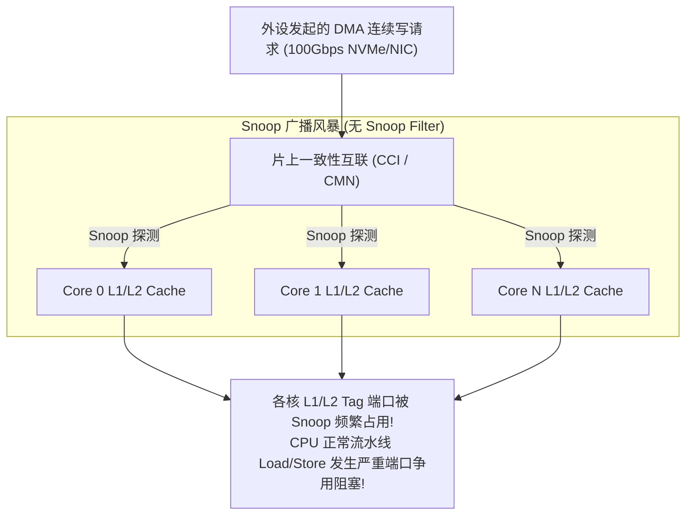
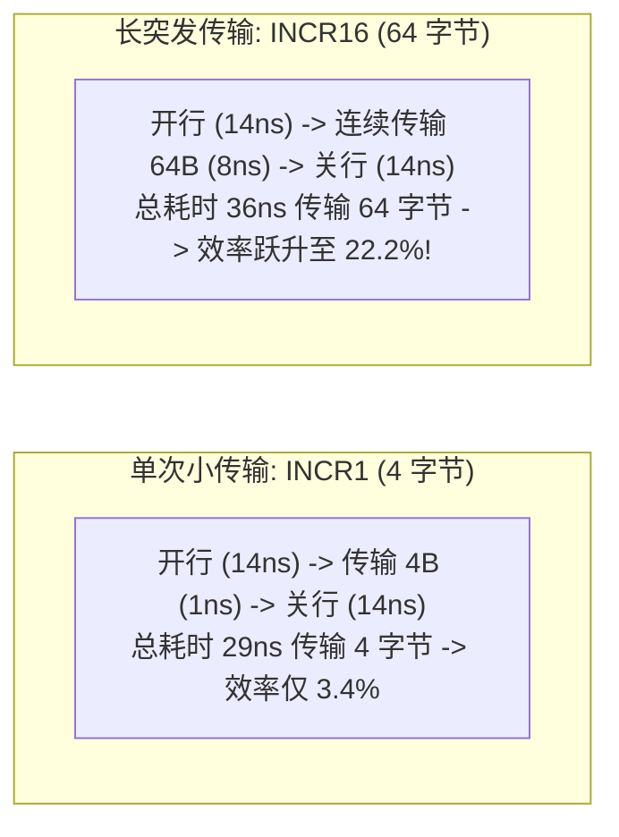

# DMA 性能模型、一致性开销与吞吐瓶颈深度推演

## 1. 软件维护 Cache 一致性的 CPU 周期损耗数学推演

在非一致性 DMA 架构下，每次网络收发包或存储读写均需 CPU 遍历物理地址执行 Cache 操作（`DC CVAC` 或 `DC IVAC`）：

### 周期开销公式
$$\text{CPU Cycles}_{\text{flush}} = \frac{\text{Buffer Size (Bytes)}}{\text{Cacheline Size (64B)}} \times t_{\text{line\_op}}$$

- **典型案例计算**：
  - 假设网卡处理 10Gbps 全双工流量，小包（64 字节）线速转发包率约为 **$14.88 \text{ Mpps}$**（每秒 1488 万包）；
  - 即使单条 Cacheline 失效操作仅消耗 12 个 CPU 周期，处理收发 Cache 同步所需的 CPU 算力为：
    $$\text{Cycles/sec} = 14.88 \times 10^6 \times 12 \approx \mathbf{178.56 \times 10^6 \text{ Cycles}} \; (0.18\text{GHz 算力纯开销!})$$
  - 对于大包（1500 字节，约 24 条 Cacheline），单包处理需消耗近 300 周期。
- **结论**：对于高吞吐低延迟场景（如 100Gbps+ 网络或高速 NVMe），采用非一致性架构会带来显著的 CPU 维护开销，推荐优先评估具备硬件缓存一致性能力的互联架构（如 ARM CCI / CMN）或利用硬件直通机制以降低软件 Cache 同步负担。

---

## 2. 一致性互联 Snoop 流量风暴与总线拥塞

在硬件一致性（Hardware-Coherent DMA）系统中，外设 DMA 读写会触发片上互联向所有 CPU 核心广播 **Snoop 探测包**：

### 工业级解决方案：Snoop Filter（目录式嗅探过滤）
- **微架构机制**：在 LLC 内部维护所有 L1/L2 Cache 驻留行的全局目录表（Directory）。
- **优化效果**：当 DMA 访问某行时，互联仅需查询 Snoop Filter。若目录显示该行并未缓存在任何 CPU 私有 Cache 中，**直接向 DDR 发起传输，完全不向 CPU 核心发送任何广播**，释放 $80\%$ 以上的内部总线带宽。

---

## 3. DMA 突发传输（Burst Size）对 DDR 带宽利用率的影响推演

假设 DDR4 内存控制器单次 Row Buffer 打开延迟为 $t_{\text{RCD}} = 14\text{ns}$，预充电延迟为 $t_{\text{RP}} = 14\text{ns}$：

- **调优准则**：在设计硬件 DMA 引擎与配置驱动时，必须将 DMA 突发传输长度（Burst Length）尽量对齐至 DDR 控制器最优 Burst 粒度（通常为 64 或 128 字节）。
