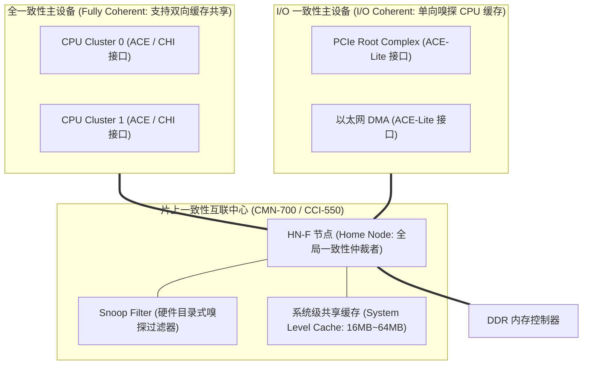
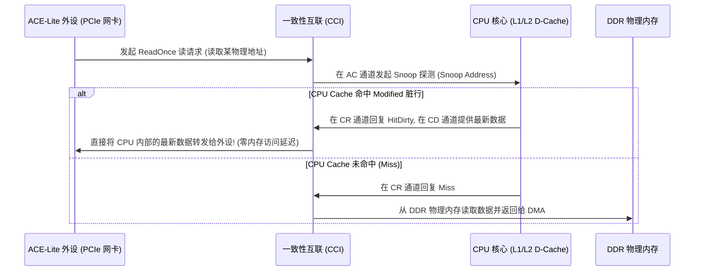

# 硬件一致性互联（CCI / CMN）、ACE 协议与 Snoop Filter 深度解析

## 1. 硬件一致性互联微架构拓扑（CCI-550 / CMN-700）

在异构 SoC 系统中，CPU Cluster、GPU、NPU 与高速 PCIe 设备通过 **一致性互联（Coherent Interconnect）** 共享内存空间：

---

## 2. ACE 协议核心嗅探通道与状态跃迁

ARM 的 **ACE（AXI Coherency Extensions）** 协议在 AXI 基础之上扩展了 3 个专用的硬件一致性通道：
1. **`AC（Address Coherent）`**：互联向 CPU 发送嗅探请求地址；
2. **`CR（Coherent Response）`**：CPU 回复该地址在本地 Cache 中的 MESI 状态（如 `IsShared`, `PassDirty`）；
3. **`CD（Coherent Data）`**：若命中脏行（Dirty），CPU 通过该数据通道将最新数据直接提供给互联或外设。

---

## 3. I/O 一致性（ACE-Lite）与全一致性（ACE/CHI）核心对比

| 特性维度 | ACE-Lite (I/O Coherency) | ACE / CHI (Full Coherency) |
| :--- | :--- | :--- |
| **主设备内部是否有私有 Cache** | **无**（外设本身不缓存一致性数据） | **有**（如 CPU 内部具有 L1/L2 私有 Cache） |
| **能否发起 Snoop 请求** | 能（外设读写会触发互联嗅探 CPU Cache） | 能 |
| **能否被其他设备 Snoop** | **否**（互联不会向外设发送 AC 嗅探请求） | **能**（CPU 私有 Cache 必须响应其他设备的嗅探） |
| **硬件复杂度与面积** | 较低（接口精简，适合网卡、GPU、DSP） | 极高（需维护完整 MOESI/MESI 五状态状态机） |
| **DTS 设备树配置规范** | 依架构与总线 binding 规范配置（在许多常见 ARM SoC 节点上通常声明 **`dma-coherent;`**） | 架构原生全一致性（如 CPU Cluster 互联），由硬件直接支持 |

---

## 4. 硬件一致性的开销本质与 Linux DMA 契约

需要特别指出的是，**硬件一致性并不等于“零软件开销”**：
- **互联与硬件开销**：硬件 Snoop 探测报文会占用片上互联带宽，Snoop Filter 目录查询存在延迟，大量跨核嗅探还会竞争 CPU Tag 端口；
- **系统与驱动开销**：描述符所有权发布仍需要内存屏障（如 `dma_wmb()`），IOMMU / SMMU 仍需建立页表和维护 IOTLB，错误处理与设备重置仍需遵循生命周期协议；
- **Linux 规范**：Linux 内核明确要求驱动无论在硬件一致性平台还是非一致性平台上，**都必须统一通过标准 Linux DMA API（如 `dma_map_single()` / `dma_alloc_coherent()`）描述 DMA 数据的生命周期和传输方向**，严禁在驱动中绕过 DMA 框架自行假设硬件行为。
