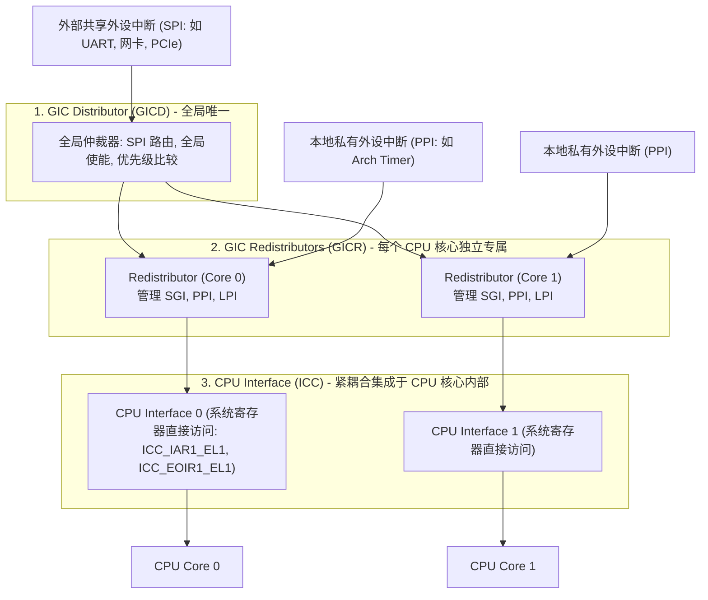
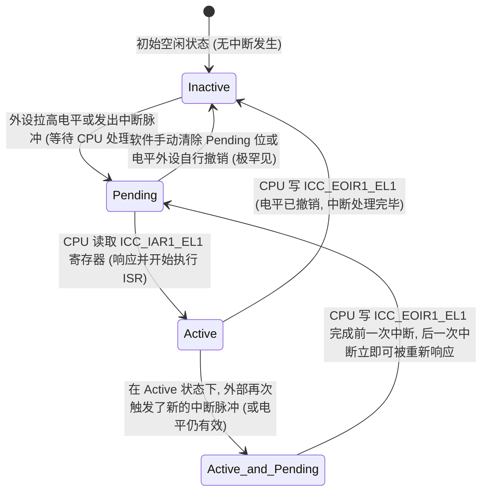

# GICv3 中断控制器、状态机与异常分发深度解析

## 1. ARM GICv3 硬件分层架构与中断类型分类

ARM 通用中断控制器（GICv3/v4）在硬件上划分为三大功能实体：



### 四大中断类型及编号（INTID）空间分配
| 中断类别 | INTID 范围 | 作用域与触发源 | 典型应用场景 |
| :--- | :--- | :--- | :--- |
| **SGI (Software Generated Interrupt)** | `0 ~ 15` | 核间中断（Core-to-Core），由 CPU 写系统寄存器触发 | 多核 IPI 通信、任务跨核调度、TLB 广播 |
| **PPI (Private Peripheral Interrupt)** | `16 ~ 31` | 每核心专属的私有中断，独立不共享 | 通用体系结构定时器（Arch Timer）、PMU 计数溢出 |
| **SPI (Shared Peripheral Interrupt)** | `32 ~ 1019` | 全局外设中断，可由 Distributor 灵活路由到任意目标核 | UART、I2C、DMA 控制器、以太网 MAC |
| **LPI (Locality-specific Peripheral Interrupt)** | `8192+` | 基于消息传递的边缘触发中断（Message-Based） | PCIe MSI / MSI-X 中断 |

---

## 2. GIC 中断全生命周期：四大状态机与状态跃迁图

GIC 内部为每一个中断源维护一个严密的状态机：



---

## 3. 中断处理两阶段解耦：EOI 与 Deactivate 拆分模式

在高性能嵌入式 Linux 与实时系统中，`ICC_CTLR_EL1.EOImode` 通常配置为 `1`（拆分模式），将中断完成过程划分为 **优先级降低（Priority Drop）** 与 **状态去激活（Deactivation）** 两步：

```mermaid
sequenceDiagram
    participant Core as CPU 核心 (ISR 上下文)
    participant ICC as CPU Interface (系统寄存器)
    participant GIC as GIC Distributor / Redistributor
    participant Thread as 内核线程 (Threaded IRQ 下半部)

    Note over Core,GIC: 1. 中断响应 (Acknowledge)
    GIC->>ICC: 仲裁出最高优先级中断 (INTID #33)
    ICC->>Core: 触发 IRQ 异常向量
    Core->>ICC: 读 ICC_IAR1_EL1 (取得 INTID 33)
    Note over ICC: 硬件动作: 自动将 CPU 运行优先级提升至该中断优先级 (防止同/低优先级中断打断)

    Note over Core,GIC: 2. 第一阶段: 优先级解降 (Priority Drop)
    Core->>Core: 标记设备硬件状态，唤醒下半部线程
    Core->>ICC: 写 ICC_EOIR1_EL1 (INTID 33)
    Note over ICC: 硬件动作: 恢复 CPU 优先级! 允许系统响应其他同优先级中断; 但 INTID 33 在 GIC 中仍保持 Active!

    Note over Thread,GIC: 3. 第二阶段: 真正去激活 (Deactivate)
    Thread->>Thread: 线程下半部完成大量数据搬运与慢速外设交互
    Thread->>ICC: 写 ICC_DIR_EL1 (INTID 33)
    Note over GIC: 硬件动作: INTID 33 彻底从 Active 恢复为 Inactive, 允许该设备未来再次产生中断
```

---

## 4. 中断亲和性（IRQ Affinity）与多核负载均衡

### Linux 下配置与硬件映射
- **DTS 节点声明与 32 偏移量原则**：
  - 设备树中：`interrupts = <GIC_SPI 12 IRQ_TYPE_LEVEL_HIGH>;`
  - **实际硬件物理 INTID**：$32 + 12 = \mathbf{44}$！
- **多核绑核命令**：
  ```bash
  # 将 INTID 44 (网卡中断) 绑定到 CPU 2 运行 (掩码 0x4 = 0b0100)
  echo 4 > /proc/irq/44/smp_affinity
  ```

---

## 5. 常见关键中断陷阱与排查手册

### 陷阱 1：电平触发中断未读空 FIFO 触发“中断风暴（Interrupt Storm）”
- **故障现象**：使能 UART 或网络中断后，CPU 利用率瞬间飙至 100%，系统无法响应任何键盘输入或调度其他进程。
- **微架构根因**：
  - 中断配置为**电平触发（Level-Sensitive）**。
  - 外设因为 RX FIFO 有数据而持续将物理中断引脚拉高（High）。
  - ISR 在没有读空 FIFO 的情况下直接执行了 `EOI` 退出。
  - 由于硬件引脚仍然处于高电平，GIC 在退出瞬间**立即将状态从 Inactive 重新置为 Pending**，CPU 刚跳出异常向量又瞬间被拉回，陷入死循环！
- **规避**：电平中断的 ISR 必须**先操作外设寄存器使中断源消失（如读空 FIFO、清除 Raw Interrupt Status）**，最后才能执行 EOI。

### 陷阱 2：Spurious Interrupt（虚假中断 INTID 1023）
- **故障现象**：CPU 响应了 IRQ 异常，但读取 `ICC_IAR1_EL1` 得到的数值为 `1023`。
- **根因**：
  - 在 GIC 向 CPU 发送中断信号到 CPU 真正执行读取 `ICC_IAR1_EL1` 的极短时钟周期内，该中断由于软件写清除了 Pending、或者被更高特权级的软件屏蔽、或者电平源提前撤销；
  - GIC 无法提供有效中断号，按规范返回特殊保留号 **`1023`**。
- **规避**：驱动 ISR 框架必须检查 `if (intid >= 1020) return;` 直接忽略，不可执行后续外设流程。
