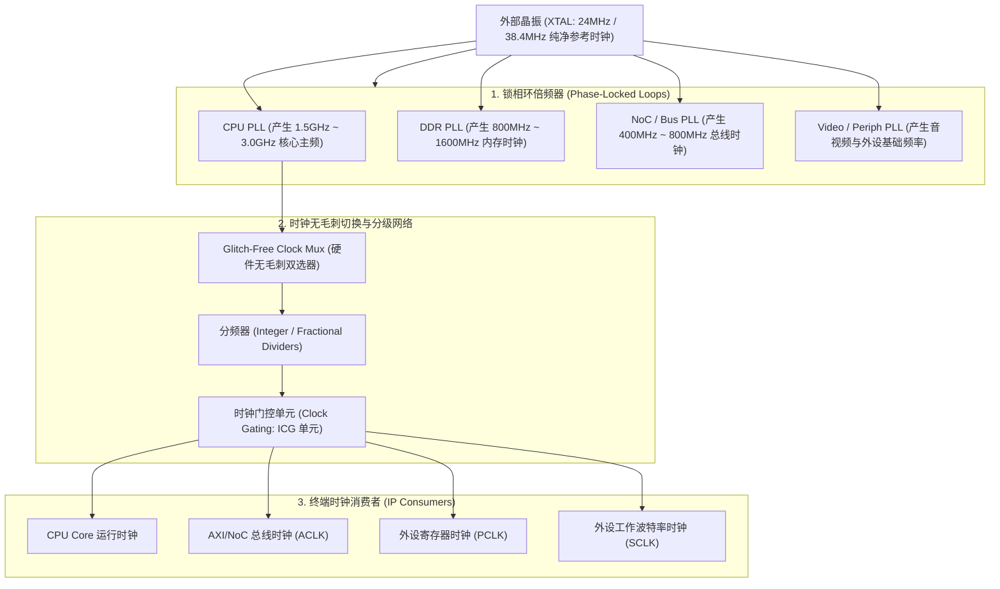
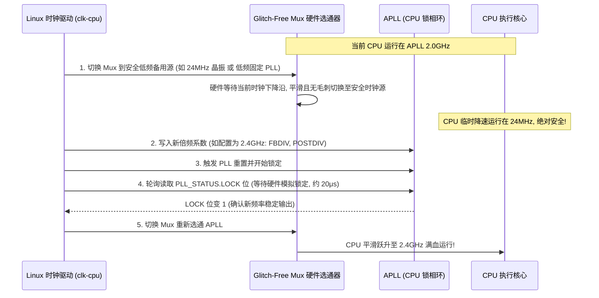
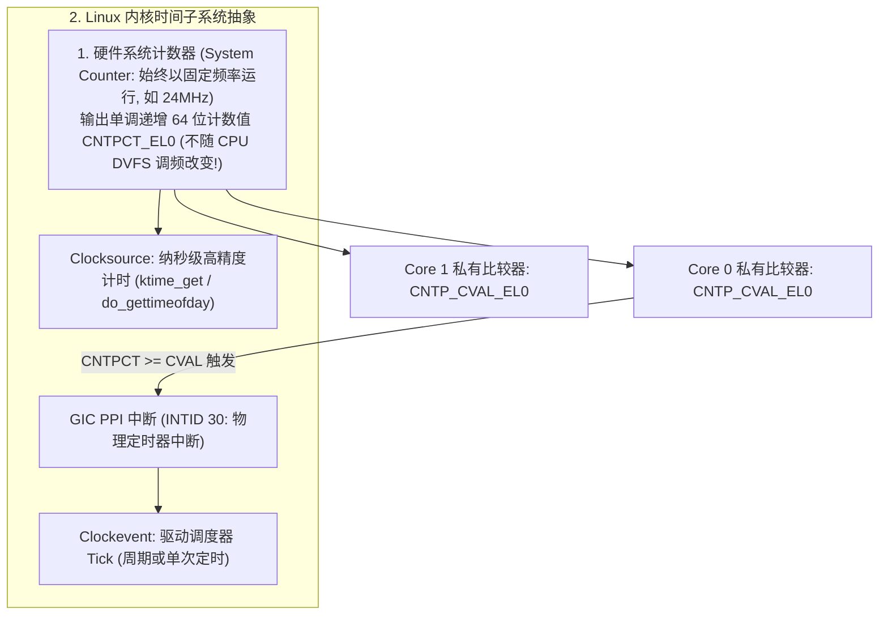

# SoC 时钟树架构、PLL 动态调频与系统定时器完全指南

## 1. SoC 时钟树（Clock Tree）分层微架构拓扑

在现代 SoC 中，所有数字逻辑的运行节奏均由全局时钟控制单元（CCU / CRU）管理。时钟从高精度外部晶振出发，逐级倍频、分发、门控与分频：

---

## 2. PLL 动态重配置与安全无毛刺切换（Glitch-Free）标准 5 步时序

### 为什么严禁在 PLL 锁定时直接修改分频系数？
PLL 内部的压控振荡器（VCO）在参数突变时会瞬间失锁（Unlock），在几微秒内产生未知振幅与超高频率的模拟杂波（Spurious High-frequency Glitches）。CPU 数字逻辑无法满足建立保持时间，会发生逻辑触发器翻转错乱并死锁。

---

## 3. ARM 架构通用定时器（Generic Timer）与 Linux 时间子系统

ARMv8/v9 架构规定了全局统一的 **System Counter 与 Generic Timer**：

### 核心寄存器与换算公式
1. **`CNTFRQ_EL0`（System Counter 频率声明）**：在 TF-A / BootROM 中必须准确写入实际物理晶振频率（例如 `24000000` = 24MHz）。
2. **纳秒时间换算**：
   $$\text{Time (ns)} = \frac{\text{CNTPCT\_EL0} \times 10^9}{\text{CNTFRQ\_EL0}}$$
- **Tickless（`NO_HZ`）微架构节能**：当 CPU 进入空闲态（Idle）时，内核计算下一个定时器事件触发时间点（如 500ms 后），将 `CNTP_CVAL_EL0` 设置为该未来值，并**彻底停止每毫秒一次的周期 Tick 中断**，使 CPU 能够长时间处于最深休眠状态（WFI / Retention）。

---

## 4. 常见时钟与定时器故障排查手册

| 故障现象 | 硬件/驱动微架构根因 | 排查与修复方法 |
| :--- | :--- | :--- |
| **系统时间过快或过慢（如 `sleep(1)` 实际只睡 0.25 秒）** | 固件（TF-A / U-Boot）向 `CNTFRQ_EL0` 写入的数值与硬件时钟源频率严重失配（如实际时钟为 100MHz，但寄存器误配为 24MHz） | 在内核日志中搜索 `arch_timer` 初始化输出；在 Bootloader 中校准并向 `CNTFRQ_EL0` 写入真实晶振频率 |
| **CPU 调频（DVFS）时系统瞬间死机** | 切换 Mux 顺序错误，或选用了非 Glitch-Free 的普通 Mux 导致产生时钟毛刺；或者未等待 PLL 锁定完成即切回 | 使用示波器捕获时钟引脚跳变波形；严格遵循“切至晶振 $\to$ 改系数 $\to$ 等 Lock $\to$ 切回”时序 |
| **系统无法进入低功耗待机模式（Suspend 失败）** | 某个外设驱动在退出时未调用 `clk_disable_unprepare()`，导致时钟树引用计数（Enable Count）不为 0，门控始终常开 | 查看 `/sys/kernel/debug/clk/clk_summary`，排查 `enable_count` 不为零的异常时钟节点 |
