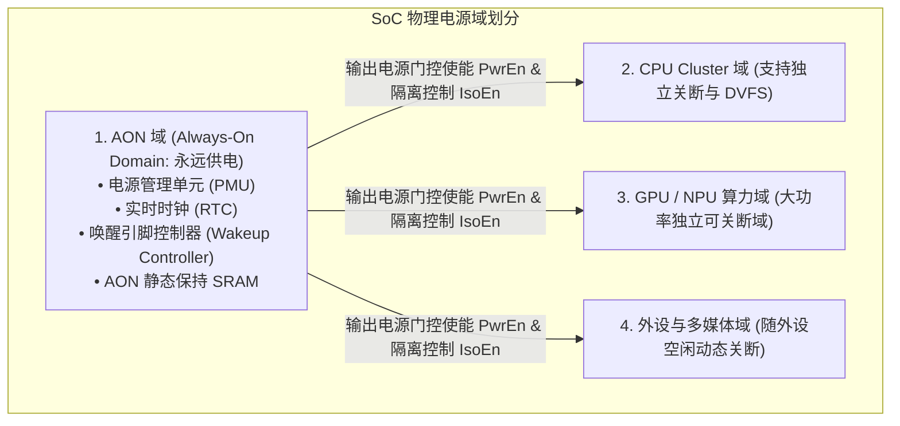
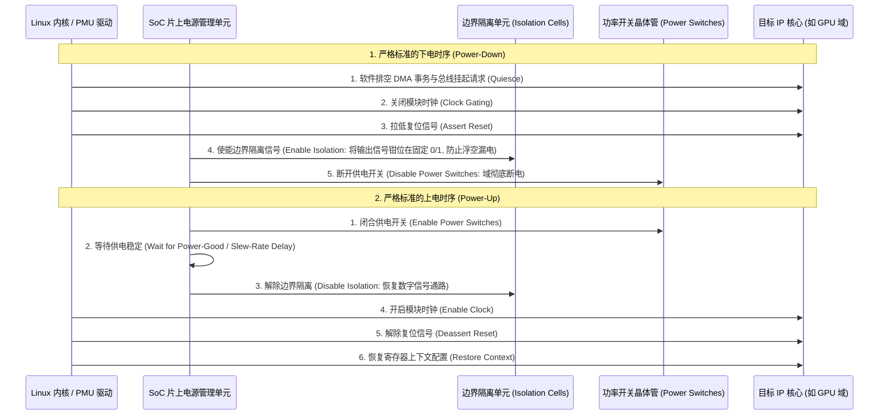
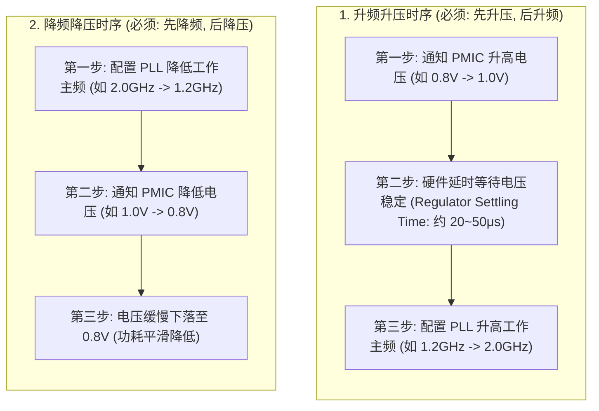
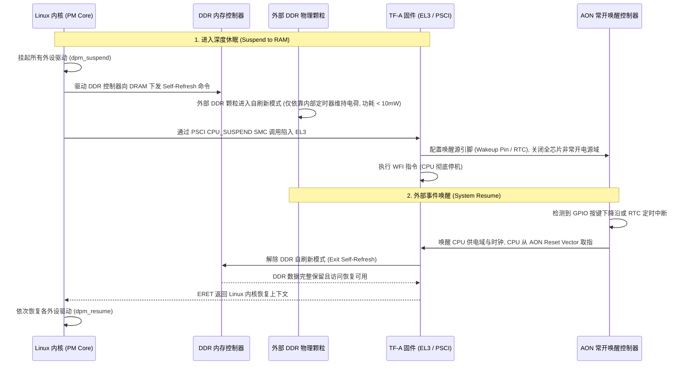

# 复位架构、电源域管理、DVFS 调压调频与系统休眠完全指南

## 1. 电源域（Power Domain）分层与上下电标准硬件时序

在多核 SoC 中，为降低静态漏电功耗（Static Leakage），芯片被划分为多个物理隔离的电源域：

### 电源域标准下电（Power-Down）与上电（Power-Up）七步硬件时序

---

## 2. 动态电压频率缩放（DVFS）升降调节时序法则

为实现性能与能效的最佳匹配，CPU 核心支持在不同 **OPP（Operating Performance Points: 电压-频率元组）** 之间动态切换：

### 违背调节顺序的微架构物理后果：
- **若升频时“先升频、后升压”**：CPU 逻辑在 $0.8\text{V}$ 低压下，MOS 管充放电速度无法支撑 $2.0\text{GHz}$ 的极窄时钟周期，信号在时钟上升沿到来时未能完成建立（**Setup Time Violation**），触发随机逻辑翻转与系统死锁崩溃！

---

## 3. 全系统休眠（System Suspend）与自刷新（Self-Refresh）全景机制

---

## 4. 常见电源与复位故障排查手册

| 故障现象 | 硬件/驱动微架构根因 | 排查与修复方法 |
| :--- | :--- | :--- |
| **CPU 满载加频瞬间系统突发重启或死机** | DVFS 驱动中配置的 PMIC 电压建立时间（Settling Time）过短，时钟在电压尚未达到目标值时提前提升 | 检查 PMIC 手册中的 Slew Rate（如 $10\text{mV}/\mu\text{s}$），在 DTS 的 regulator 节点中补齐 `regulator-ramp-delay` 参数 |
| **某外设电源域下电后，AON 域芯片异常发热漏电** | 隔离单元（Isolation Cells）未使能或使能时序落后于供电切断，下电域引脚呈现浮空电平（Floating），向常开域反向注入击穿电流 | 严格检查 PMU 固件中的下电时序，确保在断开 Power Switches 之前隔离信号（IsoEn）已完全置位 |
| **系统从 Suspend 唤醒后内存数据全部乱码** | DDR 进入自刷新（Self-Refresh）后，板级 VDDQ 供电被外部电源芯片意外切断；或唤醒退出自刷新时未等待足够的恢复时间（$t_{\text{XS}}$） | 用示波器监控 Suspend 期间 DDR 供电轨是否恒定保持；检查 DDR 控制器退出自刷新的时序延时配置 |
