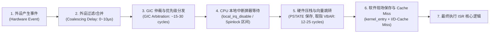
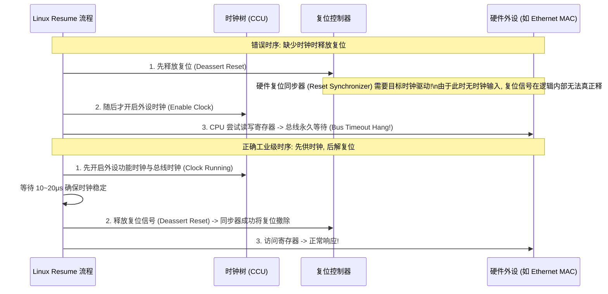

# 中断延迟分解、中断风暴定位与 PLL 偶发失锁故障排查

## 1. 中断响应延迟（Interrupt Latency）微架构全链路拆解

在硬实时系统（如车载底盘控制、运动控制）中，**中断延迟（Interrupt Latency）** 指从外部物理信号触发到 CPU 执行第一条 ISR 有效业务指令之间的绝对时间：



### 关键延迟测量方法
- **GPIO + 示波器硬件基准法**：外设拉高物理中断引脚的同时，在 ISR 入口第一行指令中拉高一个调试 GPIO。使用示波器测量两个边沿之间的绝对时间差（排除所有软件打点开销）。
- **PMU 周期计数法**：利用 `CNTPCT_EL0` 硬件计数器，记录进入中断上下文与执行完处理的时间戳差值。

---

## 2. 电平触发与边沿触发中断风暴（Interrupt Storm）定位

中断风暴表现为：**某个中断号的触发计数以每秒数万次的速度暴增，CPU 占用率达到 100% 且无法处理任何常规线程**。

```mermaid
flowchart TD
    Storm["CPU 持续陷入同一中断号 (中断风暴)"] --> Check_Type{"该中断的触发模式?"}

    Check_Type -->|电平触发 (Level-Sensitive)| Level_Cause["1. 外设状态未清除 / 硬件引脚仍为有效电平\n• 驱动 ISR 未向外设的 W1C (Write-1-Clear) 寄存器写入清除标志\n• 外设 FIFO 中仍残留未读完的数据, 硬件持续拉低/拉高中断引脚\n• CPU 执行 EOI 降权后, GIC 重新检测到有效电平, 瞬间再次触发 Pending!"]

    Check_Type -->|边沿触发 (Edge-Triggered)| Edge_Cause["2. 外部物理线路电磁干扰或震荡\n• 中断信号线由于浮空或 PCB 走线缺少去抖, 产生高频脉冲毛刺 (Glitches)\n• 共享中断引脚被错误配置为上升沿/下降沿双边沿触发"]
```

---

## 3. 高温高负载下 PLL 偶发失锁（Loss of Lock）定位时序

- **故障特征**：系统在常温下运行数天无异常，在 $85^\circ\text{C}$ 高温环室满载跑测时，多个外设（PCIe、以太网、UART）同时上报总线超时并挂死。
- **微架构根因**：
  1. 高温导致 PMIC 内部阻抗增加，CPU 满载跳变时供电轨产生瞬态电压跌落（$V_{\text{drop}} > 100\text{mV}$）；
  2. PLL 的模拟低压供电（`AVDD_PLL`）纹波超标，导致内部环路滤波器（Loop Filter）无法维持压控振荡器相位，触发 **Loss of Lock（失锁）**；
  3. PLL 频率瞬态畸变，下游所有同步数字时钟树停振或频率紊乱，引发系统级崩溃。
- **排查手段**：
  - 检查芯片 CRU 寄存器中的 `PLL_CON_STICKY_LOCK_LOST` 锁存标志位；
  - 测量 PLL 供电引脚在满载跳变瞬间的纹波，并在硬件上增加 LC 滤波与大容量陶瓷去耦电容（Decoupling Capacitor）。

---

## 4. 系统 Resume 唤醒后 MMIO 访问超时（Bus Hang）排查


