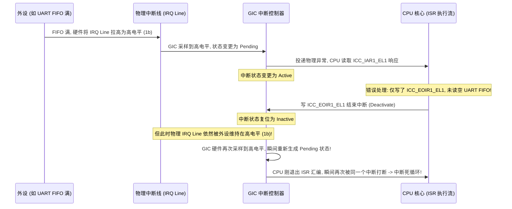
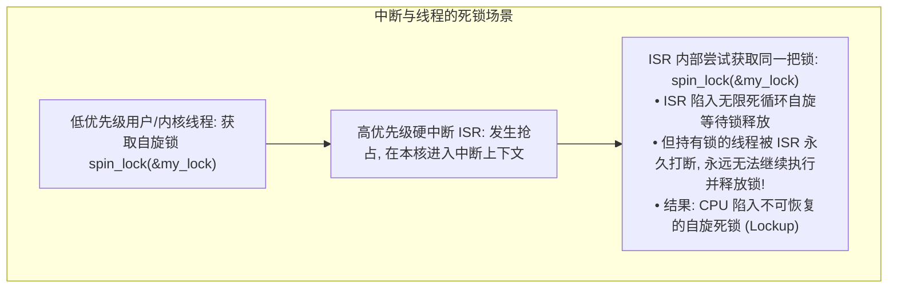
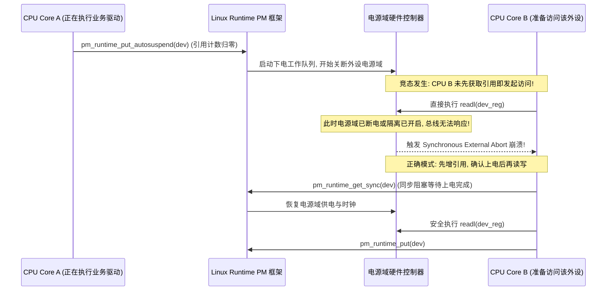

# 中断状态跃迁、优先级反转与低功耗竞争状态深度推演

## 1. 电平中断为何在 EOI 后反复重入：微架构推演

对于电平敏感型中断（Level-sensitive Interrupt），GIC 控制器采样的是**物理信号线上的实时电压电平**：

- **正确处理原则**：
  1. 在 ISR 中首先读取外设数据寄存器将 FIFO 排空，或者向中断状态寄存器写入清除位（W1C）；
  2. 确认外设状态寄存器的原始中断标志已归零（引脚电平已恢复为低电平）；
  3. 最后向 GIC 写入 `ICC_EOIR1_EL1` / `ICC_DIR_EL1`。

---

## 2. 中断优先级反转（Priority Inversion）与死锁风险

中断控制器内部的优先级硬件仲裁（Priority Preemption）仅决定哪个中断能够抢占 CPU 执行流，**它完全脱离于操作系统内核的互斥锁（Mutex / Spinlock）体系**：

- **规避规范**：当共享自旋锁可能被**当前 CPU 上的硬中断处理程序（ISR）抢占获取**时，线程上下文必须使用 **`spin_lock_irqsave(&lock, flags)`**（在获取锁的同时关闭本地中断），防止当前核心在持锁期间被本地 ISR 抢占陷入死锁；若该锁仅在跨核线程之间竞争且明确不在中断上下文中获取，使用普通 `spin_lock` 即可。

---

## 3. 定时器漂移与系统时间累积误差推算

假设某嵌入式平台系统计数器（System Counter）名义频率为 $24\text{MHz}$，但由于外部晶振老化或电容温漂，实际输出频率为 $23.976\text{MHz}$（误差 $\Delta f = -24\text{kHz}$，即 $-1000\text{ppm}$）：

$$\text{PPM 误差} = \frac{23.976\text{MHz} - 24.000\text{MHz}}{24.000\text{MHz}} \times 10^6 = \mathbf{-1000 \text{ ppm}}$$

### 误差的时间累积效应：
- 每秒钟系统时间偏慢：$1\text{s} \times 1000 \times 10^{-6} = \mathbf{1 \text{ ms}}$；
- 运行 1 小时后累积误差：$3600\text{s} \times 1\text{ms/s} = \mathbf{3.6 \text{ 秒}}$；
- 运行 1 天后累积误差：$3.6 \times 24 \approx \mathbf{86.4 \text{ 秒}}$。
- **工程诊断准则**：若系统内所有依赖 `nanosleep()`、`timerfd` 的超时时间均按严格相同的比例偏长或偏短，应直接测量外部时钟源晶振频率，严禁通过逐个修改各个驱动的分频系数来“打补丁”。

---

## 4. Runtime PM 动态下电与外设 MMIO 访问的竞态条件

