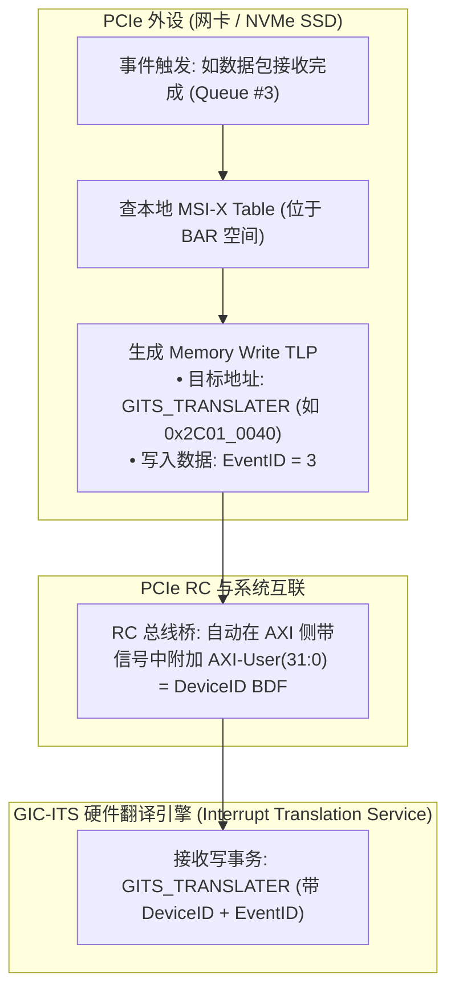
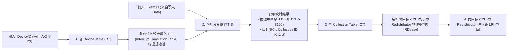
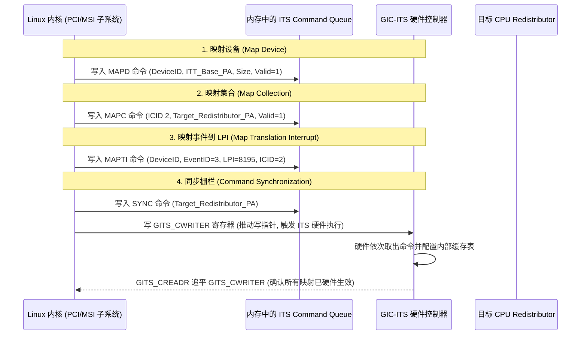

# GIC-ITS（中断翻译服务）与 PCIe MSI/MSI-X 硬件注入全流程深度解析

## 1. PCIe MSI-X 消息中断的硬件本质

在 PCIe 体系中，**MSI（Message Signaled Interrupt）与 MSI-X 本质上不是专用的物理中断引脚，而是一次由 PCIe 设备发起的标准 Memory Write TLP 内存写事务**。

---

## 2. ITS 核心翻译三级查表流水线（Device Table → ITT → Collection Table）

当 ITS 的 `GITS_TRANSLATER` 寄存器被写入时，硬件状态机在 **4~8 个时钟周期** 内自动执行三级查表，完成从逻辑事件到物理 CPU 核心的路由：

---

## 3. ITS 软件配置与命令队列（Command Queue）标准交互时序

操作系统在为 PCIe 设备分配 MSI-X 中断时，必须通过内存中的 **ITS Command Queue** 下发硬件配置命令：

---

## 4. PCIe MSI-X Table 与 Pending Bit Array (PBA) 结构

MSI-X 相比传统 MSI 的核心优势在于支持多达 **2048 个独立中断向量**，且每个向量在 BAR 空间拥有独立的 16 字节条目：

| 偏移量 | 字段名称 | 位宽与作用 |
| :--- | :--- | :--- |
| `+0x00` | **Message Address** | 32 位低地址，填入 `GITS_TRANSLATER` 的物理基地址 |
| `+0x04` | **Message Upper Address** | 32 位高地址（支持 64 位物理地址） |
| `+0x08` | **Message Data** | 32 位数据，填入内核分配给该队列的 **EventID** |
| `+0x0C` | **Vector Control** | `Bit[0]` 为 **Mask bit**（置 1 时该向量被硬件屏蔽，中断被记录至 PBA） |

---

## 5. GICv4 直通虚拟化中断（Direct Virtual LPI Injection）

在 GICv3 虚拟化中，PCIe 设备的 MSI 必须先陷入 Host Hypervisor（EL2），由 KVM 构造虚拟中断后再注入 Guest OS，单次中断延迟高达 **$1\sim 3\mu\text{s}$**。

**GICv4 硬件直通方案**：
- ITS 新增 **`vPE（Virtual Processing Element）`** 映射表。
- 当处于运行态的虚拟机收到外设 MSI 时，ITS 配合 GICv4 Redistributor **直接将 Virtual LPI 投递进虚拟机的虚拟 CPU Interface（`ICV_*_EL1`）**，**显著降低了 VM-Exit 上下文切换开销（延迟降至 100ns 级）**！

---

## 6. 常见关键 ITS 故障与排查手册

### 陷阱 1：PCIe Bridge 丢失 DeviceID 导致 ITS 静默丢弃
- **故障现象**：PCIe 网卡驱动加载成功且 MSI-X 配置完成，网卡收发包正常，但 CPU **永远收不到任何中断**。
- **微架构根因**：
  - PCIe 控制器将 TLP 转换为 AXI 写事务时，SoC 互联设计缺陷未将 PCIe BDF（Bus/Device/Function）打入 AXI 的 `AWUSER[15:0]` 侧带信号；
  - ITS 收到的写请求其 `DeviceID` 为全零（非法设备）；
  - ITS 查 Device Table 失败，静默丢弃该中断（Silent Drop），并不产生总线错误。
- **排查手段**：读取 ITS 的 `GITS_CREADR` 与错误状态寄存器，查看是否有未定义设备违例计数。

### 陷阱 2：ITS 内存表属性未配置为 Shareable Cacheable 导致数据不同步
- **故障现象**：系统冷启动时 MSI-X 正常，但进行 CPU 热插拔（Hotplug）或执行 `MOVI` 迁移中断后，中断随机丢失。
- **根因**：
  - ITS 访问内存中的 ITT 和 CT 表时，基地址寄存器 `GITS_BASER<n>` 中的 Cacheability 与 Shareability 属性被配成了 Non-cacheable；
  - CPU 修改了内存中的 ITT 表项并写回 Cache，但 ITS 从 DDR 中读出了未同步的旧表项。
- **规避**：必须在 BSP 初始化中将所有 `GITS_BASER<n>` 配置为 **`Inner-Shareable Write-Back Read/Write-Allocate`**。
