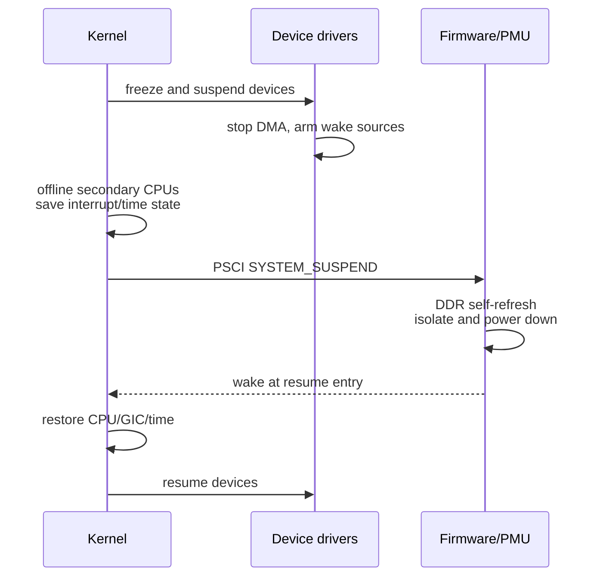

# Linux CCF、OPP、CPU Idle 与 Suspend

## Common Clock Framework

CCF 把 Clock 表示为有父子关系的 `clk_hw`，Provider 注册 PLL/Mux/Divider/Gate，Consumer 通过 Device Tree Clock Specifier 获取。`prepare/unprepare` 可睡眠，`enable/disable` 用于不可睡眠的快速 Gate，驱动通常调用组合接口。

```dts
cru: clock-controller@10000000 {
    compatible = "vendor,soc-cru";
    reg = <0x0 0x10000000 0x0 0x10000>;
    #clock-cells = <1>;
};

uart0: serial@11000000 {
    compatible = "vendor,soc-uart";
    clocks = <&cru CLK_UART0_BUS>, <&cru CLK_UART0_CORE>;
    clock-names = "bus", "core";
};
```

Provider 的 `recalc_rate` 读取硬件得到实际频率，`round_rate/determine_rate` 选择可实现频率，`set_rate` 按安全顺序修改。共享父时钟 Rate 改变会影响多个 Consumer，CCF 需传播或阻止不兼容请求。

## OPP 与 cpufreq

```dts
opp-table {
    compatible = "operating-points-v2";
    opp-800000000  { opp-hz = /bits/ 64 <800000000>;  opp-microvolt = <800000>; };
    opp-1600000000 { opp-hz = /bits/ 64 <1600000000>; opp-microvolt = <950000>; };
};
```

升频路径先请求 Regulator 到目标电压并等待 Settling，再改 PLL/Divider；降频相反。错误回退要恢复一致的电压频率组合。Governor 根据负载选择 OPP，Thermal Cooling Device 可限制最大状态。

## CPU Idle

浅状态通常只执行 `WFI`，Clock 停止、唤醒快；深状态可能经 PSCI `CPU_SUSPEND` 关闭 Core/Cluster 电源，丢失本地状态并依赖 Firmware Resume Entry。每个 Idle State 描述 Entry/Exit Latency 和 Minimum Residency，Governor 只有在预计空闲足够长时才选择深状态。

## Suspend-to-RAM



Suspend 失败要区分“不进入”和“不能恢复”。前者查 Wakeup Source 持续 Pending、设备 Busy 和冻结失败；后者查 Resume Vector、DDR、Clock/Power/Isolation 与早期 Console。
