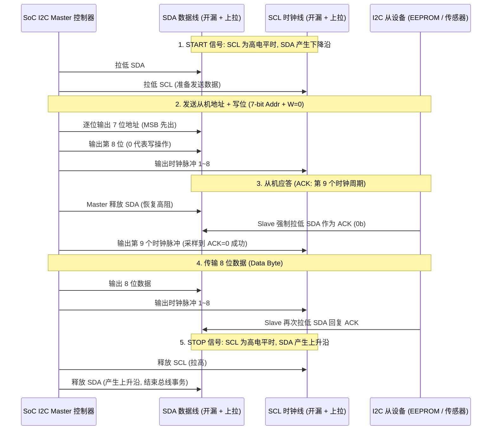
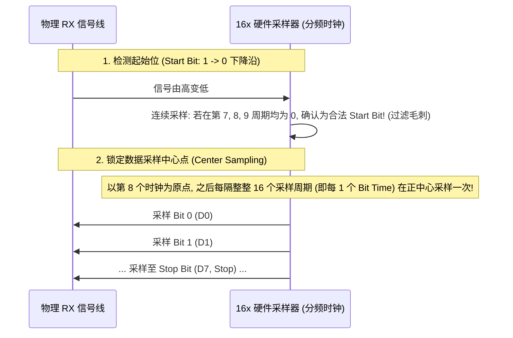

# 低速外设协议微架构、I2C 状态机与总线死锁恢复完全指南

## 1. I2C 总线硬件状态机与全流程时序图

I2C 是标准的双线开漏（Open-Drain）双向总线，依靠外部上拉电阻将空闲信号拉至高电平：



---

## 2. 关键工程故障：I2C “SDA 锁死拉低（Bus Hang Low）”与 9-Pulse 解锁算法

### 故障场景与物理根因
- **发生时机**：CPU 在正在读取从机数据（从机正在向 SDA 输出 0）的瞬间被硬件复位（Watchdog Reset 或热重启）。
- **微架构锁死根因**：
  - CPU 复位重启后，I2C Master 控制器重新初始化为空闲态（SCL=1, SDA=1）；
  - **但外部从机芯片并未复位**！从机状态机依然停留在“等待下一个 SCL 时钟沿以发送剩余 bit”的状态，**它的输出引脚持续死死拉低 SDA 线（`SDA = 0`）**；
  - Master 重新上电后检测到 `SDA == 0`，误认为总线被外部占用（`Bus Busy`），导致所有驱动 `i2c_transfer()` 永久超时阻塞！

```mermaid
flowchart TD
    Detect["Master 驱动检测到 SDA 持续为低电平 (Bus Locked)"] --> Switch_GPIO["1. 硬件引脚切为 GPIO 模式 (Pinmux: SCL & SDA 改为 GPIO)"]
    Switch_GPIO --> Loop_9["2. 软件循环: 在 SCL 引脚上连续模拟输出 9 个时钟脉冲"]

    Loop_9 --> Check_SDA{"每产生 1 个 SCL 脉冲后检测 SDA 是否已被从机释放 (SDA == 1)?"}
    Check_SDA -->|是 (从机已移出字节并释放总线)| Send_Stop["3. 模拟发送 1 个合法的 STOP 条件 (SCL 高电平时将 SDA 从低拉高)"]
    Check_SDA -->|否 (尚未读完当前字节)| Continue_Pulse["继续产生下一个 SCL 脉冲 (最多 9 次)"]
    Continue_Pulse --> Loop_9

    Send_Stop --> Restore_I2C["4. 恢复引脚为 I2C 专用控制器模式, 重新初始化 Master IP"]
```

---

## 3. SPI 四种工作模式（CPOL / CPHA）与全双工 DMA 机制

SPI 依赖 **SCLK（时钟）、MOSI（主出从入）、MISO（主入从出）、CS（片选）** 四线工作：

| SPI 模式 | CPOL（时钟空闲极性） | CPHA（采样相位） | 硬件动作特征 | 典型外设代表 |
| :--- | :--- | :--- | :--- | :--- |
| **Mode 0** | `0`（空闲为低电平） | `0`（第 1 个边沿采样） | SCLK **上升沿采样**，下降沿移位 | **绝大多数 SPI NOR Flash**（W25Qxx）、SD 卡 |
| **Mode 1** | `0`（空闲为低电平） | `1`（第 2 个边沿采样） | SCLK 下降沿采样，**上升沿移位** | 某些特定工业 ADC / DAC |
| **Mode 2** | `1`（空闲为高电平） | `0`（第 1 个边沿采样） | SCLK **下降沿采样**，上升沿移位 | 极少数特定传感器 |
| **Mode 3** | `1`（空闲为高电平） | `1`（第 2 个边沿采样） | SCLK **上升沿采样**，下降沿移位 | 常见 SPI 屏幕、STMicroelectronics 传感器 |

### 模式配置错误的微观表现：
- **若 Mode 0 误配为 Mode 3**：虽然采样沿都是上升沿，但由于空闲电平不同，首个 Bit 的建立时间被破坏，**读取出的数据全部整体向左或向右位移 1 个 Bit（例如 `0x9F` 读出为 `0x3E` 或 `0x4F`）**。

---

## 4. UART 16 倍过采样（16x Oversampling）与波特率误差容限

为什么 UART 只用一根 RX 线就能精准还原数据？微架构内部依赖 **16x 采样时钟（Sampling Clock）**：



### 波特率时钟频偏容限模型与适用边界
在异步串行通信中，接收端依靠起始位下降沿进行本地波特率分频相位重同步。以最常见的 **标准 8N1 帧格式（1 个起始位 + 8 个数据位 + 1 个停止位，共 10 位时间窗口）** 且接收端采用 **标准 16 倍过采样（16x Oversampling）** 为例：
- 理论上，第 10 位（停止位）中心的采样点偏离理想边界不得超过 $\pm 0.5$ 个 Bit 宽度，对应理论最大累计频偏上限为 $\frac{\pm 0.5 \text{ Bit}}{10 \text{ Bits}} = \pm 5\%$；
- 在工程实践中，考虑 PCB 走线电容引起的边沿上升/下降沿不对称迟滞、时钟相位抖动以及采样判决窗口安全裕量，**对于 8N1 16x 过采样系统，工程上通常推荐将收发双方的综合频率误差控制在 $\pm 2.5\%$ 以内**；
- **适用边界说明**：若采用不同帧格式（如含奇偶校验的 9 位帧、2 个停止位 8N2）或不同硬件过采样倍率（如 8x/32x 过采样、带有自适应波特率跟踪逻辑的控制器），允许的频偏边界会有所不同，需按具体硬件规格书与帧时序重新核算。

---

## 5. GPIO 无毛刺切换（Glitch-Free）原则

在控制外部复位引脚（RESET#）或电源使能脚（EN）时，如果配置代码顺序错误，会在引脚上产生关键的微秒级低电平脉冲（Glitch），导致外设异常复位：

```c
/* 严重错误写法: 产生短暂负脉冲毛刺 */
gpio_set_direction_output(GPIO_12); /* 此时数据寄存器默认为 0, 引脚瞬间被拉低! */
gpio_set_value(GPIO_12, 1);          /* 若干微秒后才拉高 -> 产生破坏性低脉冲 */

/* 工业级正确写法: 先写数据, 再改方向 (零毛刺) */
gpio_set_value(GPIO_12, 1);          /* 1. 先向数据输出寄存器写入期望的初始电平 1 */
gpio_set_direction_output(GPIO_12); /* 2. 切换为输出时直接呈现高电平, 绝无毛刺! */
```

---

## 6. 常见低速外设排查手册

| 故障现象 | 硬件微架构根因 | 快速诊断与修复方法 |
| :--- | :--- | :--- |
| **I2C 读器件 ID 始终返回 0xFF** | 从机设备未应答，Master 采样到上拉电阻的高电平 | 用示波器查看第 9 时钟周期是否有低电平 ACK 脉冲；检查 7-bit 地址是否左移了 1 位（读写位混淆） |
| **I2C 总线波形边沿过缓呈圆弧形** | 上拉电阻阻值过大（如用了 100kΩ）与 PCB 寄生电容构成大 RC 延迟 | 将上拉电阻更换为 $2.2\text{k}\Omega \sim 4.7\text{k}\Omega$ |
| **UART 接收狂吞中断，打印大量 0x00** | RX 引脚浮空未配置内部上拉，外界电磁噪声使输入电压跌落触发虚假起始位 | 在 DTS 的 `pinctrl` 节点中将 RX 引脚配置为 `bias-pull-up` |
| **SPI 读 Flash 偶发性单字节校验错** | SPI 时钟频率过高超出 PCB 走线裕量，或 CS 引脚在 DMA 传输中途意外被释放拉高 | 降低 SPI 时钟至 24MHz；检查驱动是否使用了 `cs_change` 导致分段拉高 |
