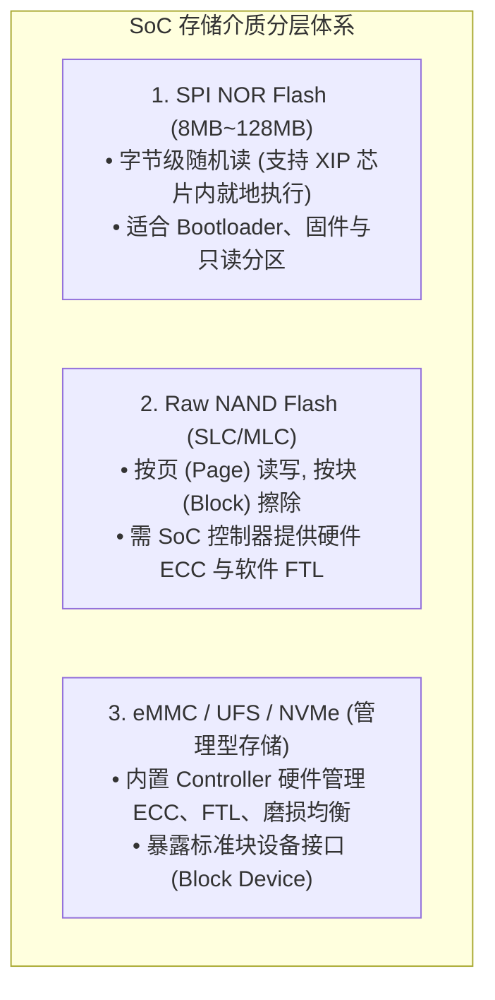
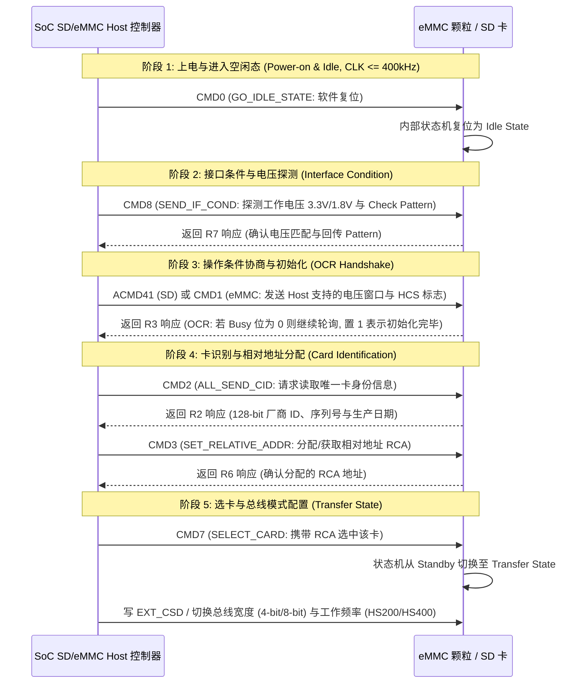
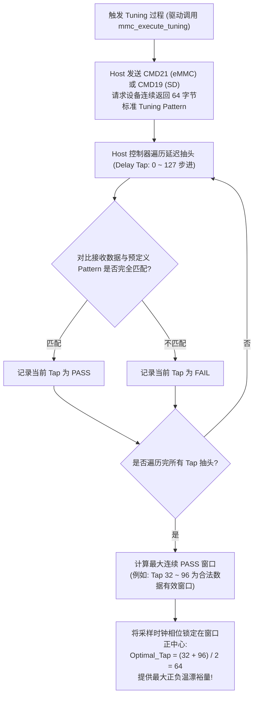

# SD/eMMC、Flash 存储介质原理、协议状态机与 Tuning 校准深度解析

## 1. 常见存储介质物理特性与软件架构对比

在嵌入式与 SoC 系统中，不同层级的非易失性存储介质在物理结构、寻址方式与软件栈支持上存在本质差异：



### 存储介质关键特性对比表
| 特性维度 | SPI NOR Flash | Raw NAND Flash | eMMC 5.1 | UFS 3.1 / 4.0 |
| :--- | :--- | :--- | :--- | :--- |
| **物理接口** | SPI / QSPI / OSPI 串行 | 8/16-bit 并行或 ONFI | 8-bit 并行数据线 + CMD + CLK + DS | M-PHY 差分高速串行（双向多通道） |
| **就地执行 (XIP)** | 支持（Memory-Mapped 读） | 不支持（需搬运到 RAM） | 不支持 | 不支持 |
| **典型读取吞吐** | 50 ~ 200 MB/s | 100 ~ 400 MB/s | 200 ~ 400 MB/s (HS400) | 1200 ~ 4200 MB/s |
| **数据可靠性管理** | 硬件位错误率极低，驱动直接读写 | 位翻转率高，必须依赖 BCH / LDPC ECC | 内部控制器透明管理 ECC 与坏块 | 内部控制器透明管理 ECC 与坏块 |
| **软件栈层级** | MTD（Memory Technology Device） | MTD + UBI / UBIFS | 块设备层（Block Layer） + EXT4/F2FS | 块设备层 + SCSI 子系统 |

---

## 2. SD / eMMC 上电枚举与 5 阶段状态机推演

SD 卡与 eMMC 共享相似的指令集架构，Host 与 Device 之间通过一条双向命令线（CMD）和 1/4/8 条数据线（DAT[7:0]）通信。系统上电后必须严格经历以下 5 个阶段的状态迁移：



---

## 3. 高速模式（HS200 / HS400 / SDR104）Tuning 采样窗口校准机制

### 为什么 200MHz 必须进行 Tuning 校准？
在 eMMC HS200（200MHz 单沿）或 SDR104 模式下，时钟周期缩短至 **5ns**。由于 PCB 走线延迟、封装寄生电容以及温度电压漂移，数据信号相对于时钟的建立/保持时间窗口（Data Valid Window）严重变窄，固定相位采样极易造成采样边缘踩在数据跳变沿上导致数据校验错误。



---

## 4. 存储控制器 ADMA2 描述符链表与 DMA 搬运

现代 SD/eMMC 控制器（遵循 SD Host Controller Simplified Specification）采用 **ADMA2（Advanced DMA 2）** 机制，消除 CPU 频繁中断干预：

```text
+-------------------+-------------------+---------------------------------------+
|  Attribute (16b)  |    Length (16b)   |             Address (32/64b)          |
+-------------------+-------------------+---------------------------------------+
| Act=0b10, Valid=1 |     0x1000 (4KB)  |    0x00000000_80001000 (物理内存块 0)  |
| Act=0b10, Valid=1 |     0x2000 (8KB)  |    0x00000000_80004000 (物理内存块 1)  |
| Act=0b10, End=1   |     0x0800 (2KB)  |    0x00000000_80008000 (最后一个散列块) |
+-------------------+-------------------+---------------------------------------+
```
- **工作机制**：CPU 构建 Scatter-Gather 链表后，仅需向寄存器 `ADMA_SA` 写入首个描述符地址，并在 `BLOCK_COUNT` 写入块总数，控制器自动遍历链表完成多块连续 DMA 传输并在 `End=1` 时触发单个完成中断。

---

## 5. 常见存储故障诊断与排查手册

| 故障现象 | 硬件/协议根因 | 排查与修复方法 |
| :--- | :--- | :--- |
| **`CMD Timeout (Response Timeout)`** | 供电不稳、复位信号未释放、CMD 引脚未使能内部上拉，或时钟未输出 | 示波器测量 VDD/VDDIO 供电是否达到规范；测量 CLK 引脚是否有波形；检查 Pinmux 配置 |
| **`Data CRC Error`（高频下偶发）** | 信号完整性差、阻抗不匹配、Tuning 采样点偏离或温漂导致采样窗口缩小 | 重新执行 Tuning 校准；适当降低总线频率测试（如从 HS400 降为 HS200 或 50MHz）；调整 PCB 驱动强度（Drive Strength） |
| **`Card stuck in busy state (D0 low)`** | eMMC/SD 内部正在执行大块擦除或后台垃圾回收（GC），持续将 DAT0 信号拉低 | 增加软件超时等待时间（大容量擦除超时可达数十秒）；避免在未完成前复位总线 |
| **RPMB 分区访问失败** | RPMB 密钥（Key）未烧写或已烧写但签名认证计算不匹配 | 检查 eFuse 派生密钥逻辑；确认 RPMB 计数器（Write Counter）未被重放攻击阻断 |
