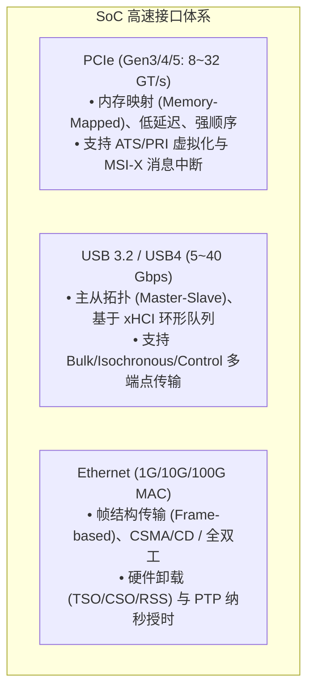
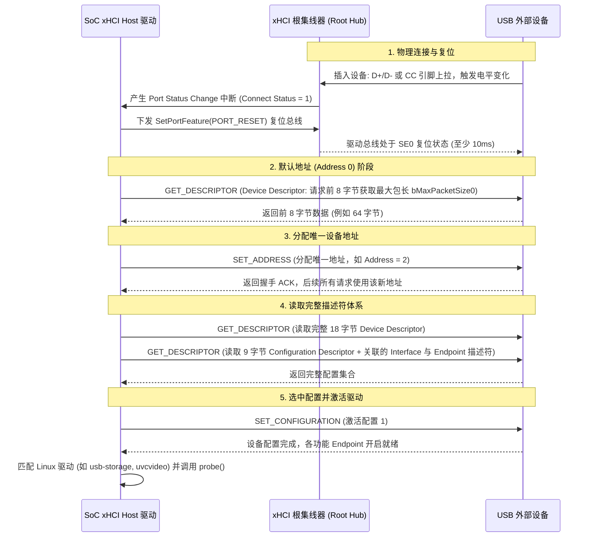
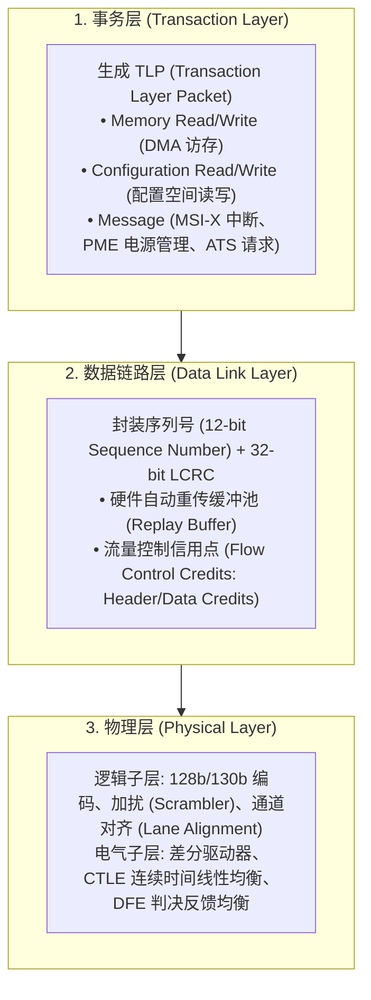

# 高速互联接口：USB 3.x/xHCI、PCIe 体系架构与千兆/万兆以太网深度剖析

## 1. 高速接口协议分层与技术特征对比

在现代 SoC 中，高速外设接口统一采用**基于分组交换的差分串行链路（Differential Serial Links）与 SerDes 物理层**：



### 三大高速协议核心架构对比
| 维度 | PCIe Gen4 | USB 3.2 Gen2 | 10G Ethernet (10GBASE-R) |
| :--- | :--- | :--- | :--- |
| **拓扑结构** | 点对点树状拓扑（Root Complex $\to$ Endpoints） | 树状主从拓扑（Host Controller $\to$ Hub $\to$ Devices） | 对等星型拓扑（Switch $\to$ MAC/PHY） |
| **链路编码** | 128b/130b 编码（开销仅 1.5%） | 128b/132b 编码 | 64b/66b 编码 |
| **单通道速率** | 16 GT/s（每 Lane 双向净吞吐约 1.97 GB/s） | 10 Gbps | 10.3125 Gbps |
| **寻址与交互模式**| 32/64-bit 物理内存映射（TLP 读写） | 逻辑设备地址 + Endpoint 索引（TRB 环） | 48-bit MAC 地址 + 报文缓冲队列 |
| **可靠性保障** | 链路层 16-bit LCRC + 硬件自动重传（Ack/Nak） | 链路层 CRC + 硬件重传；应用层协议重传 | 帧尾 32-bit FCS/CRC；错误帧由 MAC 丢弃，交由上层 TCP 重传 |

---

## 2. USB 架构、xHCI 控制器模型与设备枚举时序

### 2.1 xHCI 环形缓冲区微架构
现代 USB 3.x 统一采用 **xHCI（Extensible Host Controller Interface）** 标准。Host 与 Controller 之间通过内存中的 **TRB（Transfer Request Block）环** 交互：
1. **Command Ring**：用于主机向 xHCI 下发配置命令（如使能插槽 `Enable Slot`、配置端点 `Configure Endpoint`）。
2. **Transfer Ring**：每个活动的 Endpoint 独立分配一个 Transfer Ring，承载具体的数据传输请求（Normal TRB, Data Stage TRB）。
3. **Event Ring**：xHCI 控制器通过该只写环向 CPU 上报传输完成状态、设备插拔与错误事件。

### 2.2 USB 完整标准枚举时序图


---

## 3. PCIe 协议栈、TLP 事务与 BAR 空间探测算法

### 3.1 PCIe 三层协议栈模型


### 3.2 PCIe BAR（Base Address Register）硬件空间探测算法
当系统启动枚举 PCIe 设备时，操作系统需要获知该设备各个 BAR 寄存器请求的内存窗口大小。由于规范中没有直接存储大小的寄存器，行业采用**写全 1 探测法**：

```c
/* PCIe BAR 空间大小探测标准算法 */
uint32_t probe_pci_bar_size(uint32_t bus, uint32_t dev, uint32_t func, int bar_idx)
{
    uint32_t bar_offset = 0x10 + (bar_idx * 4);

    /* 1. 保存原 BAR 寄存器值 */
    uint32_t orig_val = pci_read_config32(bus, dev, func, bar_offset);

    /* 2. 向 BAR 寄存器写入全 1 (0xFFFFFFFF) */
    pci_write_config32(bus, dev, func, bar_offset, 0xFFFFFFFF);

    /* 3. 读回写入的值: 设备硬件会自动将只读的低位保持为 0 (掩码) */
    uint32_t mask = pci_read_config32(bus, dev, func, bar_offset);

    /* 4. 恢复原值 */
    pci_write_config32(bus, dev, func, bar_offset, orig_val);

    /* 5. 屏蔽类型位并计算大小 (以 32-bit Memory BAR 为例) */
    mask &= ~0x0F;                       /* 清除低 4 位控制标志位 */
    uint32_t size = ~(mask) + 1;         /* 取反加 1 即为物理请求空间大小 */

    return size; /* 例如读回 0xFFF00000 -> size = 0x00100000 (1MB) */
}
```

---

## 4. 以太网 MAC/PHY 链路与硬件卸载（Offload）机制

### 4.1 接口类型演进
- **RGMII（Reduced Gigabit Media Independent Interface）**：4 根 TX 数据线 + 4 根 RX 数据线，在 125MHz 时钟的双沿（DDR）触发下传输，达到 1000Mbps。
- **SGMII / 10GBASE-R**：采用 SerDes 差分对（TX± / RX±），规避了并行宽总线固有的跨通道布线时钟偏斜（Skew）问题，广泛应用于 1.25Gbps ~ 10.3125Gbps 高速背板。

### 4.2 核心硬件卸载加速技术
1. **Checksum Offload（CSO）**：MAC 硬件在发送前自动计算 IP/TCP/UDP 报头校验和并填入帧头；接收时自动校验，避免 CPU 逐字节累加开销。
2. **TCP Segmentation Offload（TSO）**：协议栈可一次性向网卡 DMA 提交高达 64KB 的超大 TCP 报文段（GSO/TSO），由 MAC 控制器硬件自动按 MTU（如 1500 字节）拆分为多个以太网物理帧并更新 TCP 序列号。
3. **Receive Side Scaling（RSS）**：MAC 硬件提取数据包的五元组（Src IP, Dst IP, Src Port, Dst Port, Proto），通过 Toeplitz Hash 算法将不同数据流分发到多个独立的 RX DMA 队列，由不同 CPU 核心并行处理。

---

## 5. 常见高速接口故障诊断与排查手册

| 故障现象 | 硬件/协议层根因 | 排查与修复步骤 |
| :--- | :--- | :--- |
| **USB 设备枚举在 `GET_DESCRIPTOR` 阶段超时报 `-EPROTO` 或 `-71`** | 差分信号线 D+/D- 走线阻抗未控制在 $90\Omega \pm 10\%$；或走线长度差过大导致共模偏斜超标；VBUS 跌落 | 用示波器测试 USB 眼图（Eye Diagram）；检查 VBUS 在设备插入瞬间的电压跌落是否低于 4.75V；检查差分线共模电感与静电保护器件寄生电容 |
| **PCIe 设备 LTSSM 停滞在 `Detect.Quiet / Detect.Active` 状态** | 物理链路未检测到对端 $50\Omega$ 终端阻抗；参考时钟（REFCLK 100MHz）未起振或 PERST# 复位未释放 | 检查金手指与插槽接触阻抗；确认 100MHz 差分时钟幅度达到规范（$\ge 700\text{mV}$）；检查复位引脚时序（PERST# 需在供电稳定后保持至少 100ms 再拉高） |
| **以太网千兆连接协商成功但丢包率高达 50%~100%** | RGMII 发送/接收时钟与数据线之间缺少必要的 **2ns 相位延迟**（RGMII Delay Mode 错配） | 在 DTS 中调整 MAC/PHY 节点的 `phy-mode` 属性（在 `rgmii`, `rgmii-id`, `rgmii-rxid`, `rgmii-txid` 之间根据 PCB 实际走线调配） |
