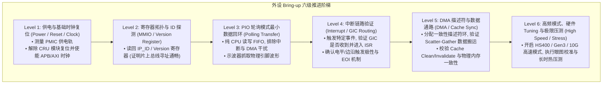
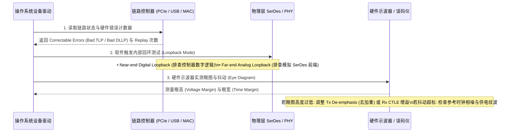

# 外设 Bring-up 分层推进与硬件故障诊断完全指南

## 1. 外设 Bring-up 六级金字塔验证方法论

在 SoC 新芯片或新板卡 Bring-up 阶段，直接加载带有完整 DMA、中断和多队列的高级驱动，往往会导致系统挂死且无法定位具体失效层级。行业最佳实践采用 **单变量分层验证模型（Layered Bring-up Model）**：



---

## 2. 外设访问无响应诊断决策树

当驱动读写外设寄存器发生挂死（Bus Hang）或读取异常时，按以下根因链路进行逐级排查：

```mermaid
flowchart TD
    Fault["外设寄存器访问异常或无响应"] --> Check_Type{"异常表现类型?"}

    Check_Type -->|CPU 读写时触发 Synchronous External Abort| Abort_Cause["1. 总线级错误 (DECERR / SLVERR)\n• 模块电源域 (Power Domain) 未上电\n• 模块总线时钟 (PCLK / ACLK) 处于门控关闭状态\n• 访问地址超出总线解码器的地址空间窗口 (Address Decode Error)"]

    Check_Type -->|寄存器可读写但写入后值不变 (维持复位值)| Reset_Cause["2. 内部逻辑处于复位或时钟缺失\n• 模块功能工作时钟 (Func Clock / Baud Clock) 未开启\n• 模块内部复位信号未由软件解冻 (Reset Asserted)\n• 寄存器字段属于只读 (RO) 或特定自清除 (Self-clearing) 属性"]

    Check_Type -->|寄存器正常工作但外部引脚无信号波形| Pin_Cause["3. 引脚复用与电气配置错误 (IOMUX / Pad)\n• 引脚复用控制寄存器 (Pinmux) 未切换至该外设功能\n• Pad 输出驱动使能 (OE) 未置位\n• 外部上拉电阻缺失或引脚被其他芯片死死拉低"]
```

---

## 3. 高速物理链路（SerDes / PCIe / USB / RGMII）不稳定定位模型

高速链路常出现“常温下工作正常，高温或长时间运行后突发断链或降速”的现象，应建立基于物理层统计的诊断闭环：



---

## 4. 吞吐瓶颈分析：DMA 正常但性能未达标时的四维排查

当外设数据搬运正确但吞吐量显著低于物理上限时，重点排查以下四个微架构瓶颈：

| 瓶颈领域 | 微架构物理根因 | 关键排查指标与工具 | 工业级优化手段 |
| :--- | :--- | :--- | :--- |
| **总线突发粒度** | AXI 突发长度（`AWLEN`）被设置为单次传输（`INCR1` / 4B），导致 AXI 握手开销占比高达 75% | AXI 协议分析仪监测 `AxLEN` 与 `AxSIZE` | 增大外设 DMA Burst 长度至 `INCR16` 或 64/128 字节对齐的大块传输 |
| **中断风暴开销** | 每到达一个数据包即产生一次硬中断，CPU 耗费 80% 以上算力在中断上下文切换与现场保存 | `mpstat -P ALL 1` 查看 `%irq` 占用 | 开启外设**中断合并（Interrupt Coalescing / Moderation）**；Linux 驱动引入 NAPI 轮询机制 |
| **描述符队列过浅** | 描述符队列深度（Ring Size）仅为 16~32，无法掩盖 DDR 突发排队延迟，外设频繁触发 FIFO 溢出丢包 | 驱动读取 `RX_OVERFLOW_DROP` 寄存器 | 将 Ring Buffer 深度扩大至 512~2048 |
| **片上互联争用** | NoC QoS 优先级配置不当，外设 AXI Master 与高带宽 GPU/显示流水线争用 DDR 导致延迟被拉长 | NoC 性能计数器监测 `Latency_Histogram` | 调整外设 Master 的 AXI QoS 优先级位，配置 DDR 控制器的读写调度权重 |
