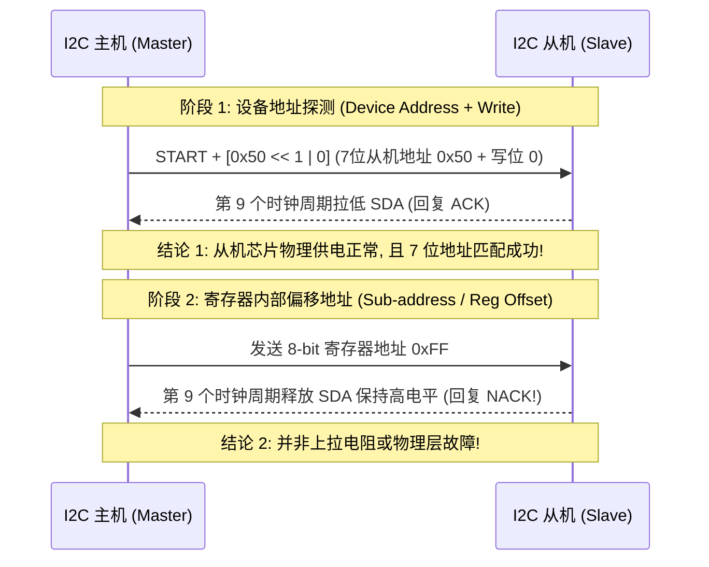
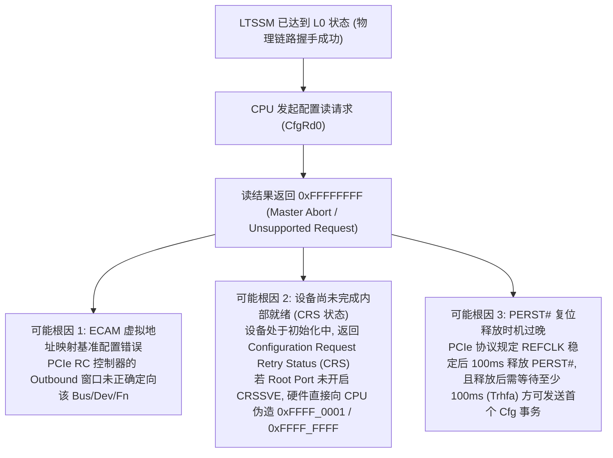
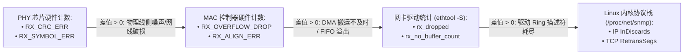

# 常见外设协议现场推演、逻辑分析与深度故障复盘

## 1. I2C 协议现场逻辑分析：地址 ACK 与数据 NACK 的精准定界

在调试 I2C 总线时，使用逻辑分析仪（Logic Analyzer）抓取波形，经常观察到“主机发出从机地址后收到 ACK，但紧接着发送第一个数据字节时收到 NACK”的现象：



### 根因定界与排查路径
1. **非法寄存器寻址（Invalid Register Address）**：从机内部控制逻辑无法识别该寄存器偏移，协议状态机主动回复 NACK。
2. **设备写保护或内部处于忙状态（Busy / Internal EEPROM Write Cycle）**：例如 EEPROM 刚刚执行完 Page Write，内部处于 $5\text{ms}$ 的高压编程周期，期间拒绝一切数据写入并回复 NACK。
3. **上拉电阻阻值与 RC 边沿失真计算**：
   - 设总线寄生电容为 $C_{\text{bus}} = 100\text{pF}$，上拉电阻 $R_{\text{pull}} = 10\text{k}\Omega$。
   - 信号上升时间：$t_r \approx 0.8473 \times R_{\text{pull}} \times C_{\text{bus}} \approx 847\text{ns}$。
   - 在 Fast Mode (400kHz, 周期 2.5$\mu\text{s}$，高电平仅 1.25$\mu\text{s}$) 下，过长的上升时间导致高电平来不及建立，造成采样点误判。应将上拉电阻更换为 $2.2\text{k}\Omega$。

---

## 2. SPI Flash 读出全 `0xFF` 或全 `0x00` 的时序推演

```mermaid
flowchart TD
    SPI_Fault["SPI 读数据返回全 0xFF 或全 0x00"] --> Branch{"全 0xFF 还是全 0x00?"}

    Branch -->|全 0xFF (高电平)| High_Side["1. MISO 引脚被弱上拉且从机处于高阻态\n• CS 片选引脚未真正拉低 (从机未被激活)\n• SPI 模式错配 (如设备要求 Mode 3, 主机配置为 Mode 0)\n• 发送的 Read JEDEC ID 命令码错误 (如误发 0x00 而非 0x9F)"]

    Branch -->|全 0x00 (低电平)| Low_Side["2. MISO 引脚被拉死或时钟缺失\n• SCLK 时钟引脚无输出 (Pinmux 未配置或分频器为 0)\n• 从机供电不足 (VCC 跌落使从机陷入复位)\n• Dummy Cycles 数量配置错误 (读高速 Dual/Quad 模式数据被提早采样)"]
```

### 读 JEDEC ID（`0x9F`）最小系统实验法则
- 严禁在驱动未跑通时直接进行大块数据读写。
- 标准做法：向 SPI 总线发送单字节 `0x9F`，连续读取 3 个字节（Manufacturer ID, Memory Type, Capacity）。因为该命令不需要任何地址参数与 Dummy Cycle，是验证 SPI 硬件物理通路最纯粹的基准测试。

---

## 3. PCIe L0 状态下读 Vendor ID 返回 `0xFFFF_FFFF` 的分层剖析

当 PCIe 链路在物理层（LTSSM）已经成功收敛至 **L0 状态**，但 CPU 尝试读取该设备的配置空间（Vendor ID / Device ID）时却读出 `0xFFFFFFFF`：



---

## 4. 以太网端到端丢包区限定位模型

当网络测试出现严重丢包时，单纯查看应用层（如 `iperf3`）吞吐无法定位问题。必须通过**分层差值统计法**锁定丢包发生的确切硬件区间：



- **诊断法则**：
  1. 若 `PHY_CRC_ERR` 快速增加：走线阻抗失配或 PHY 芯片差分匹配电阻缺失；
  2. 若 `MAC_RX_OVERFLOW` 增加：片上 AXI 总线受限或 DDR 吞吐饱和，导致 DMA 无法及时将 FIFO 排空；
  3. 若 `rx_dropped` 增加：内核网络软中断（`ksoftirqd` / NAPI）被长时间占用（如某个核处于 100% 负荷），未能及时分配新的 `sk_buff` 补充进接收环。
