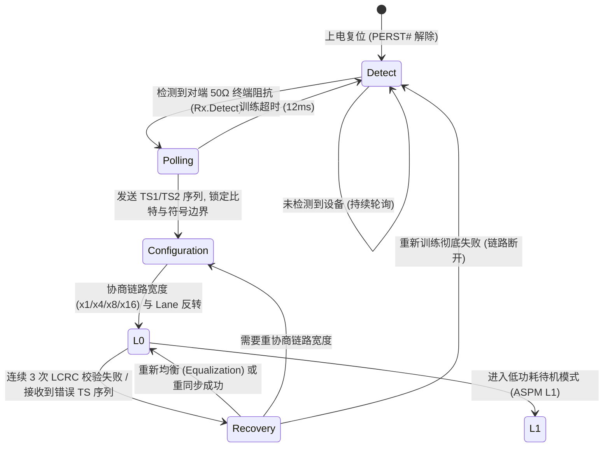
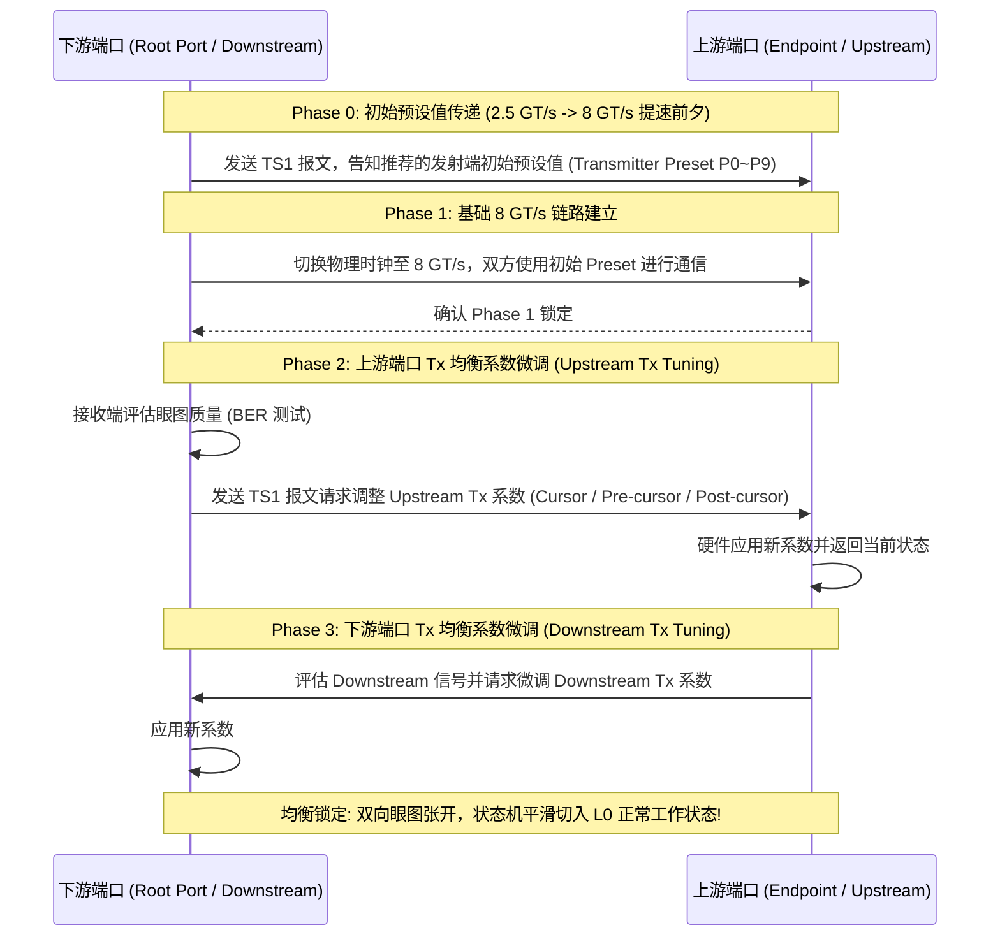
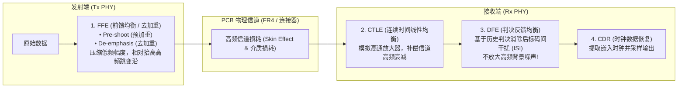
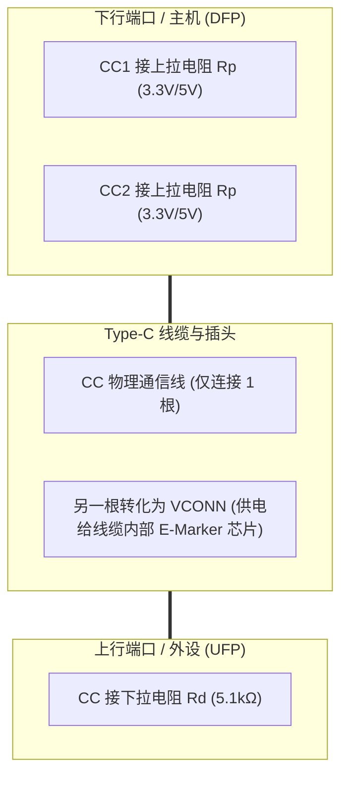

# PCIe LTSSM 状态机、SerDes 信号完整性与 Type-C 均衡校准深度解析

## 1. PCIe LTSSM（链路训练与状态状态机）微架构跃迁图

PCIe 物理层逻辑子层的核心是 **LTSSM（Link Training and Status State Machine）**。系统在上电、复位或检测到严重链路误码时，必须按照严格的状态机进行链路协商：

---

## 2. Gen3 / Gen4 硬件动态均衡（Equalization, EQ）四阶段协议

从 PCIe Gen3（8 GT/s）起，信号在 PCB 走线与连接器上的高频衰减超过 **$-20\text{dB}$**，简单的固定时钟驱动无法张开眼图，必须通过硬件握手执行 **4 阶段动态自适应均衡（Phase 0 ~ Phase 3）**：

---

## 3. SerDes 发送与接收端三大均衡技术原理

### 均衡参数调节法则
1. **Tx FFE 去加重（De-emphasis）**：通过削弱连续相同电平位（Low Frequency）的输出幅度，使得孤立跳变位（High Frequency）在接收端相对凸显，抵消传输线低通滤波效应。
2. **Rx CTLE 峰值增益（Peak Gain）**：在奈奎斯特频率点（如 8GHz）提供 $+6\text{dB} \sim +12\text{dB}$ 的模拟前置放大。
3. **Rx DFE 抽头（Taps）**：现代 Gen4/Gen5 SerDes 配备 4~16 个 DFE Tap，直接在数字判决门限上加减历史符号残余电压，有效打开闭合眼图。

---

## 4. USB Type-C CC 引脚配置与状态机

USB Type-C 通过两根配置通道引脚（**CC1 / CC2**）实现正反插识别与电源角色协商：

- **正反插识别机制**：Host 监测 CC1 和 CC2 的分压。若检测到 CC1 为低分压（被 UFP 的 $5.1\text{k}\Omega$ 下拉），而 CC2 为悬空高电平，则判定为**正插**；反之判定为**反插**。内部多路复用器（Mux）据此动态切换高速差分对路径。
- **供电能力广播**：Host 通过 `Rp` 电阻的阻值向 Device 宣告供电能力：
  - 默认 USB 供电（500mA / 900mA）：`Rp = 56kΩ (5V)`
  - 1.5A @ 5V：`Rp = 22kΩ (5V)`
  - 3.0A @ 5V：`Rp = 10kΩ (5V)`
  - USB PD 协议：通过 CC 线的 BMC（双相标记编码）调制报文，进一步协商高达 20V / 5A (100W~240W) 电压电流。

---

## 5. 常见高速信号完整性故障排查手册

| 故障现象 | 硬件物理根因 | 诊断手段与修复方法 |
| :--- | :--- | :--- |
| **PCIe 链路速率自适应降级（如 Gen3 降为 Gen1）** | 高频衰减过大或均衡（EQ）训练在指定时限内未收敛；TS 错误计数超标 | 查看 LTSSM 寄存器中的 `Recovery.Equalization` 超时标志；优化 PCB 走线，减小过孔数量（Via Stub）；调整 Tx Preset 初始配置（如从 P7 改为 P4） |
| **眼图测试出现严重的抖动（Jitter）超标** | 参考时钟（Refclk）相位噪声过大，或 SerDes 锁相环（PLL）模拟供电（AVDD）存在开关电源纹波 | 测量 100MHz 差分时钟的 TIE 抖动（需 $<1\text{ps}$ RMS）；在 PLL 供电引脚增加专用的超低噪声 LDO 和 $\pi$ 型滤波磁珠 |
| **Type-C 偶尔无法识别插入或只能单面识别** | 保护器件（ESD / TVS 管）寄生电容过大（$>0.5\text{pF}$）破坏高频波形；或 CC 引脚上的 $5.1\text{k}\Omega$ 下拉电阻精度不足（偏离 $\pm 10\%$） | 更换为低容值（$<0.2\text{pF}$）专用高速 ESD 管；检查 PCB 上 CC 引脚焊接与贴片电阻阻值 |
