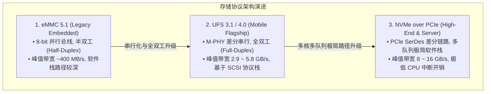
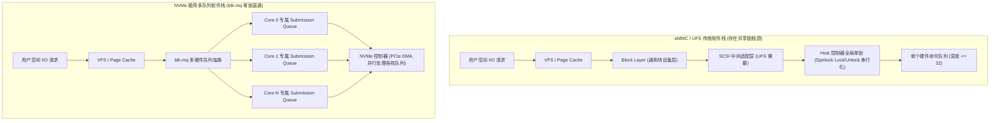
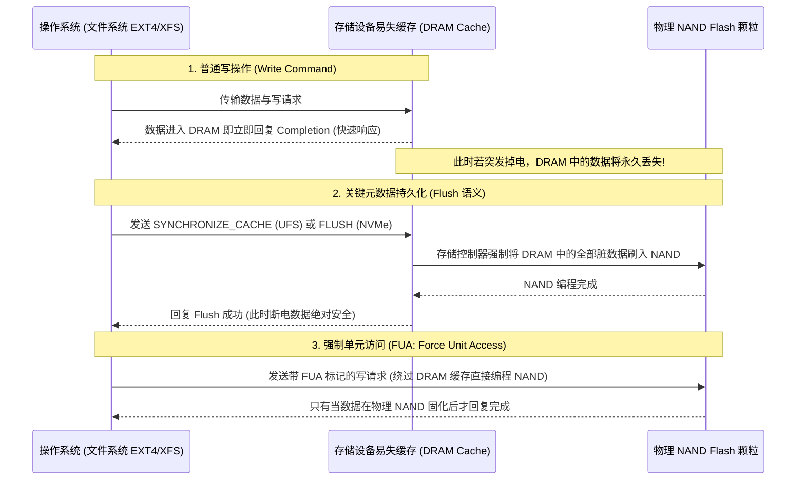

# eMMC 5.1、UFS 3.1/4.0 与 NVMe 存储系统架构、队列模型与性能对比完全指南

## 1. 现代管理型存储三大主流协议全维度对比

管理型存储（Managed Flash）在物理颗粒外部封装了专用的硬件控制器（Controller），负责固件级磨损均衡（Wear Leveling）、坏块替换、垃圾回收（GC）以及纠错（ECC）。在嵌入式、移动终端与高性能计算领域，主要分为 **eMMC、UFS 与 NVMe** 三大阵营：

### 全维度技术参数对比矩阵表
| 参数维度 | eMMC 5.1 | UFS 3.1 / 4.0 | NVMe 1.4 / 2.0 (PCIe 4.0 x4) |
| :--- | :--- | :--- | :--- |
| **物理接口** | 8-bit 并行数据线 + CMD + CLK | M-PHY 差分对（2-Lane 全双工） | PCIe Gen4 SerDes（4-Lane 全双工） |
| **双工机制** | **半双工**（读写无法同时进行） | **全双工**（读写独立物理通道） | **全双工**（读写独立通道） |
| **最大理论带宽** | 400 MB/s (HS400) | 2900 MB/s (UFS 3.1) / 5800 MB/s (UFS 4.0) | 7880 MB/s (PCIe 4.0 x4) |
| **软件驱动模型** | Linux MMC 子系统 | Linux SCSI / UFS 子系统 | 专用 **`blk-mq` NVMe 驱动（直通内核）** |
| **硬件队列结构** | 单队列 CQE（Command Queue Engine, 深度 32） | 单请求列表 UTRL（最多 32 个 UTRD 任务） | **多达 64K 个独立队列对（SQ/CQ）**，每个队列深度可达 64K |
| **多核扩展性** | 差（多核竞争同一个 Host 控制器锁） | 中等（SCSI Tagged Command Queuing） | **极优（每个 CPU 核心绑定专属 SQ/CQ 对，零锁竞争）** |
| **典型 4K 随机读 IOPS** | 15K ~ 30K IOPS | 100K ~ 400K IOPS | 500K ~ 1000K+ IOPS |
| **典型访问延迟** | 100 ~ 200 $\mu\text{s}$ | 30 ~ 60 $\mu\text{s}$ | 8 ~ 20 $\mu\text{s}$ |

---

## 2. 软件驱动栈路径与队列投递机制对比

NVMe 相比 eMMC/UFS 拥有断层式性能优势的核心原因，在于**彻底摒弃了历史包袱沉重的 SCSI 抽象层，实现了 CPU 多核与 PCIe 硬件队列的 1:1 映射**：

---

## 3. 掉电安全性（Power Loss Protection, PLP）与 Flush / FUA 语义

管理型存储设备通常包含两级存储介质：
1. **易失性缓存（Volatile Cache）**：控制器内部的高速 SRAM 或板载 LPDDR，用于写合并、地址映射表缓存与低延迟响应；
2. **非易失性介质（Non-Volatile NAND Flash）**：实际存储数据的物理颗粒。

### 工业级与企业级 PLP 硬件设计
- **无掉电保护设备（消费级 eMMC / 消费级 NVMe）**：突发断电时，DRAM 缓存中未刷盘的脏数据与 FTL 映射表完全丢失，可能导致**文件系统元数据损坏、出现 0 字节文件甚至固件死锁变砖**。
- **带硬件 PLP 设备（车载 / 工业级存储）**：PCB 配备**钽电容阵列**。当供电电压跌落触发掉电中断时，电容放电提供 $5\sim 20\text{ms}$ 的后备电力，控制器在此期间强制将易失缓存与最新 FTL 映射表完整固化到 SLC 缓存区。

---

## 4. 存储调优工程实践：队列深度（Queue Depth）与读写混合瓶颈

### 队列深度与吞吐/延迟的权衡法则
- **低队列深度（QD=1 ~ 4）**：适用于响应速度敏感的交互型业务（如 UI 渲染、数据库行锁同步读）。此时关注**单次 I/O 延迟（Service Time）**，增大 QD 不会提高性能，反而增加排队等待时间。
- **高队列深度（QD=32 ~ 128）**：适用于流式大文件传输与后台批量吞吐任务。此时高 QD 能够充分发挥 NAND 控制器的多通道（Multi-Channel）与多 Die 交织并行度（Die Interleaving），掩盖单颗粒的擦写延迟，跑满总线物理带宽。

### 读写混合场景下的“写阻塞读”现象
- **物理机制**：NAND Flash 的读取仅需 $25\sim 50\mu\text{s}$，但块擦除（Erase）需要 $2\sim 5\text{ms}$，页编程（Program）需要 $500\sim 1500\mu\text{s}$。
- **现象**：当系统后台存在高负载连续写时，偶发的一个小文件读取请求若被排在同一个 NAND Die 的擦除操作之后，读取延迟会从数十微秒瞬间飙升至数毫秒（**长尾延迟毛刺**）。
- **规避方案**：在 UFS/NVMe 中开启 **Erase/Program Suspend** 机制（允许高优先级的读取请求打断正在进行的擦除/编程操作）。
