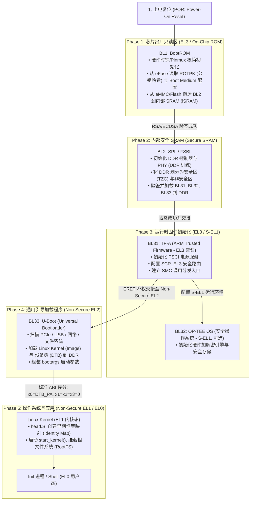
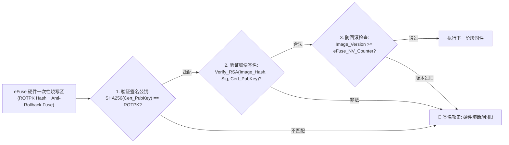
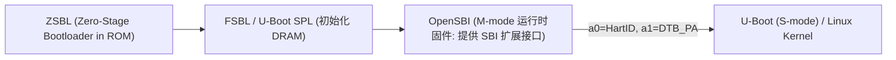

# SoC 安全冷启动链（BootROM / TF-A / U-Boot / Linux）完全指南

## 1. ARM64 工业级冷启动信任链（Chain of Trust, CoT）全景流程图

从 SoC 释放上电复位（Power-On Reset, POR）到最终进入 Linux 用户空间 Shell，系统经历严格分层的特权级演进与密码学校验：

---

## 2. 信任链（Chain of Trust）防回滚与 eFuse 硬件密码学校验

在安全芯片中，每一级固件必须**先验证下一级固件的数字签名与版本号，验证通过后方可跳转执行**：

---

## 3. U-Boot 到 Linux 内核交接时的 ABI 寄存器契约标准

根据 ARM 官方内核启动协议（`Documentation/arm64/booting.rst`），U-Boot 在执行 `booti` 或 `bootm` 跳转至 Linux 内核入口前，**必须满足以下严格硬件状态约束**：

### 核心寄存器传参表
| 寄存器 | 必须填入的值 | 含义与约束 |
| :--- | :--- | :--- |
| **`x0`** | **`DTB 物理基地址（dtb_start_pa）`** | 必须按 **8 字节对齐**，且位于内核可直接访问的 RAM 物理范围内 |
| **`x1`** | **`0x0000000000000000`** | 架构保留，必须置 0 |
| **`x2`** | **`0x0000000000000000`** | 架构保留，必须置 0 |
| **`x3`** | **`0x0000000000000000`** | 架构保留，必须置 0 |

### 硬件环境前置状态原则（若不满足，Kernel 在前 5 条汇编内直接崩溃）
1. **MMU 必须处于关闭状态**：`SCTLR_EL1.M == 0`（内核将自行创建页表）。
2. **D-Cache 必须经过 Clean 并关闭**：`SCTLR_EL1.C == 0`，且传递的 Kernel Image 与 DTB 所在内存区域已通过 `DC CVAC` 刷回 DDR。
3. **I-Cache 可以开启或关闭**：但若开启，必须在此之前执行 `IC IALLU`。
4. **中断必须全部屏蔽**：`PSTATE.DAIF = 0b1111`（禁止所有 Debug, SError, IRQ, FIQ 异常）。
5. **CPU 必须处于 EL2（推荐）或 EL1**：如果系统支持虚拟化，推荐以 Non-secure EL2 进入，以便 KVM 能够正常接管 Hypervisor 资源。

---

## 4. RISC-V 启动链标准体系（OpenSBI M-mode 到 Linux S-mode）

RISC-V 架构遵循类似的模块化交接标准：

- **传参契约**：
  - `a0` 寄存器：存放当前启动 Hart 的硬件 ID（`hartid`）。
  - `a1` 寄存器：存放 Device Tree 物理基地址（`fdt_addr`）。

---

## 5. 常见关键启动陷阱与排查手册

### 陷阱 1：DTB 地址与内核解压区域重叠（Memory Overlap Collision）
- **故障现象**：U-Boot 打印 `Starting kernel ...` 后串口永久无声，系统挂死。
- **微架构根因**：
  - U-Boot 将 DTB 放置在 `0x8200_0000`，将 `Image` 放置在 `0x8008_0000`；
  - Linux 内核启动早期会将自身解压并自解构拷贝，内核 BSS 段向高地址扩张，**直接将 `0x8200_0000` 处的设备树覆盖篡改**；
  - 内核在 `early_init_dt_scan()` 时读取到了被破坏的魔数（`OF_DT_MAGIC != 0xd00dfeed`），直接陷入死循环。
- **规避**：在 U-Boot 环境中将 `fdt_addr_r` 显式设置在远离内核映像的高物理内存区域（如 `0x8800_0000`）。

### 陷阱 2：防回滚熔丝（Anti-Rollback Fuse）提前烧写导致“变砖（Brick）”
- **故障现象**：OTA 固件升级失败后触发 A/B 分区回滚，系统连 BootROM 都无法通过，彻底变砖。
- **根因**：OTA 升级程序在刚刚写入新固件镜像后，**尚未确认系统能否成功启动并完成自检，就提前通过 SMC 调用将 eFuse 的 NV Counter 熔断递加**；当新固件崩溃触发回滚至旧 Slot A 时，BootROM 发现旧固件版本号小于 eFuse 中的新计数器，判定为降级攻击直接拒启。
- **关键准则**：**eFuse Anti-Rollback 熔丝的烧写必须在系统进入新系统用户态且确认健康运行（`mark_boot_successful`）后作为最终确认步骤执行！**
