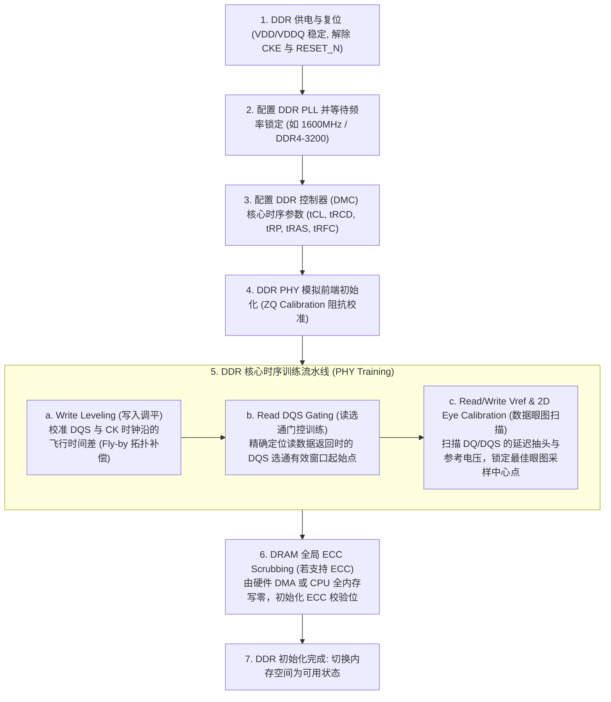
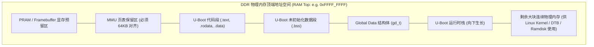

# DDR 训练初始化、U-Boot 内存重定位与系统交接深度解析

## 1. DDR 控制器与 PHY 训练（Training）微架构流程

在 SoC 启动的 SPL（Secondary Program Loader）或 BL2 阶段，DDR 物理内存尚未可用，代码必须在有限的芯片内部 SRAM（iSRAM）中运行。初始化外部 DDR 颗粒是一个涉及精确模拟时序与数字校准的复杂闭环过程：



### 关键点：为什么支持 ECC 的系统必须在初始化时进行内存清零（Scrubbing）？
- 当 DRAM 颗粒首次上电时，内部电容存储单元处于随机未定义状态（包含随机的 0 和 1），而对应的 ECC 校验位（Check Bits）并未与数据位计算匹配。
- 若软件在开启 ECC 纠错控制器后**直接读取尚未写入过的内存**，ECC 逻辑会检测到数据位与校验位严重冲突，瞬间误判为**不可纠正的多比特错误（Uncorrectable Error / SError）**。因此，初始化阶段必须对全部 DDR 空间进行显式写零填充。

---

## 2. U-Boot 自身内存重定位（Relocation）机制

U-Boot 早期由 SPL 加载到 DDR 中的某个固定地址运行（例如 `0x8020_0000`）。为了将连续、规整且最大化的低端物理内存完整留给 Linux 内核，**U-Boot 在 `board_init_f()` 执行完毕后会将自身整体搬移到 DDR 的最顶端区域**。



### 动态重定位关键执行步骤
1. **计算目标基地址**：`board_init_f` 根据总 RAM 容量计算出 `gd->relocaddr`（顶端基地址）。
2. **代码与数据拷贝**：将 `__image_copy_start` 到 `__image_copy_end` 的所有指令和数据从旧地址完整复制到 `gd->relocaddr`。
3. **修正动态重定位表（`.rela.dyn` Fixup）**：
   - U-Boot 编译时使用 `-fPIE`（位置无关可执行文件）并生成 `.rela.dyn` 段。
   - 重定位代码遍历该段中的每一个符号重定位条目，根据偏移量公式：
     $$	ext{New\_Addr} = 	ext{Original\_Addr} + (	ext{gd->relocaddr} - 	ext{TEXT\_BASE})$$
     原地修正所有全局变量指针与绝对跳转地址。
4. **切换执行流**：更新栈指针 `SP`，跳转至新位置的 `board_init_r()` 继续运行。

---

## 3. 系统级内存预留与交接布局（Reserved Memory Map）

在从 U-Boot 跳转进入 Linux 内核前，系统必须形成统一、互不重叠的内存空间划分：

| 内存物理区域 | 拥有者与特权级 | 用途说明 | DTS 声明方式 |
| :--- | :--- | :--- | :--- |
| `0x8000_0000 ~ 0x8007_FFFF` | **TF-A / BL31 (EL3)** | EL3 运行时常驻代码与 PSCI 栈 | `reserved-memory` (`no-map`) |
| `0x8008_0000 ~ 0x8200_0000` | **Linux Kernel (EL1)** | Linux 内核代码与初始数据段 | 内核加载基地址 |
| `0x8200_0000 ~ 0x8300_0000` | **DTB & Initramfs** | 设备树二进制与内存文件系统 | U-Boot 传参地址 |
| `0x8400_0000 ~ 0x8800_0000` | **OP-TEE OS (S-EL1)** | 安全世界 Trusted OS 专属内存 | `reserved-memory` (`no-map`) |
| `0x8800_0000 ~ 0x9000_0000` | **CMA / Framebuffer** | 连续物理内存分配池与多媒体显存 | `linux,cma-default` |
| `0x9000_0000 ~ Top` | **Linux Buddy System** | 操作系统常规动态物理内存 | `memory` 节点管理 |

---

## 4. 移交内核前的硬件环境清理契约

在执行 `bootm` / `booti` 的最后时刻，U-Boot 必须执行**外设静默（Quiesce）操作**，否则会导致新启动的内核发生非预期异常：

```c
/* U-Boot 跳转内核前的关键硬件排空操作 */
void boot_prep_linux(void)
{
    /* 1. 禁用所有由 U-Boot 启动的硬件外设 DMA (如以太网、USB 控制器) */
    eth_halt();
    usb_stop();

    /* 2. 屏蔽并清除中断控制器中所有已悬挂的中断 (GIC) */
    disable_interrupts();

    /* 3. 彻底清理并失效 Cache */
    flush_dcache_all();
    invalidate_icache_all();

    /* 4. 关闭 D-Cache 与 MMU (ARM64 启动协议要求) */
    dcache_disable();
    mmu_disable();
}
```

---

## 5. 常见内存交接故障与排查手册

| 故障现象 | 硬件/软件根因 | 排查与修复方法 |
| :--- | :--- | :--- |
| **内核启动时随机页表损坏（Spurious Page Table Corruption）** | U-Boot 在加载网络或 USB 镜像后**未停止外设 DMA**；内核接管内存并建立页表后，残留的 DMA 传输向原缓冲区写入数据，恰好破坏了内核新建的页表项 | 确保在 `bootm` 前调用 `eth_halt()` 和 `usb_stop()` 关闭外设 Master 使能 |
| **开启 ECC 后内核冷启动触发同步外部中止（External Abort）** | SPL 仅对部分 RAM 进行了清零初始化，未覆盖全部物理内存，当内核扫描高位内存页时触发 ECC 校验异常 | 在 SPL 中使用 DMA 或硬件加速器对整片 DDR 物理空间完成 Scrubbing 清零 |
| **重定位后 U-Boot 访问全局变量死机** | 编译时未开启 `-fPIE` 选项，或链接脚本中 `.rela.dyn` 段被意外丢弃，导致重定位后符号未完成 Fixup | 检查编译参数与链接脚本中的 `__rel_dyn_start` 导出符号 |
