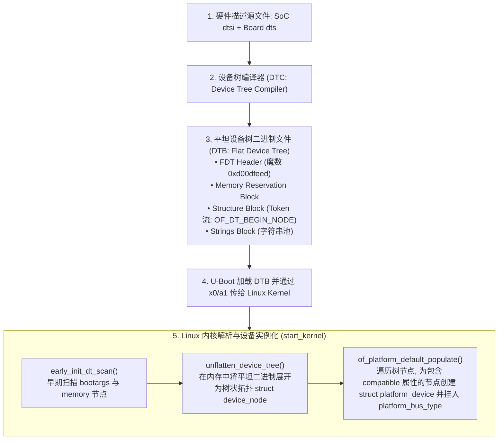
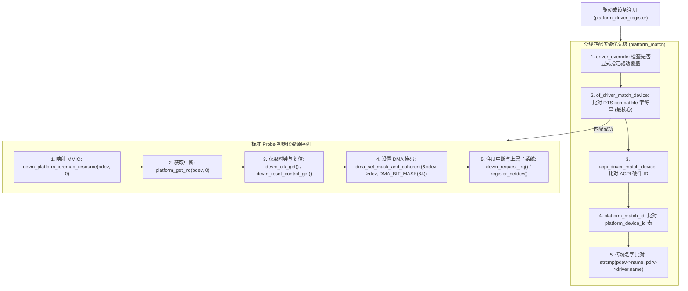
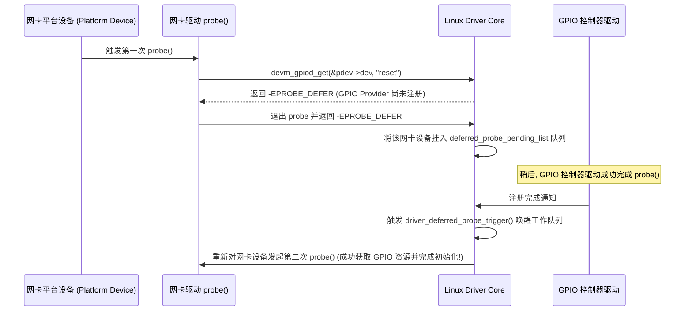

# Device Tree 体系、Linux 驱动模型与 Platform 匹配机制完全指南

## 1. Device Tree 全生命周期：从源码 DTS 到内核 Device Node 树

在现代 ARM/RISC-V 架构中，设备树（Device Tree）用于解耦硬件描述与操作系统内核代码。其全生命周期处理流水线如下：



---

## 2. Platform 驱动匹配算法与 Probe 执行全景图

Linux 内核总线驱动模型（Bus-Device-Driver Model）在设备或驱动注册时，自动触发匹配与探测流水线：



---

## 3. 依赖反转与延迟探测（Deferred Probe）微架构机制

### 为什么需要 Deferred Probe？
在 Linux 内核启动过程中，驱动加载顺序通常是并发且不确定的。如果设备驱动 A（如网卡驱动）在 `probe()` 过程中需要请求 GPIO 控制器 B 提供的复位引脚，而 GPIO 驱动 B 此时尚未完成加载与注册，驱动 A 无法获取该资源。



---

## 4. Device Tree 核心节点编写与语法约束

```dts
/* 典型 SoC 片上外设节点定义 */
uart0: serial@1c28000 {
    compatible = "ns16550a", "snps,dw-apb-uart"; /* 优先匹配具体厂商，次选通用驱动 */
    reg = <0x0 0x01c28000 0x0 0x1000>;         /* 64位基地址与 4KB 长度 */
    interrupts = <GIC_SPI 48 IRQ_TYPE_LEVEL_HIGH>;/* GIC SPI 中断号 48，高电平触发 */
    clocks = <&ccu CLK_BUS_UART0>, <&ccu CLK_UART0>;
    clock-names = "pclk", "sclk";
    resets = <&ccu RST_BUS_UART0>;
    pinctrl-names = "default";
    pinctrl-0 = <&uart0_pins>;
    status = "okay";                           /* 开启该设备 */
};
```

---

## 5. 常见设备树与驱动匹配故障排查手册

| 故障现象 | 硬件/DTS 语法根因 | 诊断手段与修复方法 |
| :--- | :--- | :--- |
| **设备节点未生成 `platform_device`** | 节点缺少 `compatible` 属性，或父节点为非总线节点且未声明 `simple-bus` | 检查节点是否包含合法的 `compatible`；若为子节点，确保父节点的 compatible 包含 `"simple-bus"` |
| **`reg` 地址解析错误导致访存崩溃** | 父节点的 `#address-cells` 与 `#size-cells` 与子节点 `reg` 数组的元组长度不匹配 | 检查父节点的 cells 声明（64位地址通常 `#address-cells = <2>`, `#size-cells = <2>`） |
| **驱动 Probe 永远不被调用** | DTS 中的 `compatible` 字符串与驱动源码中 `of_match_table` 存在大小写或下划线拼写差异 | 查看 `/sys/firmware/devicetree/base/` 确认加载的实际 DTS 内容；对比 `modinfo` 中的匹配表 |
| **系统无限死锁在 Deferred Probe** | 存在环形依赖（如 A 依赖 B 的 Clock，B 依赖 A 的 Regulator） | 启用内核调试参数 `initcall_debug`，查看 `deferred_probe` 循环超时警告 |
