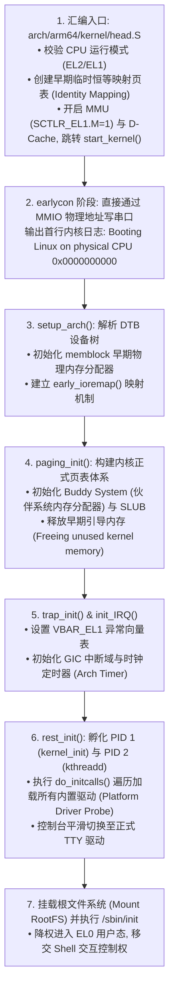
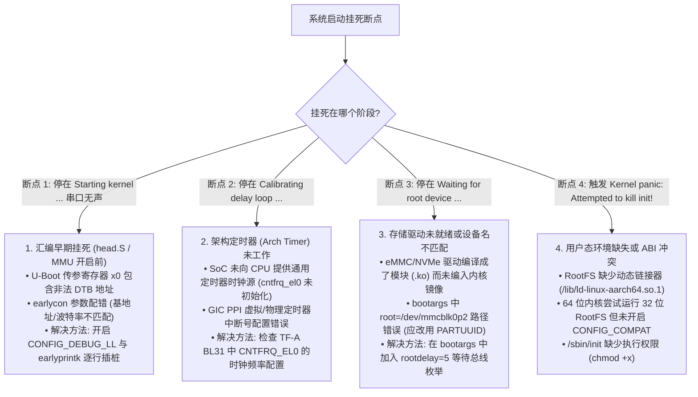

# 操作系统引导全流程、挂死断点排查与 Panic 现场定位完全指南

## 1. Linux 内核早期启动关键里程碑时序图

Linux 从接收 U-Boot 控制权到最终生成第一个用户空间进程（PID 1: `/sbin/init`），经历以下 7 个关键执行阶段：



---

## 2. 启动挂死（Boot Hang）经典四大断点定位决策树



---

## 3. `earlycon` 与正式 TTY 驱动交接时的日志丢失排坑

- **微架构机制**：
  - `earlycon` 是一个极简的无中断轮询驱动，在内核启动前几毫秒通过 bootargs 参数直接操作 MMIO 寄存器（`earlycon=uart8250,mmio32,0x01c28000,115200`）；
  - 当内核执行到 `tty_init()` 并 probe 正式串口驱动（如 `8250_dw.c`）时，内核会注销 `earlycon` 并接管该串口硬件。
- **故障排查**：若配置参数（如引脚波特率分频系数、时钟源）在 DTS 与 earlycon 中不一致，串口在交接瞬间会被重新初始化并输出乱码，导致随后的全部崩溃日志丢失。确保 DTS 中的 `clocks` 属性与 bootargs 中的时钟频率绝对吻合。

---

## 4. RTOS（FreeRTOS / Zephyr）HardFault 故障排查手册

在微控制器与实时操作系统中，系统崩溃通常直接触发 **HardFault / UsageFault / MemManageFault**：

```c
/* FreeRTOS / ARM Cortex-M HardFault 堆栈反解汇编桩函数 */
void HardFault_Handler_C(uint32_t *hardfault_args)
{
    uint32_t r0  = hardfault_args[0];
    uint32_t r1  = hardfault_args[1];
    uint32_t r2  = hardfault_args[2];
    uint32_t r3  = hardfault_args[3];
    uint32_t r12 = hardfault_args[4];
    uint32_t lr  = hardfault_args[5]; /* 函数返回地址 */
    uint32_t pc  = hardfault_args[6]; /* 触发 Fault 的指令 PC */
    uint32_t psr = hardfault_args[7];

    /* 检查 CFSR 综合症寄存器 (Configurable Fault Status Register) */
    uint32_t cfsr = (*((volatile uint32_t *)(0xE000ED28)));

    /* 核心排查:
     * 1. 若 CFSR.STKOF == 1: 任务栈深度耗尽 (Stack Overflow)
     * 2. 若 CFSR.UNALIGNED == 1: 非对齐访问
     * 3. 若 CFSR.NOCP == 1: 在未开启 FPU 协处理器前执行了浮点运算指令
     */
}
```
