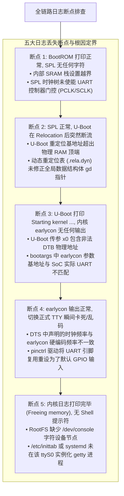
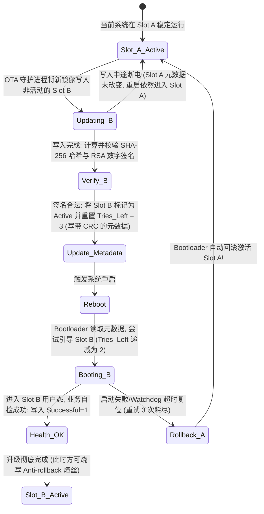

# 启动交接断点推演、A/B 分区抗掉电状态机与热复位数据踩踏深度分析

## 1. 串口日志丢失五大断点精确定界时序图

在 SoC 冷启动链路上，控制台日志（Console Log）是观察系统生命周期的唯一窗口。日志在某一步骤突然消失，标志着特定的软硬件初始化断层：



---

## 2. 设备树 `reg` 地址偏差引发的物理总线行为推演

假设某外设在 SoC 互联中的物理基地址为 `0x01C28000`，若 DTS 中因笔误写为 `0x01C29000`（偏移了 4KB），系统会发生何种行为？

```mermaid
flowchart LR
    Access["CPU 访问错误基地址: 0x01C29000"] --> Bus_Decode{"NoC / AXI 总线解码器匹配"}

    Bus_Decode -->|情况 A: 命中相邻外设寄存器窗口| Wrong_Reg["严重逻辑混乱: 误操作了相邻外设 (如修改了定时器或看门狗)"]
    Bus_Decode -->|情况 B: 命中片上未映射地址空洞 (Unmapped Hole)| DecErr["总线返回 DECERR: CPU 触发 Synchronous External Abort 崩溃"]
    Bus_Decode -->|情况 C: 命中安全受保护区域 (TrustZone Carveout)| SlvErr["TZC 防火墙阻断并返回 SLVERR / 产生安全入侵警报"]
```

- **驱动防范实践**：高质量驱动在 `probe()` 完成 `ioremap` 后的第一件事，**必须读取硬件的版本寄存器（`IP_VERSION`）或魔数 ID（`IP_MAGIC`）并做断言校验**。严禁仅凭 `ioremap` 返回非空即假定硬件正常。

---

## 3. A/B 双分区 OTA 升级防断电状态机推演

嵌入式系统在 OTA 升级过程中遭遇突然拔电，是导致设备“变砖”的高发原因。工业级系统采用基于元数据校验的双分区回滚机制：



---

## 4. 热复位（Warm Reset）残留 DMA 内存踩踏与防御

- **故障场景**：Linux 发生软件复位（`reboot`）或看门狗热复位。
- **微架构根因**：
  - CPU 核心和部分外设控制器被复位，**但外部 PCIe 网卡或自研高速 DMA 引擎可能未接收到硬件复位信号，仍保持运行态**；
  - 外部网卡继续向先前的 DDR 接收缓冲区执行 DMA 写入；
  - 此时新启动的 U-Boot 或 Linux 内核将该片物理内存重新分配给页表或内核堆栈；
  - **残留的 DMA 写入直接覆盖破坏了新内核的内存数据，导致随机、难以复现的启动崩溃**。
- **防御机制**：
  - 在 BootROM / SPL 早期执行阶段，根据复位原因寄存器（Reset Reason Register）判断是否为 Warm Reset；
  - 如果是热复位，**在使能 MMU 和初始化内存分配器之前，向总线控制器下发全局 Master 隔离命令（Isolation / Gate），强制复位所有片上 DMA 子系统并排空（Drain）互联总线**。
