# ARM64 与 RISC-V 完整引导链、运行时固件与 ABI 寄存器传参完全指南

## 1. ARM64 与 RISC-V 工业级引导链架构对比

```mermaid
flowchart TD
    subgraph ARM64_Boot_Chain ["ARM64 安全多特权级引导链"]
        POR_ARM["上电复位 (POR)"] --> BL1_ARM["BL1: BootROM (EL3)"]
        BL1_ARM --> BL2_ARM["BL2: SPL / FSBL (SRAM / Secure EL1)"]
        BL2_ARM --> BL31_ARM["BL31: TF-A 运行时固件 (常驻 EL3)\n提供 PSCI / SMC 安全服务"]
        BL31_ARM --> BL32_ARM["BL32: OP-TEE (可选 S-EL1)"]
        BL31_ARM --> BL33_ARM["BL33: U-Boot (Non-secure EL2)"]
        BL33_ARM --> Linux_ARM["Linux Kernel (Non-secure EL1)"]
    end

    subgraph RISCV_Boot_Chain ["RISC-V 模块化引导链"]
        POR_RV["上电复位 (POR)"] --> ZSBL_RV["ZSBL: Zero-Stage Bootloader (ROM)"]
        ZSBL_RV --> FSBL_RV["FSBL / U-Boot SPL (DRAM 训练)"]
        FSBL_RV --> OpenSBI_RV["OpenSBI: 运行时固件 (常驻 M-mode)\n提供 SBI 规范服务 (Timer, IPI, HSM)"]
        OpenSBI_RV --> UBoot_RV["U-Boot (S-mode)"]
        UBoot_RV --> Linux_RV["Linux Kernel (S-mode)"]
    end
```



---

## 2. 跨阶段移交时的 ABI 寄存器传参精确标准

### 2.1 ARM64 引导传参规范（ARMv8-A Boot Protocol）
在 U-Boot（BL33）向 Linux 内核跳转的瞬间：
- **`x0` 寄存器**：**设备树二进制（DTB）的 64 位物理基地址（PA）**，必须保证 **8 字节对齐**；
- **`x1` 寄存器**：`0x00000000_00000000`（架构保留，置 0）；
- **`x2` 寄存器**：`0x00000000_00000000`（架构保留，置 0）；
- **`x3` 寄存器**：`0x00000000_00000000`（架构保留，置 0）；
- **PSTATE 状态**：`PSTATE.DAIF = 0b1111`（所有异常全部屏蔽），MMU 与 D-Cache 必须关闭。

### 2.2 RISC-V 引导传参规范（RISC-V Linux Boot Protocol）
在 OpenSBI / U-Boot 向 Linux 内核（S-mode）跳转的瞬间：
- **`a0` 寄存器**：**当前引导 Hart 的物理硬件 ID（`hartid`）**；
- **`a1` 寄存器**：**设备树二进制（DTB）的物理基地址（`fdt_addr`）**；
- **从属 Hart（Secondary Harts）状态**：全部处于 M-mode 的 OpenSBI HSM（Hart State Management）挂起等待状态，等待 Linux 主核通过 `sbi_hart_start()` 远程唤醒。

---

## 3. 设备树 `/chosen` 节点与运行时动态修剪（FDT Fixup）

Bootloader 在跳转内核前，负责动态探测内存容量与启动介质，并对内存中的 DTB 进行原地修改（Fixup）：

```dts
chosen {
    bootargs = "console=ttyS0,115200 root=PARTUUID=12345678-02 rw rootwait earlycon";
    stdout-path = "serial0:115200n8";
    linux,initrd-start = <0x0 0x84000000>;
    linux,initrd-end   = <0x0 0x85000000>;
    kaslr-seed         = <0x1a2b3c4d 0x5e6f7a8b>; /* 硬件真随机数种子 (TRNG) */
};
```
- **内存对齐防踩踏准则**：U-Boot 在执行 `fdt_chosen()` 插入参数前，必须确保分配给 DTB 的内存区域预留了至少 **$64\text{KB}$ 的扩容填充空间（Padding）**，防止新增节点导致平坦树溢出破坏紧邻的内存。
