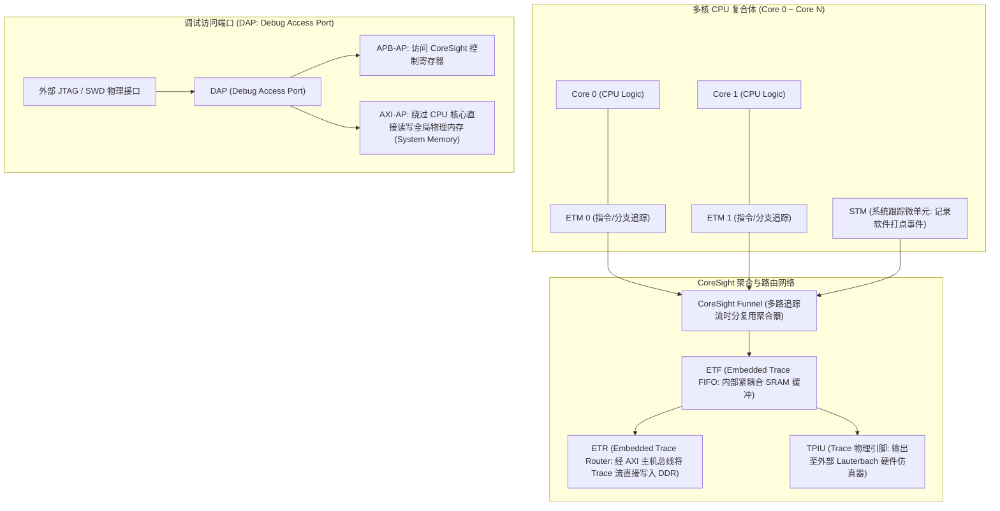
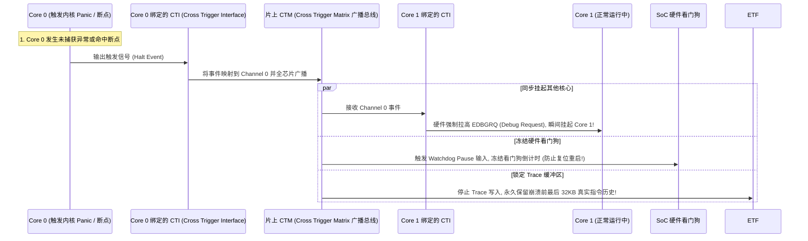
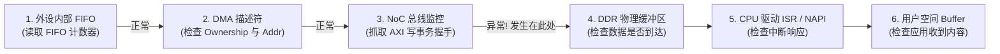

# 调试方法论、CoreSight 硬件架构与非侵入式 Trace 完全指南

## 1. ARM CoreSight 硬件调试与 Trace 数据流全景拓扑

在复杂的多核 SoC 中，依靠打日志（`printk`）不仅会引入巨大的时间开销（Heisenbug 效应），而且在死锁或异常挂死时往往无法输出。ARM 体系结构采用专用的 **CoreSight 硬件调试与追踪子系统**：

---

## 2. 交叉触发矩阵（CTI / CTM）与全核同步冻结机制

在多核对称多处理（SMP）系统中，若某个 CPU 核心陷入死锁或触发断点，如果仅将该核心 Halt，**其余 CPU 核心、片上 DMA 以及硬件看门狗仍在继续运行，会迅速覆写内存破坏现场**。

---

## 3. 硬件断点、软件断点与观察点（Watchpoint）微架构对比

| 调试原语 | 实现机制与微架构原理 | 适用场景与限制 |
| :--- | :--- | :--- |
| **硬件断点 (Hardware Breakpoint)** | 由 CPU 内部专用的硬件比较器寄存器（`DBGBVR` / `DBGBCR`）监视当前取指 PC，地址匹配时触发 Debug 异常 | **唯一可用于 ROM / Flash 只读代码段的断点方式**；数量有限（ARM 核心通常仅提供 4~8 个硬件断点） |
| **软件断点 (Software Breakpoint)** | GDB 调试器将目标内存处的原始机器码读取保存，并原地替换为一条 `BRK #0`（ARM）或 `EBREAK`（RISC-V）指令 | 数量不受限制；**只能在 RAM 内存中生效**；自修改代码必须配合 D-Cache 刷回与 I-Cache 失效 |
| **数据观察点 (Watchpoint)** | 由专用数据地址比较器（`DBGWVR` / `DBGWCR`）监视 LSU 访存地址，匹配指定变量的 Load（读）或 Store（写） | 用于**精确定位内存踩踏（Memory Corruption）的罪魁祸首**；数量极少（通常 2~4 个） |

---

## 4. 复杂外设数据流“二分定界法（Bisection Path Method）”

当高速外设（如 NVMe、PCIe 网卡）出现数据丢失或错乱时，建立结构化观测矩阵，寻找**最后一个正常状态点**与**第一个异常状态点**：

- **定界结论**：若步骤 3（NoC AXI 写事务已成功握手）正常，但步骤 4（DDR 缓冲区内容未更新），直接排查 **Cacheline 脏行逐出（Dirty Eviction）覆写** 或 **DDR 控制器交织映射配置错误**。
