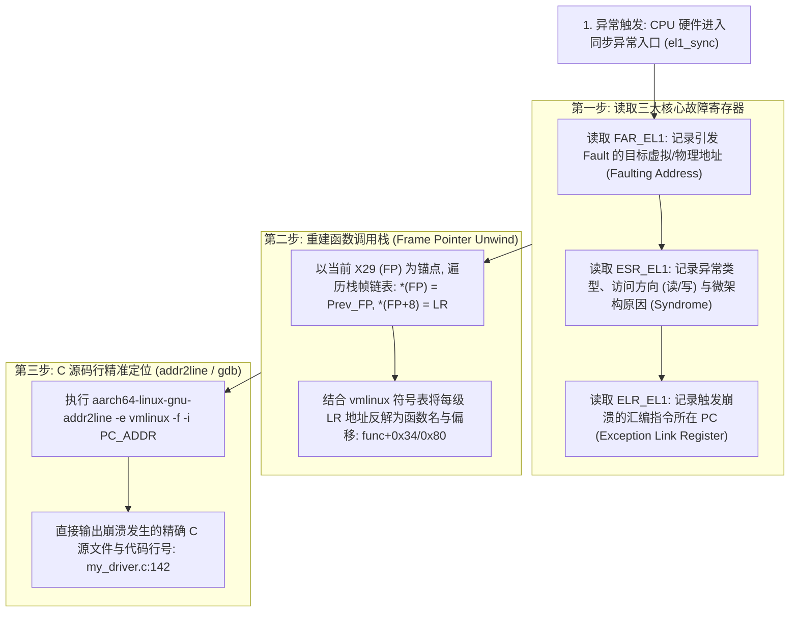
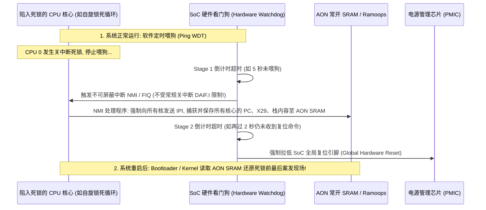

# ARM64 Crash 现场还原、ESR 综合症反解与死锁定位完全指南

## 1. Linux Oops / Panic 现场寄存器反解三步法

当 Linux 内核遭遇不可恢复的同步异常或空指针时，CPU 硬件与内核异常处理框架会自动打印结构化的 Crash Dump：



---

## 2. `ESR_EL1` 寄存器 32 位二进制字段深度反解字典

`ESR_EL1`（Exception Syndrome Register）是定位一切内核崩溃的“黑匣子”：

```text
 31       26 25  24 23 22 21 20 19      16 15 14 13 12 11 10 9 8 7 6  5          0
+-----------+---+--+-----+--+--+----------+--+--+--+--+--+--+-+-+-+-+-+------------+
|    EC     |IL |  | SAS |  |  |   SRT    |  |  |  |  |  |  | | | | |W|    DFSC    |
+-----------+---+--+-----+--+--+----------+--+--+--+--+--+--+-+-+-+-+-+------------+
```

### 核心位域含义详解
1. **`Bit[31:26] (EC: Exception Class)` —— 异常大类判定**：
   - `0x01`：`WFI / WFE` 指令被截获（Trapped）。
   - `0x15`：来自 AArch64 用户态的系统调用（`SVC`）。
   - `0x20` / `0x21`：指令中止（Instruction Abort：取指缺失或只读段执行违例）。
   - `0x22`：PC 指针未对齐异常（PC Alignment Fault）。
   - `0x24` / `0x25`：**数据中止（Data Abort：最常见！0x25 代表内核态自身触发）**。
   - `0x26`：栈指针未对齐异常（SP Alignment Fault，必须 16 字节对齐）。

2. **`Bit[6] (WnR: Write not Read)` —— 访存方向**：
   - `0`：这是一次 **读操作（Load）** 触发的故障。
   - `1`：这是一次 **写操作（Store）** 触发的故障。

3. **`Bit[23:22] (SAS: Syndrome Access Size)` —— 访问宽度**：
   - `0b00`：Byte (1B) | `0b01`：Halfword (2B) | `0b10`：Word (4B) | `0b11`：Doubleword (8B)。

4. **`Bit[5:0] (DFSC: Data Fault Status Code)` —— 微架构具体根因**：
   - `0x04 ~ 0x07`：**Translation Fault (L0~L3 级页表未建立映射 / 空指针)**。
   - `0x09 ~ 0x0B`：**Access Flag Fault (AF 位未置 1)**。
   - `0x0D ~ 0x0F`：**Permission Fault (写只读页或内核访问用户页)**。
   - `0x10` / `0x14`：**Synchronous External Abort (总线返回 DECERR/SLVERR)**。
   - `0x21`：**Alignment Fault (非对齐访问 Device MMIO 区域)**。

---

## 3. Frame Pointer 调用栈链表遍历与栈破坏检测

ARM64 标准 ABI 规定 **`X29` 作为帧指针（Frame Pointer, FP）**，`X30` 作为返回地址寄存器（Link Register, LR）：

```mermaid
flowchart TD
    subgraph Stack_Memory ["内核栈内存布局 (高地址 → 低地址向下生长)"]
        Frame1["Function A 栈帧\n... 本地变量 ...\n(FP+8): Caller A's LR\n(FP+0): Caller A's FP"]
        Frame2["Function B 栈帧\n... 本地变量 ...\n(FP+8): Return to Function A LR\n(FP+0): Pointer to Function A's FP"]
        Frame3["Function C (当前崩溃函数) 栈帧\n... 本地变量 ...\n(FP+8): Return to Function B LR\n(FP+0): Pointer to Function B's FP (X29 指向此处)"]
    end

    Frame3 -->|解引用 *(X29)| Frame2
    Frame2 -->|解引用 *(Prev_FP)| Frame1
```

- **栈破坏识别**：若遍历过程中发现 `Prev_FP` 的值不在当前内核栈的有效地址范围内（例如读出 `0xdeadbeef` 或全零），说明发生了**栈缓冲区溢出（Stack Buffer Overflow）**，此时打印的 Call Trace 可能会在被篡改处中断。

---

## 4. 两阶段看门狗（Two-Stage Watchdog）与死锁全景捕获机制

硬死锁（Hard Lockup）发生时，由于本地中断被关闭，常规定时器无法执行。工业级 SoC 普遍采用**两阶段看门狗机制**：



---

## 5. 常见 Crash 诊断速查矩阵

| 崩溃特征日志 | 核心诊断结论 | 最速定位手段 |
| :--- | :--- | :--- |
| `ESR = 0x96000004`, `FAR = 0x00000000` | **绝对空指针解引用**：代码直接解引用了 `NULL` 指针 | 用 `addr2line` 反查崩溃 PC，检查传入指针是否未判空 |
| `ESR = 0x96000005`, `FAR = 0x00000038` | **结构体成员空指针解引用**：`ptr` 为 NULL，访问了 `ptr->field`（偏移量 0x38） | 检查对应结构体中偏移 56 字节的字段 |
| `ESR = 0x9600000f`, `WnR = 1` | **写保护权限违例**：尝试向只读代码段或被 `const` 保护的内存写入 | 检查是否试图修改驱动只读常量或 Hook 未解保护的代码 |
| `ESR = 0x96000021` | **Device 内存非对齐访问**：使用 64 位指令读取了未 8 字节对齐的 MMIO | 检查寄存器访问宏，使用 `readl()` (32位) 代替 `readq()` (64位) |
| `ESR = 0x96000010` (External Abort) | **总线访问未响应/挂死**：访问了处于 Gate Off（时钟关闭）或未上电的外设寄存器 | 检查时钟控制器（CRU）与电源域（PD）状态 |
