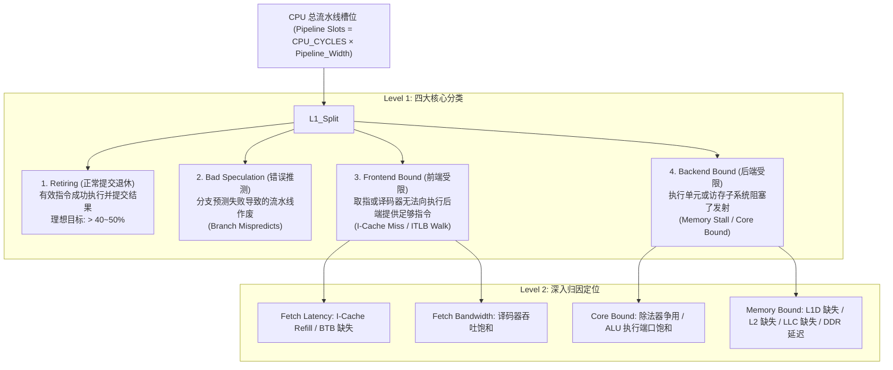
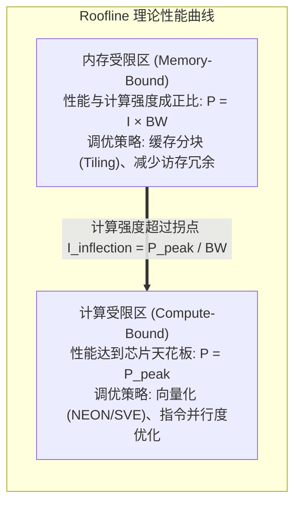
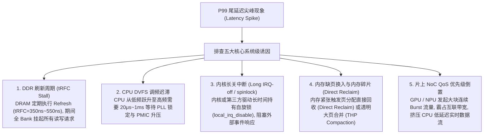

# 全栈性能分析：Top-Down 归因、Roofline 模型与长尾延迟排查完全指南

## 1. Top-Down 微架构性能分析方法论（TMAM）

在现代超标量乱序执行处理器中，单纯观察 CPU 利用率（%CPU）已无法揭示性能瓶颈。现代性能工程采用 **Top-Down 微架构分析法（Top-Down Microarchitecture Analysis Method, TMAM）**，将 CPU 流水线所有发射槽位（Pipeline Slots）在时钟周期级别进行分类归因：

---

## 2. Roofline 性能瓶颈模型与计算强度分析

**Roofline 模型**用于直观判断某个算法的性能瓶颈究竟是受限于 **芯片算力峰值（Compute Peak）** 还是 **内存总线带宽（Memory Bandwidth）**：

### 核心数学公式
1. **计算强度（Arithmetic Intensity, $I$）**：
   $$I = \frac{\text{总计算量 (FLOPs 或 Operations)}}{\text{总内存搬运量 (Bytes 访问 DDR)}}$$
2. **可达到的理论最大性能（Performance, $P$）**：
   $$P = \min\left(P_{\text{peak}}, \; I \times \text{Bandwidth}_{\text{DDR}}\right)$$
- **工程诊断法则**：若算法的计算强度 $I < \frac{P_{\text{peak}}}{\text{Bandwidth}_{\text{DDR}}}$，则该算法处于**内存受限区**。此时单纯优化算术逻辑（如换用更快算法）无法带来加速，必须通过**数据局部性提升、Cache 驻留与压缩数据传输**来提升性能。

---

## 3. 全链路性能指标与 PMU 硬件事件映射表

| 瓶颈领域 | 核心性能指标 | ARMv8/v9 标准 PMU 事件 | Linux `perf` 采集指令与分析方法 |
| :--- | :--- | :--- | :--- |
| **整体执行** | **IPC**（每周期指令数） | `INST_RETIRED` (0x08) `CPU_CYCLES` (0x11) | `perf stat -e instructions,cycles ./app` $\text{IPC} = \frac{\text{instructions}}{\text{cycles}}$（若 $< 0.8$ 需深入排查） |
| **分支预测** | 分支失准率 | `BR_MIS_PRED` (0x10) `BR_PRED` (0x12) | `perf stat -e branch-misses,branches ./app` 失准率 $> 5\%$ 表明控制流分支过于随机 |
| **指令缓存** | I-Cache 缺失率 | `L1I_CACHE_REFILL` (0x01) `L1I_CACHE` (0x14) | `perf stat -e L1-icache-load-misses,L1-icache-loads ./app` |
| **数据缓存** | D-Cache 缺失率与 MPKI | `L1D_CACHE_REFILL` (0x03) `L2D_CACHE_REFILL` (0x17) | $\text{MPKI} = \frac{\text{L1D\_REFILL} \times 1000}{\text{INST\_RETIRED}}$ |
| **页表翻译** | TLB Walk 延迟 | `DTLB_WALK` (0x35) `ITLB_WALK` (0x34) | TLB Walk 周期占比高需考虑配置 **2MB / 1GB 大页（Huge Pages）** |
| **多核伪共享** | Cacheline 跨核颠簸 | `LL_CACHE_MISS_RD` MESI Remote HITM | `perf c2c record -F 60000 ./app && perf c2c report` 直接检测多核竞争的高发 Cacheline |

---

## 4. 长尾延迟（P99 / P999 Tail Latency）根因排查体系

在对实时性敏感的系统（如车载座舱、工业网关、低延迟交易）中，平均延迟可能非常优异，但 **P99 / P999 尾延迟** 经常出现数毫秒至数百毫秒的异常尖峰（Jitter）。

---

## 5. 性能调优实战排查路线图

1. **第一步（整体定性）**：运行 `perf stat -d ./app` 查看 IPC、Branch Miss 与 Cache Miss；若 IPC 处于高位（$>1.5$）且性能仍不达标，说明算法复杂度本身较高，需从业务逻辑算法层面优化。
2. **第二步（热点下钻）**：运行 `perf record -g ./app` 结合 `perf report` 或生成火焰图（FlameGraph），精确定位耗费周期最多的顶层函数与内联汇编行。
3. **第三步（存储与多核分析）**：
   - 检查工作集大小，优化结构体内存布局以贴合 64 字节 Cacheline 边界；
   - 若多核扩展性随核心数增加反而下降，使用 `perf c2c` 定位 False Sharing 热点；
   - 针对长尾延迟，使用内核跟踪工具 `ftrace`（`irqsoff`, `preemptoff` 跟踪器）捕捉最长关中断时间。
