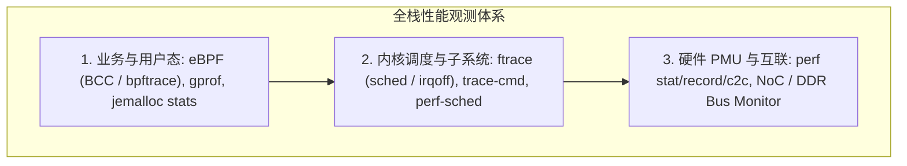

# 性能诊断工具链、A/B 对照实验设计与三大经典案例复盘

## 1. Linux 性能诊断工具矩阵与分层定位

性能分析必须构建从用户空间、内核子系统到物理硬件的多维立体观测体系：

### 工具选型与指标矩阵
| 工具名称 | 核心观测指标 | 侵入性与开销 | 适用场景 |
| :--- | :--- | :--- | :--- |
| **`perf stat`** | IPC, Cache Miss, Branch Miss, Cycle 占比 | 极低（硬件计数器采样） | 宏观定性：判断是算力受限还是内存受限 |
| **`perf record -g`** | CPU 热点调用栈（FlameGraph 火焰图） | 低（按时钟周期中断采样） | 定位代码热点函数与热点指令行 |
| **`perf c2c`** | HITM（Modified Cacheline 跨核命中）、False Sharing | 中等 | 多核扩展性劣化与伪共享定位 |
| **`ftrace`** | `sched_switch`, `irqsoff`, `preemptoff` | 低~中 | 调度抖动、硬中断屏蔽延迟与长尾 Jitter |
| **`bpftrace`** | 块设备 I/O 延迟直方图（`biolatency`）、系统调用耗时 | 极低（动态 JIT 探针） | 生产环境无侵入故障排查与延迟分布统计 |

---

## 2. 经典案例复盘 1：DRAM 周期性刷新（$t_{\text{RFC}}$）引发的 7.8$\mu$s 尾延迟毛刺

- **现象**：某车载雷达信号处理任务平均延迟 $2\mu\text{s}$，但每隔数毫秒必然出现一次高达 $10\mu\text{s}$ 的延迟毛刺，导致偶发丢帧。
- **排查链路**：
  1. `ftrace` 确认 CPU 核心未被任何硬中断抢占，上下文未发生切换；
  2. PMU 计数器显示在毛刺发生窗口，CPU 的 `STALL_BACKEND_MEM` 骤增；
  3. 挂接 DDR 控制器性能监测仪，发现毛刺时间点与 **DDR 定期刷新命令（Auto-Refresh）** 严格同步；
  4. **微架构根因**：根据 JEDEC 规范，DRAM 颗粒每隔 $7.8\mu\text{s}$（$t_{\text{REFI}}$）必须执行一次全 Bank 刷新操作（$t_{\text{RFC}} = 350\text{ns} \sim 550\text{ns}$），期间所有正常的读写请求被强制排队等待。
- **解决方案**：在 DDR 控制器中开启 **Per-Bank Refresh（逐 Bank 轮流刷新）** 模式，分散刷新开销；并将实时雷达数据缓冲区锁定在片内 SRAM（TCM）中。

---

## 3. 经典案例复盘 2：Cache 对齐优化后性能反而严重下降

- **现象**：工程师为消除结构体多核伪共享，将所有成员变量全部按 `____cacheline_aligned`（64 字节）填充，测试发现系统吞吐量反而下降了 $25\%$。
- **微架构根因**：
  - 过度 Padding 使得原本 16 字节的结构体膨胀至 256 字节，**数据工作集体积扩大了 16 倍**；
  - L1/L2 D-Cache 的容量仅有 32KB/512KB，膨胀后的结构体迅速填满 Cache，导致 **L1/L2 D-Cache Miss 激增，DDR 总线带宽被占满**；
  - 伪共享的收益被巨大的 Cache 缺失惩罚完全抵消。
- **规范实践**：仅对**跨多核高频并发写入的热点字段**进行 Cacheline 隔离，冷字段与只读字段保持紧凑打包（Compact Packing）。
