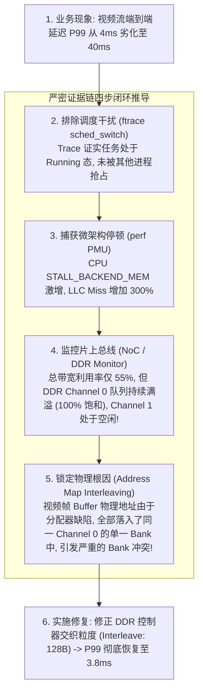
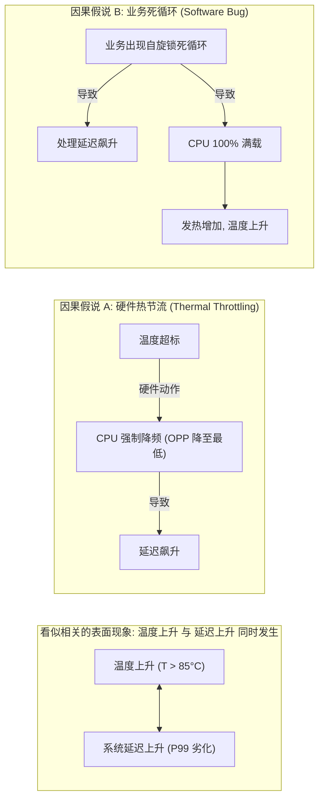

# 性能证据链推导、因果关系定界与工程报告实战

## 1. 结构化性能证据链推导模型

在性能调优与故障排查中，切忌“猜测式打补丁”。标准工程分析必须建立**从顶层现象到物理底层闭环的不可辩驳证据链**：



---

## 2. 性能计数器相关性 vs 因果性判断准则

在性能分析中，“两个指标同时升高”绝不等于存在因果依赖：



### 时序先后判别法定界：
- 查看事件高精度时间戳（Timeline）：
  - 若 `Thermal Throttle Interrupt` **先于** IPC 下降发生 $\to$ 属于假说 A（散热或硬件供电问题）；
  - 若 CPU 利用率暴涨 **先于** 温度缓慢爬升发生 $\to$ 属于假说 B（软件并发或死锁问题）。

---

## 3. 标准工业级性能与故障复盘报告模板

一份可供同行评审（Peer Review）与复现的合格工程报告必须具备以下核心要素：

```text
================================================================================
【性能问题排查与根因分析报告】
1. 核心结论 (Summary)
   - 现象：万兆网卡在 64B 小包转发时吞吐仅达 4.2Mpps (目标 14.88Mpps)。
   - 根因：RX 缓冲区在非一致性 DMA 架构下，驱动频繁调用 dma_sync 执行 Cache 失效，消耗了 72% 的 CPU 周期。
   - 结果：开启硬件 I/O 一致性 (dma-coherent) 并优化描述符环后，吞吐达标至 14.2Mpps。

2. 复现环境与基准 (Environment)
   - 硬件版本: SoC Rev B0, DDR4-3200 16GB, Kernel 5.15.0-arm64
   - 固件与 Build ID: TF-A v2.8 (Commit a1b2c3d)

3. 证据链 (Evidence Timeline)
   - [00:01:23] perf top 显示 arch_sync_dma_for_cpu 占用率 71.8%。
   - [00:02:15] ARM PMU 事件 L1D_CACHE_REFILL 达到 820 MPKI。

4. 修复与验证 (Fix & Verification)
   - 补丁: [PATCH] net: driver: enable hardware snoop via dma-coherent in DTS.
   - 连续 48 小时线速压力测试，零丢包，CPU 利用率从 98% 降低至 23%。

5. 剩余风险与跟进 (Remaining Risks)
   - PCIe 早期批次固件存在 No-Snoop 属性兼容问题，需配合升级网卡 Option ROM。
================================================================================
```
