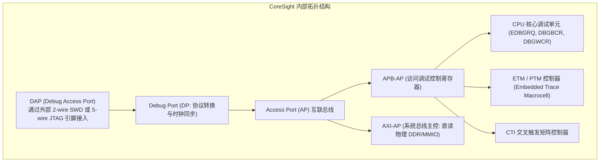
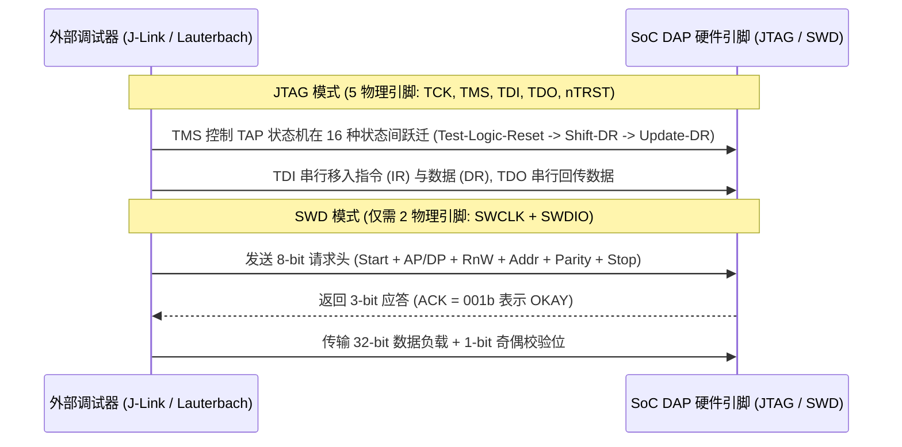

# ARM CoreSight 硬件调试组件、JTAG/DAP 协议与 ETM Trace 深度剖析

## 1. ARM CoreSight 调试体系架构（Debug & Trace Architecture）

CoreSight 是 ARM 架构定义的片上硬件调试与追踪规范，它在物理芯片内独立于 CPU 计算核心，构建了一套专用的调试互联子系统：

---

## 2. JTAG 与 SWD 协议底层通信时序

- **SWD 优势**：仅用 2 根引脚即可实现与 JTAG 相当的调试带宽（最高达 50MHz 时钟），极大节省了芯片封装引脚（Pin Count）与 PCB 走线面积。

---

## 3. ETM 非侵入式追踪（Instruction & Data Trace）与压缩编码

**ETM（Embedded Trace Macrocell）** 能够在 CPU 全速运行（如 3.0GHz）时，以**硬件零侵入（Zero Intrusion）** 的方式实时捕获每条指令的执行流：

### ETM 硬件流压缩算法机制
由于引脚带宽限制，ETM 不可能输出每条指令的完整 PC。它采用极高压缩比的 **分支追踪算法（Branch-only Compression）**：
1. **顺序执行**：对于顺序执行的指令，ETM **不输出任何追踪数据**（调试器利用离线 ELF 文件直接反汇编推进 PC）；
2. **条件分支**：仅输出 1 个比特：`1` 代表分支跳转成功（Taken），`0` 代表未跳转（Not-taken）；
3. **间接跳转（Indirect Jump / Function Call）**：输出目标函数的完整物理 PC 地址。
- **效果**：平均每条执行指令仅需消耗 **$1 \sim 2$ 个比特** 的 Trace 数据带宽，使得片内 32KB ETF 环形缓冲能够记录数十万条历史执行指令！
