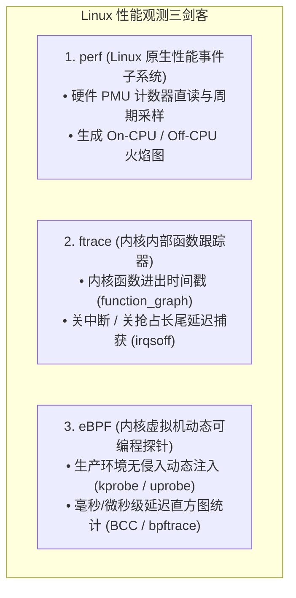

# Linux 性能工具链实战：perf、ftrace、eBPF 与火焰图完全指南

## 1. 现代 Linux 性能剖析三剑客对比



---

## 2. On-CPU 火焰图生成全流程与采样实战


- **火焰图判读法**：
  - **X 轴（宽度）**：代表该函数及其子函数占用 CPU 采样周期的**相对比例（越宽耗费 CPU 越多）**；
  - **Y 轴（高度）**：代表函数调用栈深度（最顶端为当前正在执行的叶子函数）；
  - **优化目标**：寻找火焰图顶端最平、最宽的“平顶山”（Plateau），此处即为最核心的性能热点。

---

## 3. 使用 `ftrace` 捕捉微秒级关中断（IRQ-off）延迟

当实时任务出现偶发性响应超时时，使用 `irqsoff` 跟踪器定位内核最长关中断代码段：

```bash
# 挂载 tracefs
cd /sys/kernel/debug/tracing

# 1. 设置跟踪器为 irqsoff (追踪 local_irq_disable 到 enable 的最长区间)
echo irqsoff > current_tracer

# 2. 设置延迟捕获阈值 (例如超过 100μs 记录)
echo 100 > tracing_thresh

# 3. 开启跟踪
echo 1 > tracing_on
# ... 运行测试负载 ...
echo 0 > tracing_on

# 4. 查看捕获报告 (精准指出关中断的起始/结束函数及调用栈)
cat trace | head -n 30
```

---

## 4. 常用性能监控命令速查

```bash
# 监控每核 CPU 中断与上下文切换速率
mpstat -P ALL 1

# 实时监测内存脏页与回写压力
sar -B 1 10

# 捕获块设备 I/O 队列等待与服务时间
iostat -xz 1
```
