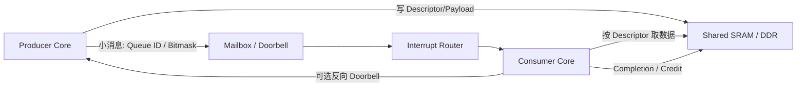

# 通信模型与系统边界

## 1. 先识别参与者

“多核”至少包含三类不同问题，不能用同一套 API 和一致性假设处理。

| 系统形态 | 典型参与者 | 地址空间 | 调度与故障域 | 常见通信方式 |
| --- | --- | --- | --- | --- |
| SMP | 多个 Cortex-A/RISC-V Hart | 通常共享内核页表 | 同一 OS 调度 | 锁、原子变量、IPI、每核队列 |
| AMP | Linux A 核运行域 + RTOS/M 核 | 可能只共享一段物理内存 | 独立启动、独立崩溃 | Mailbox + Shared Memory、RPMsg |
| 异构加速 | CPU + DSP/NPU/GPU | CPU VA、IOVA、设备 VA 并存 | 驱动管理设备固件 | Command Queue、Doorbell、DMA Fence |
| 多 Die/Chiplet | 不同 Die 上的处理器 | 可能经过一致性或非一致性桥 | 链路可独立复位 | CXL/CHI C2C/私有消息协议 |

设计前必须回答：

1. 双方看到的地址是 VA、PA、IOVA 还是某个本地总线地址？
2. 共享区是否 Cache Coherent？一致性范围覆盖哪些 Agent？
3. 接收端是否可能独立复位、掉电或停钟？
4. 谁负责分配共享内存，谁负责回收？
5. 通知是边沿还是电平？重复写是否会合并？
6. 发送者如何确认对方已经消费，而不是仅收到中断？

## 2. 数据通道与控制通道

高吞吐系统通常不会把 Payload 逐字节塞进 Mailbox 寄存器，而采用“双通道”结构：

- 数据通道承担容量，适合批量和零拷贝；
- 控制通道承担低延迟通知，只携带队列号、事件位或少量参数；
- Completion 是协议状态，不能用“中断已经送达”代替；
- Doorbell 可以合并，因此接收端必须依据共享队列状态循环 Drain，不能假定一次中断只对应一条消息。

## 3. 一致性域与 Shareability

同一片 DDR 并不等于共享数据天然可见：

- SMP CPU 核通常位于同一 Inner Shareable 一致性域，但仍需要内存序原语；
- MCU/DSP 端口可能绕过 CPU Cache，一侧必须通过平台 Cache API 维护共享区；
- 一些片上 SRAM 不可缓存，避免了一致性维护，却提高了访问延迟；
- SMMU/IOMMU 可能让设备地址与 CPU PA 不同，双方协议不能直接交换普通指针；
- Secure/Non-secure、Realm、PMP 或总线防火墙可能让物理地址存在但访问被拒绝。

推荐把共享区契约写成表格并随固件发布：

| 字段 | 示例 |
| --- | --- |
| CPU PA | `0x8800_0000` |
| Remote Bus Address | `0x6000_0000` |
| 长度 | 8 MiB |
| Cache 属性 | CPU Normal WB；Remote Non-cacheable |
| 所有权 | Host 分配，Remote 不得释放 |
| 同步方式 | Host Clean；Remote 无 Cache 维护 |
| 通知 | Mailbox Channel 3，电平中断 |

## 4. 通信语义

应明确协议提供哪一种保证：

- **Best Effort**：队列满时允许丢弃，适合统计或 Trace；
- **At Most Once**：最多处理一次，但崩溃可能丢消息；
- **At Least Once**：超时重发，接收端必须去重；
- **Exactly Once Effect**：通常通过事务 ID、持久化状态和幂等操作实现，不能只依赖可靠中断；
- **Ordered**：是全局有序、每通道有序，还是只保证同一事务内有序；
- **Bounded Latency**：需要同时约束排队、互联、IRQ 屏蔽和处理时间。

## 5. 常见错误

### 把虚拟地址直接发给异构核

Linux 指针只在当前页表上下文有意义。Remote 可能需要物理地址、设备地址或资源表协商后的 Device Address。规避方法是使用共享内存 Offset、I/O 地址映射或框架提供的 Buffer Handle。

### 假设双方结构体布局一致

32/64 位 ABI、对齐规则、大小端和编译器 Padding 都可能不同。跨核 ABI 应使用固定宽度整数、显式 Offset/Length、规定字节序，并用静态断言检查结构体尺寸。

### 把“多核”误等同为 SMP

AMP 辅核可以在 Host 正常运行时重启。协议必须包含 Generation、Epoch 或 Session ID，使旧 Completion 不会完成新会话中的请求。
