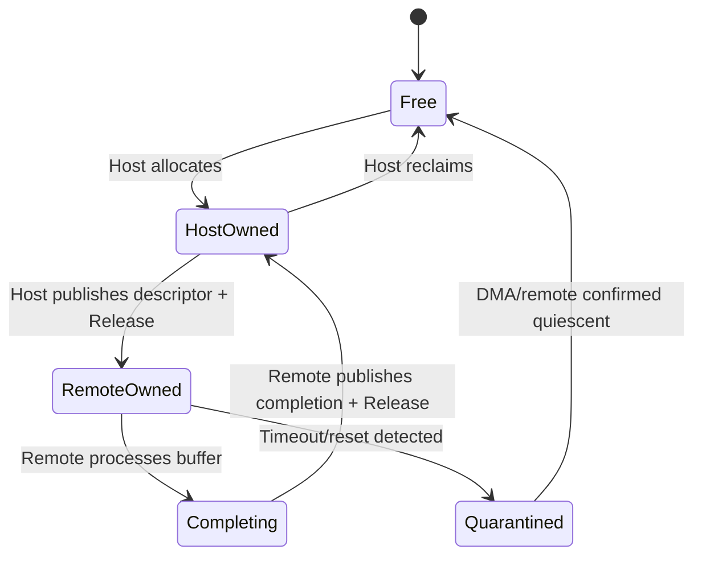

# 共享内存、Mailbox 与所有权协议

## 1. 共享内存布局

一个可维护的共享区至少应分成控制头、描述符区和 Payload Pool：

```text
+0x0000  protocol_header
         magic, ABI version, feature bits, epoch, state
+0x1000  tx_ring
         producer index, consumer index, descriptors
+0x5000  rx_ring
+0x9000  buffer_pool
+...     crash_log / trace buffer
```

控制头不要与高频 Producer/Consumer Index 共用 Cache Line。否则状态轮询会导致无关字段不断在核心间迁移，形成 False Sharing。

```c
struct ipc_header {
    uint32_t magic;
    uint16_t major;
    uint16_t minor;
    uint32_t features;
    uint32_t epoch;
    uint32_t state;
};
```

跨核 ABI 不应放裸指针、`long`、位域、编译器相关枚举或柔性对齐结构。协议字段应规定：

- 固定宽度和大小端；
- 结构长度，允许新版本尾部扩展；
- Offset 的基准地址；
- 保留字段必须写零、接收端忽略未知字段；
- Major 不兼容时拒绝启动，Minor/Feature 通过协商兼容。

## 2. Ownership 状态机

共享内存最危险的错误是双方同时认为自己可以写。



所有权移交必须满足两个条件：数据先可见，状态位后可见。以 Host 提交为例：

```c
desc->addr = buffer_da;
desc->len = length;
desc->cookie = cookie;

/* 保证字段写入先于 OWN 发布。具体原语由平台决定。 */
atomic_store_explicit(&desc->owner, OWNER_REMOTE,
                      memory_order_release);
ring_doorbell();
```

接收端只有通过 Acquire 观察到新 Owner/Index 后，才能读取前面的描述符字段。

## 3. Coherent 与 Non-coherent

### 硬件一致性共享区

硬件一致性避免显式 Clean/Invalidate，但不消除内存屏障。若 Producer 先让 Doorbell 可见、Payload 仍滞留在 Store Buffer，Consumer 仍可能读到旧字段。

### 非一致性共享区

典型发送顺序是：

1. Producer 写 Payload 和 Descriptor；
2. Clean 覆盖完整 Cache Line 范围；
3. 执行平台要求的完成/排序屏障；
4. 发布 Producer Index 或 Owner；
5. 写 Mailbox/Doorbell。

典型接收顺序是：

1. Ack 或屏蔽通知源；
2. Invalidate 接收端将要读取的控制区；
3. Acquire 读取 Producer Index；
4. Invalidate 新增描述符和 Payload；
5. 处理消息并发布 Consumer Index；
6. 若队列仍非空，继续 Drain，不能立即退出 ISR/线程。

具体 Cache API、PoC/PoU 和屏障由处理器与 BSP 决定。Linux 侧优先使用 DMA API；RTOS 侧必须核对 Cache Line 大小、地址别名和维护指令作用域。

### PoU、PoC 是观察点，不是固定的 Cache 层级

Arm 中的 Point of Unification（PoU）和 Point of Coherency（PoC）描述可见性边界，不能直接写成“L2 就是 PoU、SLC 就是 PoC”。下面只是一个可能的实现，实际位置必须查处理器、互联和 SoC 手册：

```text
CPU L1 D/I Cache
       │
       ├── 可能的统一点（PoU）
       │
CPU Cluster Cache ── Coherent Interconnect ── System Cache ── DDR
                                  ▲
                                  └── PoC 的具体位置由实现决定
```

- `DC CVAU` 是 Clean by VA to PoU，常用于自修改代码或装载可执行代码后的 I/D Cache 同步；
- `DC CVAC` 是 Clean by VA to PoC，适用场景仍取决于目标 Agent 的观察路径；
- `DC IVAC` 是 Invalidate by VA to PoC。若目标行包含本核尚未写回的私有脏数据，直接失效可能丢失这些修改；
- Cache 维护指令完成后通常还需要规定域和强度的屏障，不能把“执行过 Clean”当成“对端现在一定可以读取”。

因此，协议文档应记录“接收方从哪个观察点取数据、共享区经过哪些 Cache/互联、使用哪个平台 API”，而不是只记录一条汇编指令。

### Linux DMA API 表达所有权转换

`dma_sync_single_for_device()` 与 `dma_sync_single_for_cpu()` 不能简单等同于某条 Arm Cache 指令。它们只适用于已经通过 `dma_map_single()` 等接口建立的 Streaming DMA Mapping，实际操作由 DMA Direction、平台一致性和 IOMMU/SWIOTLB 实现共同决定。

```c
dma_addr = dma_map_single(dev, buffer, size, DMA_BIDIRECTIONAL);
if (dma_mapping_error(dev, dma_addr))
    return -EIO;

/* CPU 写完，移交给设备或可按 DMA Agent 建模的 Remote。 */
dma_sync_single_for_device(dev, dma_addr, size, DMA_BIDIRECTIONAL);
ring_doorbell();

/* 收到完成通知后，先把所有权取回 CPU，再访问内容。 */
dma_sync_single_for_cpu(dev, dma_addr, size, DMA_BIDIRECTIONAL);
consume(buffer);

dma_unmap_single(dev, dma_addr, size, DMA_BIDIRECTIONAL);
```

映射地址、长度和 Direction 必须与原调用一致。若 Remote Core 并未注册成 Linux DMA Device，不能为了“顺手刷 Cache”伪造 `struct device` 调 DMA API；此时应使用该 SoC 为共享 Carveout 提供的专用一致性接口。

### Invalidate 踩踏相邻数据

Cache 维护以 Cache Line 为粒度。若接收 Buffer 与栈变量、Slab 中的其他对象或对端正在更新的字段共用一行，Invalidate 可能丢弃本核脏数据，Clean 又可能把旧内容写回并覆盖对端新值。

规避方式不是简单地把起始地址向下取整，而是同时满足：

1. Buffer 起点和长度覆盖范围按双方最大维护粒度隔离；
2. 同一 Cache Line 在同一阶段只有一个写入者；
3. 接收 Buffer 不放在栈上，也不与普通 Heap 对象拼在同一行；
4. 分配器保证首尾两侧的 Padding 不被其他对象复用；
5. 发布所有权后，本端停止读写，直到对端归还。

## 4. Mailbox 寄存器设计

常见硬件寄存器包括：

| 寄存器 | 作用 | 软件注意点 |
| --- | --- | --- |
| `TX_DATA` | 写入少量消息或事件位 | 确认深度与写满行为 |
| `TX_STATUS` | Full/Empty/Credit | 轮询必须有 Timeout |
| `SET` | 置位目标核通知 | 常为 Write-1-to-Set |
| `CLEAR` | 清除本地中断 | 常为 Write-1-to-Clear |
| `MASK` | 屏蔽通道 | 修改时防止丢失并发事件 |
| `ROUTE` | 目标核/安全域 | 通常只能由特权固件配置 |

### 电平通知的正确处理

对于“队列非空即拉高中断”的电平模型：

```text
读取/保存 Pending
→ 清除或屏蔽 Mailbox 源
→ Drain 共享队列
→ 再次检查队列与 Pending
→ 确认都为空后解除屏蔽
```

若先 EOI、后清外设源，中断会立即再次进入；若 Clear 与新事件并发且寄存器语义理解错误，则可能把新事件一起清掉。

## 5. 故障与规避

### Doorbell 早于数据

症状是接收端偶尔看到正确 Index，却读到零或上一条消息。应检查发布前的 Release/Cache Clean，以及 MMIO 写之前的平台 I/O 排序要求。

### 丢 Doorbell

Doorbell 可能合并多个写。协议必须以 Ring 状态为真相，中断只是提示。接收端每次被唤醒都应处理到 Consumer Index 追上 Producer Index。

### Cache Line 踩踏

双方分别修改同一行中的不同字段，在非一致性系统中可能互相覆盖。Producer 与 Consumer 私有字段应按共享系统的维护粒度隔离，并避免对包含对端新数据的行执行错误的 Clean。

### Remote Reset 后旧消息复活

共享 DDR 可能在 Remote Reset 后仍保留旧 Ring。双方握手时递增 `epoch`，所有 Descriptor 携带 Epoch；不匹配的 Completion 必须丢弃。

## 6. 规范与实现资料

- [Arm：Caches and self-modifying code](https://developer.arm.com/community/arm-community-blogs/b/architectures-and-processors-blog/posts/caches-self-modifying-code-implementing-clear-cache)：PoU 级数据与指令 Cache 维护示例；
- [Linux Dynamic DMA Mapping Guide](https://docs.kernel.org/core-api/dma-api-howto.html)：Streaming Mapping、Direction、Sync 与 Unmap 生命周期；
- [Linux DMA API](https://docs.kernel.org/core-api/dma-api.html)：DMA Mapping 接口语义与边界条件。
