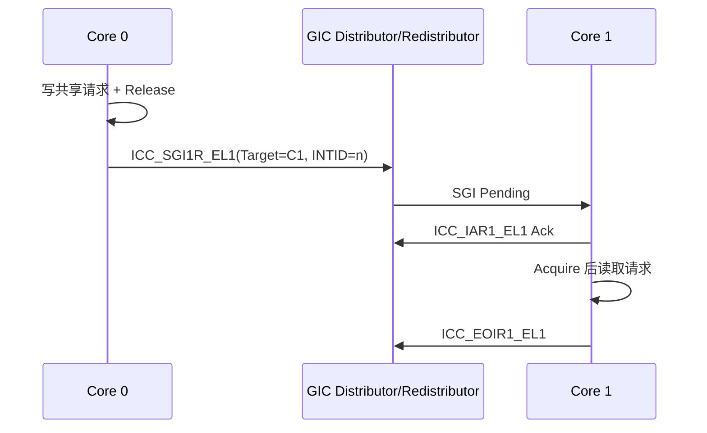

# IPI、Doorbell 与中断路由

## 1. 三种通知方式

| 机制 | 典型场景 | 数据容量 | 特点 |
| --- | --- | --- | --- |
| CPU IPI/SGI | SMP 调度、TLB Shootdown | 通常只含中断号 | 延迟低，目标为 PE/CPU Mask |
| Mailbox | CPU 与 MCU/DSP | 数位到数个 Word | 可跨电源/时钟域，常带 FIFO |
| Doorbell/MSI | Queue 通知、加速器 | 通常是 MMIO Write | Payload 在共享内存，通知可合并 |

通知通道不承担数据一致性。发送 IPI 之前仍需完成共享状态发布。

## 2. ARM GIC SGI

GICv3 中，软件可通过 `ICC_SGI1R_EL1` 向目标 PE 发送 SGI。关键字段表达目标 Affinity、目标列表和 INTID。操作系统通常封装成 `smp_call_function*()`、Reschedule IPI、TLB Shootdown 等接口，驱动不应自行写系统寄存器。

安全状态、Interrupt Group 和异常级是三个不同维度。下表描述寄存器职责，不把它们固定绑定到某一个操作系统：

| 寄存器 | 主要职责 | 容易混淆的地方 |
| --- | --- | --- |
| `ICC_SGI0R_EL1` | 生成 Group 0 SGI | 是否可访问取决于当前异常级、安全状态和 GIC 配置 |
| `ICC_SGI1R_EL1` | 为当前 Security State 生成 Group 1 SGI | 不是“只供 Non-secure EL1 使用” |
| `ICC_ASGI1R_EL1` | Alias Group 1 SGI 接口，用于目标另一 Security State 的相应场景 | 目标组别还受 `GICD_IGROUPR`、`GICD_IGRPMODR` 等配置影响 |
| `ICH_LR<n>_EL2` | Hypervisor 描述待注入 Guest 的虚拟中断 | 这是常规虚拟中断注入入口之一 |
| `ICH_AP0R<n>_EL2`、`ICH_AP1R<n>_EL2` | 保存虚拟 CPU 接口的 Active Priority 状态 | 不是“发送或注入 vSGI”的寄存器 |

GICv4 的 vSGI/VLPI 直接注入还涉及 ITS、vPE 和 Redistributor 状态，不能用一个 `ICH_AP1R_EL2` 概括。排查虚拟 IPI 时，应分别观察 Guest 请求、Hypervisor List Register 或直接注入状态、物理中断路由以及目标 vCPU 是否正在运行。



常见问题：

- Affinity 层级计算错误，SGI 发给了错误 Cluster；
- 目标 CPU Offline 或处于不接收该组中断的状态；
- Priority Mask、Group Enable 或安全路由阻止送达；
- 接收端长时间关闭 IRQ，导致 IPI 延迟尾部恶化；
- 把 IPI 到达误当成远端操作已经完成，缺少 Completion/Ack。

## 3. RISC-V IPI

RISC-V 将 IPI 作为平台机制：旧平台常通过 CLINT 的 `msip` 或 ACLINT MSWI；采用 AIA 时，可以向目标 Hart 的 IMSIC Interrupt File 写入 MSI。PLIC/APLIC主要负责外部中断，不能笼统当作传统 IPI 寄存器。

S-mode 软件通常调用 SBI IPI/RFENCE 接口，由 M-mode Runtime 根据平台实现发送通知。跨 Hart TLB Shootdown 还需要目标 Hart 本地执行 `SFENCE.VMA`，发送一个软件中断本身不会失效远端 TLB。

采用 AIA/IMSIC 后，每个 Hart 可以包含面向 M、S 或 VS 级的独立 Interrupt File，每个文件通过内存映射的 32 位寄存器接收 MSI。若平台把目标 Hart 的 S-level Interrupt File 映射给 S-mode，并正确配置 PMP/IOMMU/安全权限，内核可以通过一次 MSI 写触发目标 Hart，而不必沿用 `ecall → SBI → msip` 路径。

这里的“可以直接写”是平台能力，不是仅凭检测到 AIA 就成立。实现需要确认：

1. 目标 Interrupt File 的物理页与目标 Hart 映射正确；
2. S-mode 对该页有写权限；
3. 写入的数据是分配给 IPI 的有效 Interrupt Identity；
4. 目标文件的 Delivery、Enable 和 Threshold 允许投递；
5. 虚拟机场景下，写入目标是 Guest Interrupt File，或由 Hypervisor 完成重定向。

IPI 延迟应在目标平台测量。SBI 陷入、缓存状态、跨 Die 互联和目标 Hart 电源状态都会影响结果，不宜给出脱离平台的固定周期数。

## 4. Mailbox 跨时钟域

Mailbox 连接的两端可能分别运行在 2GHz 与 200MHz。硬件必须处理：

- 请求/应答的 CDC 同步；
- 多比特 Payload 的握手或异步 FIFO；
- Reset Domain 不同步导致的半事务；
- Clock Gate 时的 Wakeup 请求；
- 写满时丢弃、覆盖、阻塞还是返回 Bus Error。

软件必须读取 TRM 确认 `CLEAR` 的语义。Write-1-to-Clear、Read-to-Clear、Clear-on-Ack 不能互换。

## 5. 中断抑制与批处理

每条消息一次中断会在高吞吐场景形成 Interrupt Storm。常见策略包括：

- **Threshold**：积累 N 条消息再通知；
- **Timer Coalescing**：第一条消息后等待若干微秒；
- **Event Index**：Consumer 指定下一次希望被通知的 Index；
- **Hybrid Polling**：高负载轮询，空闲时恢复中断；
- **NAPI-like Budget**：一次最多处理固定数量，避免饿死其他任务。

调优不能只看平均延迟。应同时测量 P50/P99/P999、单位消息中断数、每次 Wakeup 批量和 Ring Occupancy。

## 6. 丢中断竞态

经典竞态发生在 Consumer 准备休眠时：

```text
Consumer 判断队列为空
Producer 发布消息并触发一次边沿通知
Consumer 清 Pending/进入睡眠
通知已经过去，队列却非空
```

解决方法是建立“检查—Arm—复查”协议：

1. Consumer 标记自己即将睡眠或使能通知；
2. 使用屏障保证该状态可见；
3. 再次检查 Ring；
4. 若 Ring 非空，取消睡眠并继续 Drain；
5. Producer 在发布数据后检查通知条件。

使用电平中断可以降低边沿丢失风险，但仍必须正确处理 Clear 与新事件并发。

## 7. 规范资料

- [Arm `ICC_SGI1R_EL1` 寄存器说明](https://developer.arm.com/documentation/ddi0601/latest/AArch64-Registers/ICC-SGI1R-EL1--Interrupt-Controller-Software-Generated-Interrupt-Group-1-Register)；
- [Arm GICv3/v4 Software Overview](https://developer.arm.com/-/media/Arm%20Developer%20Community/PDF/Learn%20the%20Architecture/GICv3_v4_overview.pdf)；
- [RISC-V AIA：Incoming MSI Controller](https://docs.riscv.org/reference/aia/IMSIC.html)。
