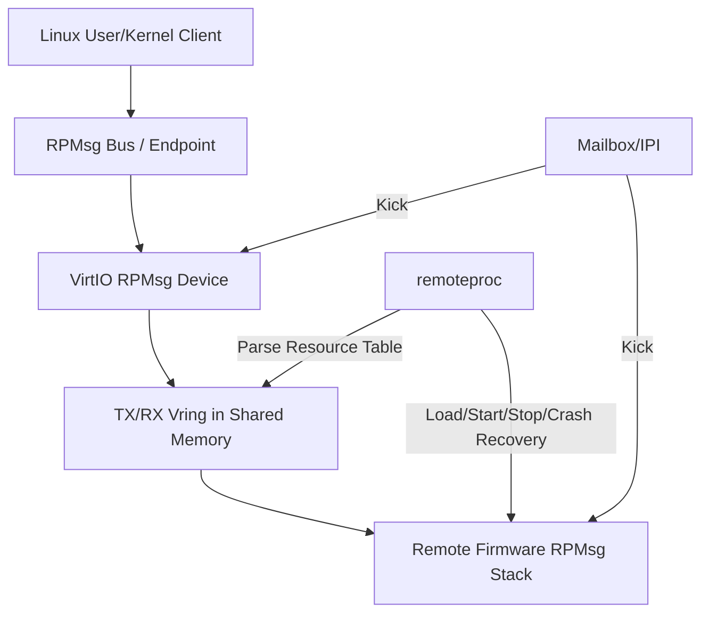

# remoteproc、RPMsg、VirtIO 与 OpenAMP

## 1. 框架分别解决什么问题

Linux 异构核通信常同时出现四个名词，它们不在同一层：

| 组件 | 职责 |
| --- | --- |
| remoteproc | 装载固件、解析资源、启动/停止 Remote、处理崩溃 |
| VirtIO/Vring | 定义共享描述符队列和 Feature 协商 |
| RPMsg | 在 Vring 上提供 Endpoint、Channel 和消息寻址 |
| OpenAMP | 为 Linux/RTOS/裸机提供 remoteproc、RPMsg 的跨平台实现 |



## 2. remoteproc 启动流程

典型流程如下：

1. 驱动取得 Reset、Clock、Power Domain、IOMMU 和固件名；
2. `request_firmware()` 读取 ELF 固件；
3. 校验段地址、长度和目标 Device Address；
4. 把 Loadable Segment 复制到 Remote 可执行内存；
5. 解析 `.resource_table`，分配/映射 Vring、Trace 和 Carveout；
6. 配置 IOMMU、总线防火墙和地址转换；
7. 设置 Boot Address，解除 Reset；
8. Remote 初始化并通过 Name Service 宣告 RPMsg Channel；
9. Linux RPMsg Driver 按 Channel 名称匹配。

这里至少涉及三种地址：固件 ELF 中的 Device Address、Linux CPU Physical Address、内核 Virtual Address。三者数值相同只是某些简单平台的特例。

## 3. Resource Table

Resource Table 是 Host 与 Remote 的启动期契约，常描述：

- Carveout：Remote 私有或共享内存；
- Devmem：Remote Device Address 到物理资源的映射；
- Trace：Remote 日志缓冲区；
- VDEV：VirtIO Device、Feature 和 Vring；
- Vendor Resource：平台私有扩展。

所有 Offset、Entry 数量和长度都必须做边界检查。恶意或损坏固件中的 Resource Table 不能被直接信任，否则可能让 Host 映射越界物理内存。

## 4. RPMsg Endpoint 与 Name Service

RPMsg 消息包含 Source、Destination、Length 等头部。Endpoint 相当于本地地址，Channel 则描述一项服务。

```text
Remote 启动
→ 创建 Endpoint
→ 发送 Name Service Announcement
→ Host 创建 rpmsg_device
→ rpmsg_driver.id_table 匹配
→ probe() 建立服务
```

应用协议仍需自行定义版本、事务 ID、超时、权限和重放规则。RPMsg 解决传输与寻址，不自动提供业务级 Exactly Once 或身份认证。

## 5. Vring 与 Kick

Vring 中 Descriptor 描述 Buffer 地址与长度，Available Ring 由发送方发布，Used Ring 由接收方完成。正确顺序是：

```text
填充 Buffer
→ 填充 Descriptor
→ Release/Cache Clean
→ 更新 Available Index
→ Kick Remote
```

接收方必须基于 Available Index Drain 队列，不能假定 Kick 次数等于 Descriptor 数量。Notification Suppression 可能主动省略 Kick。

### Split Virtqueue 的实际组成

Split Virtqueue 包含三块共享数据结构，而不只是三个数组：

| 区域 | 固定头部 | 每项大小 | 可选尾部 |
| --- | --- | --- | --- |
| Descriptor Table | 无 | 16 Byte | 无 |
| Available Ring | `flags` + `idx`，共 4 Byte | 2 Byte | `used_event`，2 Byte |
| Used Ring | `flags` + `idx`，共 4 Byte | 8 Byte | `avail_event`，2 Byte |

可选 Event 字段只在对应 Feature 协商后有意义。布局计算必须使用 VirtIO/OpenAMP 提供的宏或严格按规范处理 Alignment，不能简单按 `2 * queue_size`、`8 * queue_size` 分配。

```text
Descriptor Table        Available Ring             Used Ring
+----------------+      +-------------------+      +-------------------+
| desc[0..N-1]   |      | flags / idx       |      | flags / idx       |
| 16 Byte each   |      | ring[0..N-1]      |      | used[0..N-1]      |
+----------------+      | optional event    |      | optional event    |
                        +-------------------+      +-------------------+
```

### Packed Virtqueue 不能只看版本号启用

Packed Virtqueue 把 Available/Used 状态放进 16 Byte Descriptor，并通过 Wrap Counter 区分环绕，但仍包含独立的 Driver Event Suppression 和 Device Event Suppression 结构。它是通过 `VIRTIO_F_RING_PACKED` 协商的可选布局，不是“使用 VirtIO 1.1 以后自动切换”。

```text
Packed Descriptor Ring: 16 * N Byte
Driver Event Suppression: 4 Byte
Device Event Suppression: 4 Byte
```

Packed 布局可能减少元数据访问并改善局部性，也增加 Wrap、Event Suppression 和兼容性验证工作。用于 RPMsg 前，应确认 Linux remoteproc/rpmsg、Remote 固件及所用 OpenAMP 版本都实现该 Feature，并验证：

1. Feature 位协商失败时能退回双方都支持的布局；
2. Descriptor Flag 与 Wrap Counter 的发布顺序正确；
3. Non-coherent 两端对 Descriptor 和 Event 区分别维护 Cache；
4. Reset 后双方同时重新初始化 Wrap 状态；
5. Queue Size、Alignment 和地址宽度符合传输层限制。

## 6. Libmetal 的边界

Libmetal 为 OpenAMP 提供设备与 I/O Region、原子操作、屏障、中断和平台适配抽象。例如 `metal_io_read32()`、`metal_io_write32()` 隐藏了具体 MMIO 访问方式，但不替平台自动决定以下内容：

- 共享内存应该映射为 Normal Cacheable 还是 Device Memory；
- 某次 Cache 操作应到 PoU、PoC 还是更外层系统缓存；
- Mailbox 的 W1C、路由和低功耗唤醒语义；
- Remote Device Address 与 Host Physical Address 的转换；
- 崩溃恢复时哪些 Outstanding 事务已经终止。

移植 OpenAMP 时，应把这些决定集中在 platform layer，并用启动自检验证共享区地址、Vring 对齐、中断回环和 Cache 可见性。不要在业务 Endpoint 中散落体系结构汇编和 Mailbox Magic Number。

## 7. 常见故障

### Remote 能启动但 RPMsg Channel 不出现

依次检查：固件 Resource Table 是否被找到、VDEV Feature 是否匹配、两端 Vring 地址是否一致、Mailbox Kick 是否到达、Name Service Feature 是否协商成功。

### 第一条消息正常，之后卡死

常见原因是 Used/Available Index Cache 维护遗漏、Kick 被清错、Descriptor 未归还，或 Buffer 数量耗尽。

### Remote Crash 后 Host 永久等待

所有同步 RPC 必须设置 Timeout，并在 remoteproc Crash Recovery 时唤醒等待者、标记旧 Epoch 失效、停止新提交，再重新建立 Endpoint。不能让用户线程无限等待一个已经消失的 Remote。

### 安全边界缺失

Remote Firmware 不是天然可信。IOMMU、PMP/MPU 和总线防火墙应把它限制在 Carveout 与必要外设范围；Host 对 RPMsg Length、Opcode、Offset 都要验证。

## 8. 规范与实现资料

- [VirtIO 1.2 Specification](https://docs.oasis-open.org/virtio/virtio/v1.2/virtio-v1.2.html)：Split/Packed Virtqueue、Feature Negotiation 和 Notification；
- [Linux remoteproc Framework](https://docs.kernel.org/staging/remoteproc.html)；
- [Linux RPMsg Framework](https://docs.kernel.org/staging/rpmsg.html)；
- [OpenAMP Documentation](https://openamp.readthedocs.io/en/latest/)。
