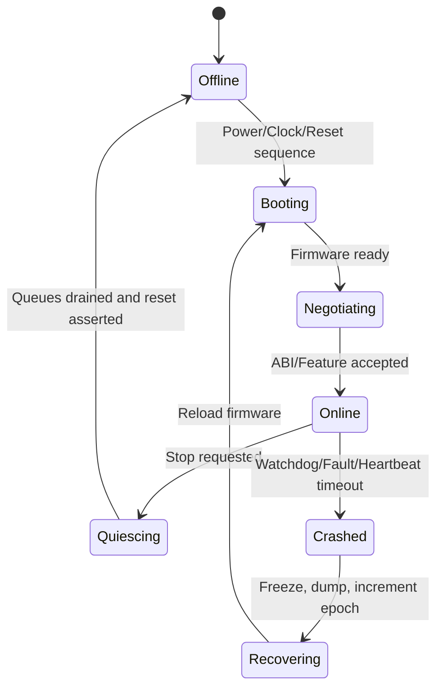

# 启动、复位、电源与故障恢复

核间通信最难的阶段往往不是稳定运行，而是一端正在启动、复位或掉电时另一端仍在访问共享资源。

## 1. 双方状态机



Host 只能在 `Online` 状态提交普通请求。`Booting` 和 `Recovering` 期间出现的用户请求应排队、返回可重试错误或显式失败，不能悄悄写入尚未初始化的 Ring。

## 2. 启动握手

推荐共享控制块包含：

```c
struct ipc_boot_status {
    uint32_t magic;
    uint16_t abi_major;
    uint16_t abi_minor;
    uint32_t host_features;
    uint32_t remote_features;
    uint32_t epoch;
    uint32_t host_state;
    uint32_t remote_state;
    uint64_t heartbeat;
};
```

启动时应执行：

1. Host 保持 Remote Reset；
2. 清理或重新初始化共享控制区；
3. Host 写 Magic、版本、Epoch 和支持 Feature；
4. 完成 Cache/Barrier；
5. 设置 Boot Vector，按电源时序释放 Remote；
6. Remote 校验 Header，写回 Feature 和 Ready；
7. Host 校验 ABI Major 与必要 Feature；
8. 双方进入 Online 后才开放业务队列。

必须设置启动 Timeout，并保存 Boot Stage Code。只报告“辅核启动失败”无法区分固件未加载、地址映射错误、时钟未开、异常向量崩溃或 Mailbox 不通。

## 3. 停止与重启

安全停止顺序：

```text
拒绝新请求
→ 通知 Remote Quiesce
→ Remote/DMA 停止获取新 Descriptor
→ 等待已接收请求和 Outstanding 总线事务完成或被硬件终止
→ 屏蔽并清理 Mailbox
→ 断开 IOMMU Mapping
→ Assert Reset
→ Gate Clock / Power Off
```

不能仅因为队列为空就认为 DMA 已停止；Remote 可能已经取走 Descriptor，正在访问 Payload。撤销 SMMU/IOMMU Mapping 或让防火墙返回错误，也不等于已经 Quiesce，它只能影响后续访问，不能证明旧事务已经收到最终 Response。

### Remote 已失去响应时

如果 Remote 已经无法执行 Quiesce Handler，Host 需要使用 SoC 明确定义的硬件恢复路径：

```text
停止 Host 新提交
→ 屏蔽 Remote 的新请求入口
→ 启动 Bus Isolation / Transaction Termination
→ 等待隔离完成或 Master Idle 状态
→ 保存互联与 Fault 状态
→ Assert Remote/DMA Reset
→ 清理旧中断、IOMMU Context 和共享队列
```

并非每个平台都有 `Master Idle` 寄存器，也不是所有互联都允许通过 Reset 丢弃尚未完成的 AXI 事务。Reset Controller、NoC 和 DMA 的顺序必须来自 SoC TRM。若硬件没有隔离或事务终止能力，软件不能承诺对任意 Hang 状态实施无损局部复位。

## 4. Epoch 与迟到消息

Remote Reset 后，旧中断、旧 Completion 或互联中的延迟写仍可能到达。每次会话递增 Epoch：

```text
Request ID = Epoch | Queue ID | Sequence
```

Host 只接受当前 Epoch 的 Completion。重启前还应屏蔽通知、等待硬件 Quiescent，并在必要时重置 Mailbox/FIFO，避免旧事件污染新会话。

## 5. Heartbeat 与故障判定

Heartbeat 只能证明某段代码仍在运行，不一定证明业务队列有进展。推荐同时监控：

- Remote Heartbeat；
- Producer/Consumer Index 是否变化；
- 最老请求年龄；
- Remote Watchdog；
- Mailbox Pending；
- NoC Timeout、ECC、IOMMU Fault；
- Remote Crash Reason 和 PC/LR/SP。

Timeout 必须依据最坏执行时间、DVFS、低功耗唤醒和队列深度制定，不能直接复制实验室平均值。

可以从一个可审计的上界开始：

$$T_{timeout}=T_{wakeup,max}+T_{queue,worst}+T_{service,worst}+T_{completion,worst}+T_{margin}$$

其中 `T_queue,worst` 应基于最大队列深度和最低保证处理率计算，`T_wakeup,max` 应覆盖目标电源状态下的电源轨、晶振、PLL、时钟和固件恢复时间。DVFS 不应再额外写成一个含义模糊的固定时间项，而应体现在各阶段的最坏执行时间中。

Timeout 触发后先采集当前 OPP、电源状态、队列深度和最老请求年龄，再决定重试、降级还是复位。否则低功耗唤醒变慢会被误报成 Remote Crash。

## 6. 电源管理竞态

### Doorbell 发向已掉电核心

若 Mailbox 不在 Always-On 域，写操作可能 Bus Timeout；即使 Mailbox 常开，中断也可能无法投递。发送前需要 Runtime PM Reference 或平台定义的 Wakeup Handshake。

若产品要求 IPC 能唤醒掉电或停钟的 Remote，Doorbell 必须连接到 AON Wakeup Controller，并区分“唤醒请求已被 AON 接收”和“Remote 已恢复到能够消费 Ring”两个时刻。发送端应等待 Ready/Ack，再开始业务 Timeout；仅看到 Doorbell 写事务完成不能证明目标核已经启动。

### Remote 准备休眠时新消息到达

使用两阶段协议：Remote 宣布 `QUIESCING`，Host 停止提交并确认；Remote 复查 Ring 为空后才进入低功耗。若复查发现新请求，取消睡眠。

### Cache 尚未退出一致性域就断电

具备私有 Cache 的核必须按平台流程 Clean/Invalidate、退出 Coherency，再 Gate Clock/Power。顺序错误可能造成数据丢失或 Snoop Timeout。

## 7. Crash Dump

Remote 崩溃处理程序应尽量使用预留、无锁的 Crash Area 写入：

- Magic、Version、Epoch；
- Fault Reason；
- PC/LR/SP、通用寄存器；
- 异常状态和 Fault Address；
- 最近 Mailbox/Ring Index；
- 最近 Trace/Event；
- Firmware Build ID。

写完后执行必要的 Cache Clean/Barrier，再通过独立 Watchdog/Mailbox 通知 Host。Crash Dump 本身必须限制长度，防止二次越界破坏共享控制区。
