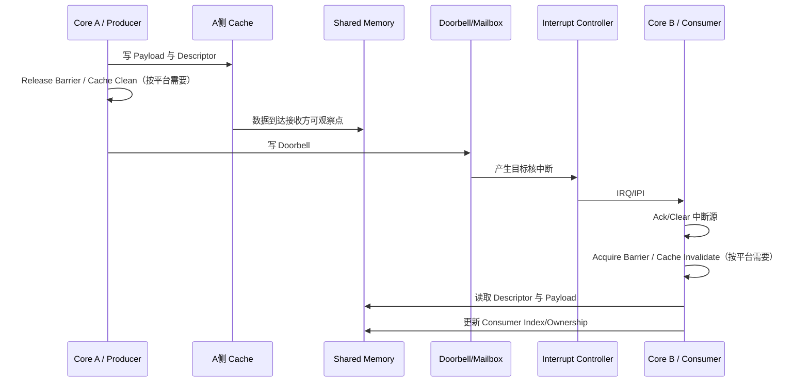

# 11 核间通信与多核协作

核间通信（Inter-Processor Communication, IPC）研究的不是“两个核怎样互相调用函数”，而是不同执行实体怎样交换数据、发出通知、转移所有权，并在乱序、Cache、不同时钟和独立复位条件下维持正确性。

这里的“核”既包括同一 CPU Cluster 内运行同一操作系统的对称核，也包括 Application CPU、实时核、DSP、NPU、MCU 等运行不同固件的异构处理器。

## 内容导航

1. [通信模型与系统边界](01-models-topology.md)
2. [共享内存、Mailbox 与所有权协议](02-shared-memory-mailbox.md)
3. [IPI、Doorbell 与中断路由](03-ipi-doorbell-interrupt.md)
4. [Ring Buffer、无锁队列与内存序](04-ring-lockfree-memory-order.md)
5. [remoteproc、RPMsg、VirtIO 与 OpenAMP](05-remoteproc-rpmsg-openamp.md)
6. [启动、复位、电源与故障恢复](06-lifecycle-recovery.md)
7. [调试、性能与工程案例](07-debug-performance-cases.md)
8. [核间通信工程检查表](08-engineering-checklist.md)

## 一条消息的完整路径

这个流程包含四个不能相互替代的条件：

- **数据存放**：共享内存、TCM、片上 SRAM 或 DDR；
- **可见性**：Cache 一致性、Clean/Invalidate、Release/Acquire；
- **通知**：SGI、软件中断、Mailbox、Doorbell；
- **生命周期**：双方必须对启动、版本、复位和错误恢复达成协议。

中断只说明“有事情发生”，不保证 Payload 已经可见；共享内存保存了数据，也不会自动唤醒接收核。工程实现必须同时设计数据通道与通知通道。

## 与其他模块的关系

- CPU 原子操作与弱内存序：参见[模块 02](../02-CPU-Architecture/README.md)；
- Cache Line 所有权与非一致性 DMA：参见[模块 03](../03-Cache-Memory-Hierarchy/README.md)和[模块 06](../06-DMA-Cache-Coherency/README.md)；
- NoC、CDC 与 QoS：参见[模块 05](../05-Bus-Interconnect/README.md)；
- GIC、PLIC/IMSIC 和低功耗：参见[模块 07](../07-Interrupt-Clock-Power/README.md)；
- 辅核装载与启动：参见[模块 09](../09-Boot-BSP-OS/README.md)。
