# 千兆网卡 DMA 收包全流程

## 初始化契约

驱动先恢复 MAC/PHY Power Domain，打开 AXI/Core/Reference Clock，释放 DMA、MAC 和 PHY Reset。MDIO 读取 PHY ID，启动 Auto-negotiation；Link Up 后取得 Speed/Duplex。驱动配置 DMA Mask/IOMMU，分配 Coherent Descriptor Ring，为每个 RX Slot 分配并 Map Buffer，发布 Ownership，最后使能 NAPI、中断和 RX DMA。

## 数据路径

```mermaid
flowchart LR
    W["网线物理信号 (wire symbols)"] --> PHY["以太网 PHY 芯片"]
    PHY --> MAC["MAC 控制器"]
    MAC --> F["RX FIFO 缓冲"]
    F --> D["DMA Engine"]
    D --> S["SMMU: IOVA 到 PA 转换"]
    S --> N["AXI/NoC 总线互联"]
    N --> DDR["DDR 内存"]
    DDR --> C["CPU Cache 视图"]
    C --> NAPI["Linux NAPI 轮询调度"]
    NAPI --> SKB["sk_buff 结构体"]
    SKB --> IP["TCP/IP 网络协议栈"]
    IP --> Sock["Socket 接收队列"]
    Sock --> App["用户态应用程序 (read/recv)"]
```

PHY 恢复时钟并解码线路；MAC 校验 Preamble、长度和 CRC，执行地址/VLAN 过滤；FIFO 吸收线速与 DMA 间瞬时差异。DMA 读取 Descriptor 中的 IOVA，经 SMMU 转为 PA，通过 NoC 写 DDR，再写 Packet Length、Checksum 和 Ownership。

## 完成路径

达到 Coalescing 阈值后 MAC/DMA 置 Raw Status。若使用线中断，信号进入 GIC SPI；PCIe 网卡则发 MSI-X，ITS 将 DeviceID/EventID 翻译为 LPI。CPU ISR 读取状态、屏蔽该 Queue IRQ 并调度 NAPI。NAPI Poll 在 Budget 内批量收包，执行 DMA Sync，构造/复用 SKB，交给 GRO 与协议栈，再补充 RX Buffer；Ring 清空后重新开中断。

## 内存顺序

设备必须先完成 Payload，后归还 Descriptor Ownership。CPU 观察到 Ownership 后执行 `dma_rmb()`，再读长度和 Payload。补充 Buffer 时 CPU 先写地址/长度，`dma_wmb()` 后交 Ownership，最终更新 Doorbell。非一致平台还由 DMA API 完成 Clean/Invalidate。

## 一包消失在哪里

| 观察点 | 增长 | 不增长 | 结论 |
| --- | --- | --- | --- |
| PHY Good Frame | 否 | — | 线缆、协商或 PHY |
| MAC Good Frame | 否 | PHY 增长 | MAC 过滤/帧格式 |
| RX FIFO | Overflow | MAC 增长 | DMA 排空不足 |
| DMA Head | 否 | FIFO 有数据 | Ring/SMMU/NoC |
| Descriptor Done | 是 | ISR 不进 | IRQ/ITS/GIC |
| NAPI packets | 是 | Socket 无数据 | 协议栈/过滤/应用 |

## 吞吐计算

1 Gb/s 是线路比特率。以太网 Preamble、IFG、Header 和 CRC 占用线速，小包有效载荷效率明显低于大包。单队列 CPU 饱和时启用 RSS 多队列，把 IRQ/NAPI/Application 按 Queue 绑核；若 DDR/NoC 已饱和，增加 Queue 只会加剧拥塞。
