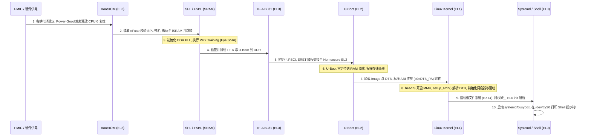

# 案例实战：从 SoC 上电冷启动到 Linux 用户态 Shell 全景推演

## 1. 冷启动端到端全景时序泳道图

从按下电源键到串口输出 `root@soc-host:~#`，系统跨越 6 大特权级与执行环境：

---

## 2. 关键各阶段状态机与数据流排查断点

| 执行阶段 | 运行空间与特权级 | 核心硬件依赖 | 典型挂死断点与定位方法 |
| :--- | :--- | :--- | :--- |
| **Phase 1: BootROM** | 片上只读 ROM (EL3) | 24MHz 晶振, PMIC 供电, eFuse | 串口完全无输出。读取 AON Scratch 寄存器中的错误码，测量晶振是否起振 |
| **Phase 2: SPL** | 片内 SRAM (Secure EL1) | 内部 SRAM, 存储控制器 (eMMC/SPI) | 打印 SPL 标志后挂死。检查 DDR Training 是否在特定 Byte Lane 失败 |
| **Phase 3: TF-A** | DDR 预留内存 (EL3) | DDR 物理内存可用, GIC 安全配置 | 切换安全世界时崩溃。排查 `SCR_EL3` 安全位与 PSCI 栈空间 |
| **Phase 4: U-Boot** | DDR 顶端区域 (EL2) | 全总线可用, 存储与网络外设 | 重定位后断流。排查 `.rela.dyn` 动态重定位修复与设备树传递 |
| **Phase 5: Kernel** | DDR 低端区域 (EL1) | MMU 页表, GIC PPI/SPI, Arch Timer | 停在 `Starting kernel ...` 或 `Calibrating delay`。开启 `earlycon` |
| **Phase 6: Shell** | 用户态进程空间 (EL0) | 根文件系统块设备, TTY 控制台 | `Attempted to kill init!`。检查 RootFS 架构匹配与动态链接库 |
