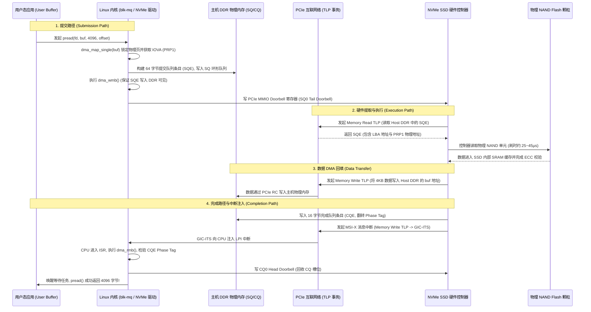

# 案例实战：PCIe NVMe SSD 读写事务全链路软硬件推演

## 1. 一次完整 NVMe 读事务（4KB Direct Read）全生命周期流

从用户空间发起 `pread()` 或 `io_uring` 读请求，到最终数据进入用户态内存的完整微架构时序：

---

## 2. PRP（Physical Region Page）与 SGL 寻址模式

NVMe 协议使用 **PRP** 描述主机 DMA 物理内存缓冲区：
- **`PRP1`**：指向第一个 4KB 物理页的基地址（必须 8 字节对齐）；
- **`PRP2`**：若单次传输超过 4KB 且小于 8KB，PRP2 直接指向第二个物理页基地址；若传输超过 8KB，PRP2 指向一个 **PRP List 链表页**，链表中按序记录所有后续物理页的基地址。

---

## 3. NVMe 高性能端到端故障排查矩阵

| 故障现象 | 硬件/协议层微架构根因 | 定位与排查方法 |
| :--- | :--- | :--- |
| **I/O 吞吐极高但 P99 尾延迟严重劣化（出现秒级卡顿）** | SSD 内部 SLC 缓存耗尽，触发后台 TLC 直接写入或垃圾回收（GC / Folding）阻塞 | 使用 `fio` 压测长时间稳态写入；排查 SSD 固件的 Trim 支持与预留空间（Over-Provisioning）比例 |
| **`nvme nvme0: I/O 123 QID 1 timeout, aborting`** | PCIe 物理链路发生 AER 无法纠正错误，或 NVMe 控制器固件死锁未能回写 CQE | 查看 `lspci -vvv` 中的 AER 状态寄存器；检查 SSD 供电与散热温度 |
| **Direct I/O 读出全零或数据错乱** | 用户态 Buffer 未按 512B/4KB 扇区对齐，或在异步 `io_uring` 期间用户空间提前覆写了正在传输的 Buffer | 确保用户态分配缓冲区使用 `posix_memalign()`，严格遵循所有权生命周期 |
