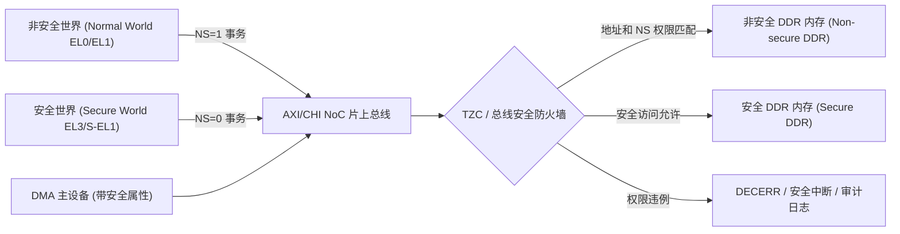

# SoC 安全：TrustZone、PMP 与可信启动

安全边界从 BootROM 的 Root Key 开始，经签名链建立可信软件，再由 CPU 特权、内存控制器、总线 Firewall 和 IOMMU 限制运行时访问。只做 Secure Boot 不能阻止启动后的 DMA 越权；只做 Firewall 也不能保证加载的软件可信。

## TrustZone 事务属性如何传播

`NS` 属性与地址共同参与访问判定。CPU 处于 Secure World 不表示它发出的所有事务必然安全，页表描述符和具体指令也可产生 Non-secure 访问；DMA 的安全属性则由设备配置、Stream/Firewall 规则和 SoC 集成决定。

ARM TrustZone 让事务带 Secure/Non-secure 属性，EL3 Monitor 在两个世界间切换。TZC/TZASC 保护 DDR 区域，外设可被分配为 Secure 或 Non-secure；GIC Group 隔离中断。OP-TEE 位于 Secure World，但共享内存和 SMC 参数仍需严格验证。

RISC-V PMP 由 M-mode 配置 Region 的 R/W/X 权限，支持 TOR、NA4、NAPOT 等匹配。Lock 位可把条目锁到 Reset；ePMP 增强 M-mode 自身约束和默认策略。条目数量有限，应先规划 ROM、Firmware、OS、MMIO 和共享区。

密钥不应以明文长期停留普通 DDR。OTP/eFuse 保存 Root Material 或设备身份，硬件 Crypto Engine 可通过 Key Ladder 派生工作密钥。Memory Encryption 保护外部总线数据，完整性/Replay 还需额外机制。

调试是安全入口。研发态可开放 JTAG，量产态应认证并按生命周期限制；错误日志要保留诊断价值，又不能泄露安全地址和密钥相关状态。

## 常见破坏方式与规避

**只按 CPU 世界配置 Firewall。** 非安全 DMA 仍可能访问安全 DDR。策略必须覆盖每个 Initiator/Stream ID，复位后默认拒绝，再由可信固件开放最小窗口；用负向测试确认被禁止设备得到 Fault。

**共享内存 TOCTOU。** Normal World 在 Secure World 校验参数后再次修改 Buffer。安全侧把长度、命令和指针复制到私有内存后验证，或建立明确 Ownership；任何 Offset+Length 计算都检查整数溢出。

**密钥清零不完整。** 软件擦除 Buffer，但寄存器、Cache、DMA 临时区或 Crash Dump 仍有副本。定义密钥生命周期，使用不可优化删除的清零函数，禁止敏感区进入普通 Dump，并让硬件 Key Slot 在 Reset/生命周期切换时清除。

**Anti-rollback 先烧版本。** 新镜像尚未完整写入就提升 Fuse，断电后旧镜像被拒、新镜像又不可用。采用 A/B 更新，在新 Slot 验证和健康确认后，按设计的恢复策略提交版本；不可逆操作必须有电源和双重确认保护。

**量产调试后门。** 仅隐藏 JTAG 引脚不等于关闭 DAP。验证所有入口、Debug Authentication、RMA 流程和生命周期 Fuse；认证失败做限速与审计，避免调试协议成为密钥 Oracle。
