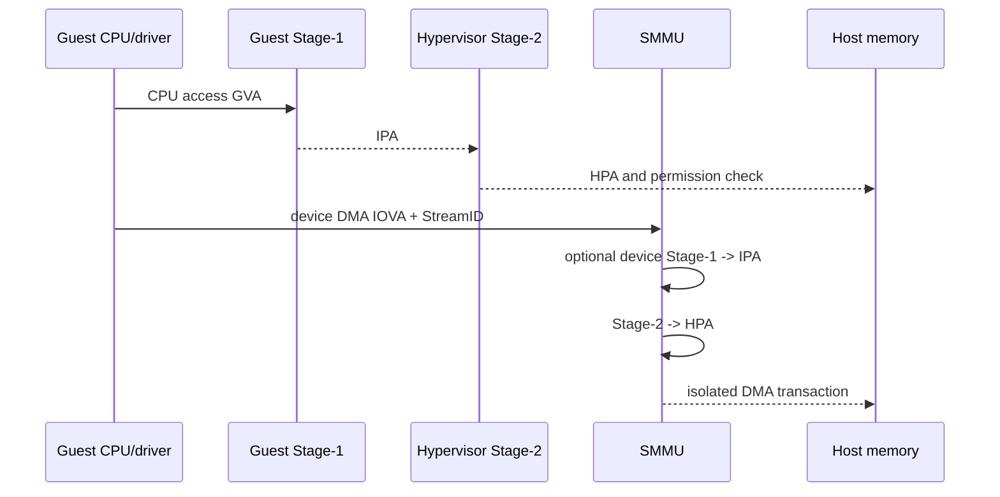

# 虚拟化、Stage-2 与 VFIO 直通

ARM EL2/RISC-V H 扩展让 Hypervisor 拦截敏感操作、管理虚拟 CPU 和第二阶段页表。Guest Stage-1 把 GVA 转为 IPA，Stage-2 再转 HPA。VMID 标记 TLB 条目；切换或回收映射时执行按 VMID/IPA 的失效。

## CPU 与设备的嵌套翻译

CPU Stage-2 与 SMMU Stage-2 使用相同的隔离意图，却有独立的 TLB、命令队列和 Fault 记录。Hypervisor 撤销 Guest 页面时，要协调 vCPU TLB、SMMU IOTLB，以及启用 ATS 时的设备 Translation Cache。

中断虚拟化可由 Hypervisor 注入，也可借 GICv4 Virtual LPI 减少陷入。Timer 提供虚拟 Offset，让 Guest 看到独立时间基准。设备模拟简单但开销大；Virtio 用共享 Ring 和通知减少模拟；直通性能最好，隔离和迁移最复杂。

VFIO 把设备绑定到 IOMMU Domain并暴露给用户态 VMM。设备的 DMA 只能到 Guest Pin/Map 的页，MSI 被重映射到 Guest。直通前要确认 IOMMU Group 隔离粒度：同 Group 设备若共享不可分隔的 DMA 路径，不能安全分配给不同 VM。

SR-IOV 让 Physical Function 创建多个 Virtual Function，各 VF 有独立 Requester ID、Queue 和 MSI-X，仍需 SMMU 隔离。ATS/PASID 改善翻译与共享地址空间，迁移时必须停止设备并清 Device-TLB。

## 常见问题与规避

**回收页早于 Shootdown。** vCPU 或设备仍持有旧 TLB/IOTLB，物理页已分配给另一 VM。撤销映射后分别失效 CPU Stage-2、SMMU 和 ATS Device-TLB，等待全部 Completion，再回收。

**IOMMU Group 拆分错误。** 同一桥下设备共享 ACS 不可隔离路径，任一设备可绕过上游 IOMMU Peer-to-peer 写另一个设备。直通以真实 Isolation Group 为最小单位，检查 ACS/Requester ID 和平台勘误，不能只按 PCI Function 分配。

**虚拟中断重复或丢失。** 迁移 vCPU/Queue 时旧目标仍有 Pending，新目标已接管。先停止设备通知，Drain/Mask，中断状态与 Queue 状态一起迁移，再更新 ITS/vPE/Affinity并恢复。

**Live Migration 遗漏设备内部状态。** 只复制 Guest RAM，未保存 Submission Queue Head、DMA 和 Device-TLB。设备进入 Quiescent，完成或取消未完成请求，序列化控制器状态；无法冻结的直通设备不能声称支持透明迁移。

**过度陷入。** Guest 高频访问虚拟寄存器或 Timer 产生 VM Exit。使用 Paravirtual Interface、Posted/Direct Interrupt 和硬件虚拟 Timer；优化前用 Exit Reason 统计证明热点，避免牺牲隔离换取无关性能。
