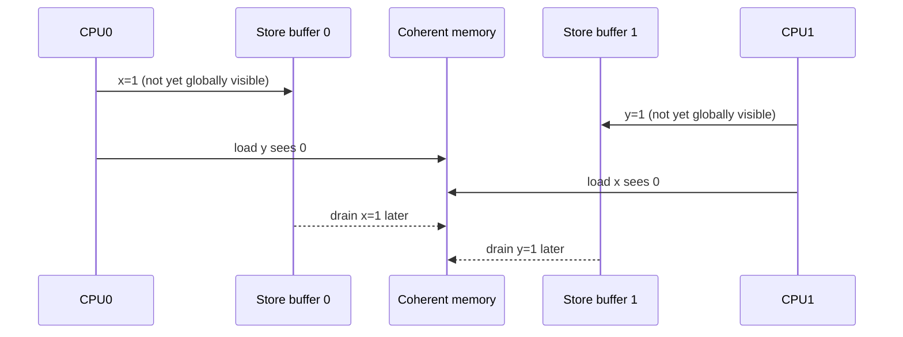

# 内存一致性模型

Cache Coherency 回答单个地址的副本如何一致；Memory Consistency 回答多个地址的访问可以按什么顺序被观察。x86 TSO 较强，主要允许 Store→Load 重排；ARM/RISC-V 更弱，允许更多优化，便携并发代码不能依赖在某台机器上的偶然结果。

经典 Store Buffering：

```text
Initially x=0, y=0
CPU0: x=1; r0=y
CPU1: y=1; r1=x
```

弱序机器可能得到 `r0=0,r1=0`。若业务要求禁止该结果，使用满足协议的 Full Barrier 或更高层原子同步，而不是 `volatile`。



这张图只是允许结果的一种微架构解释；语言和 ISA 模型定义“允许观察什么”，并不要求处理器真的实现名为 Store Buffer 的结构。Barrier/Seq-cst 禁止相关顺序组合，而不是简单地“关闭乱序执行”。

C++11 `memory_order_relaxed` 只保证原子性；Release Store 与读到它的 Acquire Load 建立 Synchronizes-with，使之前写入对之后读取可见；Seq_cst 还提供单一全局顺序。编译器把语义映射到架构指令，例如 AArch64 常用 `STLR/LDAR`，RISC-V 用 `.rl/.aq` 或 Fence，但映射随操作和编译器变化。

`DMB` 约束观察顺序，`DSB` 等待完成，`ISB` 同步后续取指；RISC-V `FENCE` 指定 predecessor/successor 类别。设备 Doorbell、DMA Descriptor 和自修改代码分别需要 I/O 顺序、DMA 顺序与 I/D Cache 同步，不能用一个“万能屏障”概括。

## 常见错误与规避

**把 `volatile` 当同步。** 它主要限制编译器对该对象访问的删除/合并，不保证原子性、核间 Happens-before 或设备到达顺序。线程通信使用语言原子/锁，MMIO 使用平台 Accessor，DMA 使用 DMA Barrier/API。

**Flag 是原子，Payload 不是。** 生产者用 Relaxed Store 发布 Flag，消费者可能先看见 Flag 后看见旧 Payload。生产者 Release Store、消费者 Acquire Load，并确保消费者确实读到该 Release Sequence。

**屏障方向错误。** 读屏障不能替代发布端写屏障，CPU 屏障也不自动 Clean 非一致 Cache。先画出 Producer、Consumer 和需要建立的顺序边，再选择最小正确原语。

**锁外读取“只读状态”。** Writer 在锁内更新多个字段，Reader 无锁读取会观察组合状态，且 C/C++ 中数据竞争本身未定义。使用同一锁、Seqcount/RCU 或按协议发布不可变快照。

**Litmus 没复现就判定安全。** 一次硬件运行覆盖不了模型允许的所有重排。用 herd7/LKMM 等模型验证允许结果，再用压力实验查实现；测试是补充，不是规范证明。
