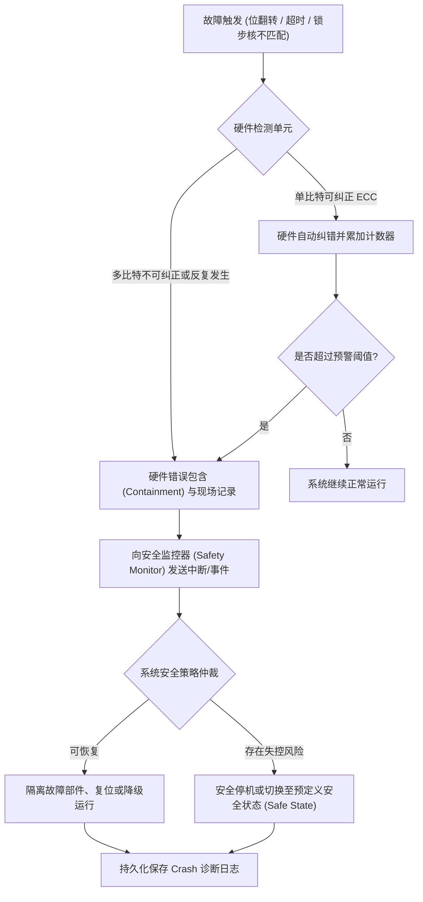

# 功能安全与 RAS

RAS 指 Reliability、Availability、Serviceability。ECC/Parity 检测存储与传输错误，SError/Machine Check 上报不可恢复错误，错误记录保存 Syndrome、地址和 Initiator。单比特纠正应计数并触发阈值维护，而不是纠正后完全忽略。

## 从错误到安全状态

检测、包含、通知、恢复和记录必须分别验证。硬件能报错却无法隔离失控 DMA，不构成完整错误包含；系统进入复位却丢失首错信息，也削弱可维护性。

Lockstep 让两个核执行同一指令并比较结果，可检测随机硬件故障；它不防止共同的软件错误和同源设计缺陷。Safety Island 常由独立电源/时钟的小核监控主系统、Watchdog、温度和关键 I/O。

Watchdog 要监控系统“进展”而非某个高优先级线程机械喂狗。Windowed Watchdog 同时检测过早和过晚喂狗；多任务系统用 Health Monitor 汇聚关键任务 Heartbeat，全部满足才喂硬件狗。

故障注入验证 Error Path：向 ECC 注入单/双比特、模拟 Clock/Voltage Fault、阻断总线响应、让任务失去 Heartbeat。每次验证检测时间、错误包含、系统进入安全状态和日志完整性。

ISO 26262 要求从 Hazard 分析得到 Safety Goal、Technical Safety Requirement 和验证证据。诊断覆盖率、独立性和潜伏故障周期需要定量论证；添加 ECC 或 Watchdog 本身不等于达到某个 ASIL。

## 常见失效与规避

**ECC 只报不处置。** Correctable Error 持续累积，最终成为双比特不可纠正。建立按页/Lane 的阈值、后台 Scrub 和下线策略；日志保存首错与累计数。

**Lockstep 的共同原因失效。** 两个核共享 Clock、Power、编译器和规格，同一扰动或软件错误会让它们一致地错。通过电源/时钟监控、设计多样性、独立 Safety Mechanism 和软件验证覆盖 Common-cause Failure。

**Watchdog 被无条件喂。** 系统业务已经死锁，喂狗线程仍运行。按关键任务 Progress 汇聚健康状态；Pre-timeout 保存现场，最终 Bite 进入定义的安全复位。

**安全状态本身不可达。** 故障发生后关闭执行器需要某条已经失效的总线。关键 Safe-state 路径放在独立/AON 域，做故障注入证明在主 CPU、NoC 或 DDR 失效时仍可动作。

**只验证故障检测。** 注入错误后看到中断，并不证明完成隔离与恢复。测试从注入、检测延迟、错误包含、通知、恢复/安全状态一直到诊断日志，逐项记录覆盖率。
