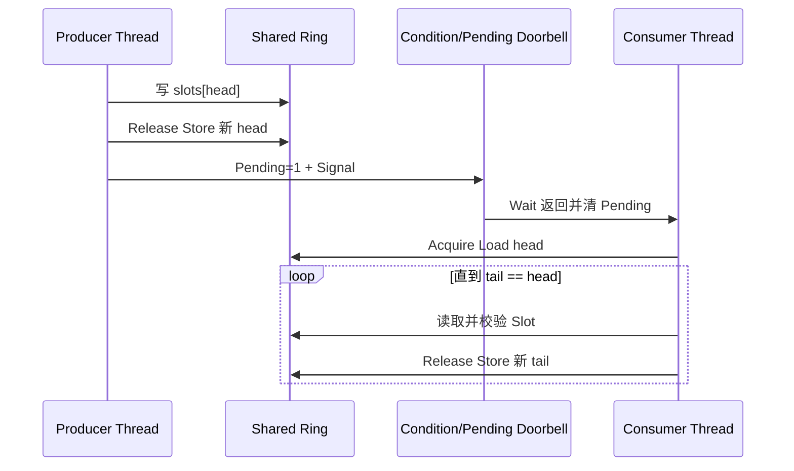

# Lab 05：共享内存 Ring 与 Doorbell 通知

本实验用两个 POSIX 线程模拟运行在不同核心上的 Producer 与 Consumer。共享的 SPSC Ring 承担数据通道，条件变量与一个 Pending 位模拟可合并的电平 Doorbell 通知。

它验证三个关键规则：

1. Producer 必须先写 Slot，再以 Release 发布 Head；
2. Consumer 以 Acquire 观察 Head 后才能读取 Slot；
3. 一次 Doorbell 可能代表多条消息，Consumer 必须 Drain Ring，不能把通知次数当成消息数。

条件变量是软件教学替身，不是硬件 IPI 或 Mailbox；C11 原子也不模拟 Non-coherent Cache 维护。

## 编译与运行

```bash
make
./inter-core-ring
```

Linux 上可以尝试把进程限制到两个 CPU：

```bash
taskset -c 0,1 ./inter-core-ring
```

预期输出：

```text
received=100000 sequence-errors=0
```

## 通信过程



## 完整文件内容

### `Makefile`

```makefile
CC ?= cc
CFLAGS ?= -O2 -std=c11 -Wall -Wextra -Wpedantic -pthread

all: inter-core-ring

inter-core-ring: inter-core-ring.c
	$(CC) $(CFLAGS) $< -o $@

clean:
	rm -f inter-core-ring

.PHONY: all clean
```

### `inter-core-ring.c`

```c
#include <pthread.h>
#include <stdatomic.h>
#include <stdint.h>
#include <stdio.h>
#include <stdlib.h>
#include <string.h>

#define RING_SIZE 64U
#define MESSAGE_COUNT 100000U

struct ipc_ring {
    _Alignas(64) atomic_uint head;
    _Alignas(64) atomic_uint tail;
    _Alignas(64) uint32_t slots[RING_SIZE];
};

struct doorbell {
    pthread_mutex_t lock;
    pthread_cond_t condition;
    int pending;
};

static void fail_pthread(const char *operation, int error)
{
    fprintf(stderr, "%s: %s\n", operation, strerror(error));
    exit(EXIT_FAILURE);
}

struct context {
    struct ipc_ring ring;
    struct doorbell doorbell;
};

static void ring_doorbell(struct doorbell *doorbell)
{
    int error = pthread_mutex_lock(&doorbell->lock);
    if (error != 0)
        fail_pthread("pthread_mutex_lock", error);

    /* Repeated notifications merge while pending remains set. */
    doorbell->pending = 1;
    error = pthread_cond_signal(&doorbell->condition);
    if (error != 0)
        fail_pthread("pthread_cond_signal", error);

    error = pthread_mutex_unlock(&doorbell->lock);
    if (error != 0)
        fail_pthread("pthread_mutex_unlock", error);
}

static void wait_for_doorbell(struct doorbell *doorbell)
{
    int error = pthread_mutex_lock(&doorbell->lock);
    if (error != 0)
        fail_pthread("pthread_mutex_lock", error);

    while (!doorbell->pending) {
        error = pthread_cond_wait(&doorbell->condition, &doorbell->lock);
        if (error != 0)
            fail_pthread("pthread_cond_wait", error);
    }

    doorbell->pending = 0;
    error = pthread_mutex_unlock(&doorbell->lock);
    if (error != 0)
        fail_pthread("pthread_mutex_unlock", error);
}

static void *producer(void *argument)
{
    struct context *context = argument;

    for (uint32_t message = 1; message <= MESSAGE_COUNT; message++) {
        unsigned int head;
        unsigned int next;

        for (;;) {
            head = atomic_load_explicit(&context->ring.head,
                                        memory_order_relaxed);
            next = (head + 1U) % RING_SIZE;

            if (next != atomic_load_explicit(&context->ring.tail,
                                             memory_order_acquire))
                break;
        }

        context->ring.slots[head] = message;

        /* Publish the initialized slot before notifying the consumer. */
        atomic_store_explicit(&context->ring.head, next,
                              memory_order_release);
        ring_doorbell(&context->doorbell);
    }

    return NULL;
}

static void *consumer(void *argument)
{
    struct context *context = argument;
    uint32_t expected = 1;
    unsigned int received = 0;

    while (received < MESSAGE_COUNT) {
        wait_for_doorbell(&context->doorbell);

        /* One doorbell can represent multiple queued messages. */
        for (;;) {
            unsigned int tail = atomic_load_explicit(&context->ring.tail,
                                                     memory_order_relaxed);
            unsigned int head = atomic_load_explicit(&context->ring.head,
                                                     memory_order_acquire);

            if (tail == head)
                break;

            if (context->ring.slots[tail] != expected) {
                fprintf(stderr, "sequence error: expected=%u actual=%u\n",
                        expected, context->ring.slots[tail]);
                exit(EXIT_FAILURE);
            }

            expected++;
            received++;

            atomic_store_explicit(&context->ring.tail,
                                  (tail + 1U) % RING_SIZE,
                                  memory_order_release);
        }
    }

    printf("received=%u sequence-errors=0\n", received);
    return NULL;
}

int main(void)
{
    struct context context = { 0 };
    pthread_t producer_thread;
    pthread_t consumer_thread;
    int error;

    error = pthread_mutex_init(&context.doorbell.lock, NULL);
    if (error != 0)
        fail_pthread("pthread_mutex_init", error);

    error = pthread_cond_init(&context.doorbell.condition, NULL);
    if (error != 0)
        fail_pthread("pthread_cond_init", error);

    error = pthread_create(&consumer_thread, NULL, consumer, &context);
    if (error != 0)
        fail_pthread("pthread_create(consumer)", error);

    error = pthread_create(&producer_thread, NULL, producer, &context);
    if (error != 0)
        fail_pthread("pthread_create(producer)", error);

    error = pthread_join(producer_thread, NULL);
    if (error != 0)
        fail_pthread("pthread_join(producer)", error);

    error = pthread_join(consumer_thread, NULL);
    if (error != 0)
        fail_pthread("pthread_join(consumer)", error);

    error = pthread_cond_destroy(&context.doorbell.condition);
    if (error != 0)
        fail_pthread("pthread_cond_destroy", error);

    error = pthread_mutex_destroy(&context.doorbell.lock);
    if (error != 0)
        fail_pthread("pthread_mutex_destroy", error);

    return EXIT_SUCCESS;
}
```

## 可做的破坏性修改

1. 把 Head 的 Release Store 和 Acquire Load 都改成 Relaxed，观察程序仍可能“看起来正常”，但语言内存模型已不再保证 Slot 发布关系。
2. 把 Consumer 的 Drain 循环改成每次通知只取一条消息，观察 Pending 位合并通知后是否造成队列长期积压。
3. 将 `RING_SIZE` 改小并在 Consumer 中加入延时，观察 Producer 在 Ring Full 时的 Backpressure。
4. 统计每次条件变量唤醒处理的消息数量，计算通知合并比。

真实 SoC 上，应把条件变量替换为 SGI/Mailbox/Doorbell，把 C11 原子映射到对应 OS 原语，并根据一致性属性补充 Cache 维护。
