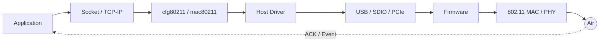

# 总览与阅读路线

Wi-Fi 问题很少只属于“协议”或“驱动”。连接成功但没有 IP，可能是四次握手、数据队列、聚合状态或 DHCP 报文没有走通；吞吐下降，也可能发生在空口、Firmware、总线、CPU 调度或 TCP 窗口。这里用三条相互交叉的路径组织知识。

## 端到端主线



读任何章节，都持续回答五个问题：

1. 当前由哪个实体拥有数据和状态？
2. 状态变化由命令、事件、中断还是超时驱动？
3. 数据在哪些位置发生封装、复制、聚合或排队？
4. 成功与失败分别留下什么可观测证据？
5. 恢复动作会影响单个连接、整个 Device，还是系统其他功能？

## 三条推荐路线

### 建链与平台适配

```text
01 系统架构 → 03 建链与安全 → 04 Linux 软件栈
→ 05 Driver/Firmware → 09 场景与平台集成 → 10 调试
```

适合解决扫描不到、关联失败、四次握手失败、无 IP、P2P 或 Android 集成问题。

### 吞吐、时延与功耗

```text
02 802.11 MAC → 06 总线与数据通路 → 07 性能
→ 08 低功耗 → 11 PHY/RF → 10 调试
```

适合性能优化。先区分空口速率、MAC 有效吞吐、Host 总线吞吐与应用 Goodput，避免只用单个 `iperf3` 数字下结论。

### 故障定位与恢复

```text
03 状态机 → 05 控制/数据路径 → 06 总线
→ 10 证据链 → Case Studies
```

适合偶现断流、Firmware 无响应、休眠唤醒异常等跨层问题。

### 芯片研发与产品化

```text
01 参考架构 → 05 Firmware/ABI → 02 Hardware MAC
→ 11 PHY/RF/Calibration → 12 验证/认证/量产 → 10 多源 Trace
```

适合芯片设计、First Silicon Bring-up、互操作认证、量产和现场问题闭环。

## 深度标准

本库的目标不是停留在术语层。核心章节按五层递进：

| 层级 | 必须回答的问题 |
|---|---|
| 概念 | 它是什么，与相邻模块边界在哪里？ |
| 路径 | 数据、控制和状态由谁在什么时刻推进？ |
| 实现 | 关键结构、Descriptor、队列、状态机和所有权是什么？ |
| 推演 | 容量、时序、回绕、竞态和不变量如何计算？ |
| 证据 | 用哪些 Trace、计数、抓包、仪表或注入实验证明结论？ |

如果一篇文章只能回答“是什么”，它只是索引；能落到不变量和证据链，才是面向芯片工程的正文。

## 边界

- SoC 的 DMA、Cache、中断和电源基础放在 [SoC System Atlas](/tech/soc/)；本库关注这些机制如何作用于 Wi-Fi。
- 本库默认覆盖 Linux Host 与 FullMAC/混合卸载架构，同时说明 mac80211/SoftMAC 边界。
- PHY、RF、校准和法规章节建立跨层诊断模型，不替代目标芯片规范、仪表方法和适用地区法规。
