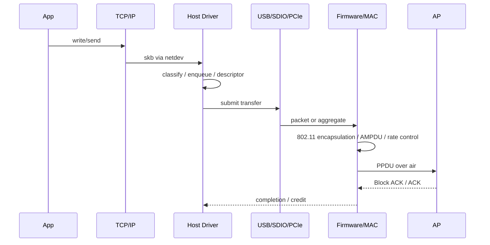

# 一次数据传输的端到端路径

## TX：应用数据怎样变成空口帧

沿途至少存在四种不同的“完成”：数据被内核接收、交给总线、被 Firmware 排入硬件队列、获得空口确认。驱动过早释放 buffer，或把“总线完成”误当成“发送成功”，都会制造难以复现的数据损坏或错误统计。

## RX：空口帧怎样到达应用

RX 从 PHY 解调开始，经过 MAC 校验与解密、重排序和去聚合，形成设备侧数据；再通过总线上送 Host，驱动构造或恢复 `skb`，交给 Linux 网络栈。SoftMAC 和 FullMAC 的 802.11→802.3 转换位置不同，但排查时都应记录：

- PHY/MAC 是否收到并通过 FCS、解密与重放检查；
- Firmware 是否因 reorder、flow control 或 buffer 不足丢弃；
- 总线传输是否完成，长度与 descriptor 是否匹配；
- Host 是否进入 RX handler/NAPI，最终是否到达协议栈和 Socket。

## 控制面与数据面的耦合

数据通路依赖控制状态。密钥尚未安装时，普通数据可能被 Port Control 拦截；ADDBA 建立前后，接收端的 reorder 行为不同；进入省电模式后，队列释放又受 TIM、U-APSD 或 TWT 调度约束。

因此最小系统快照应同时包含：连接状态、密钥状态、BA Session、功耗状态、每级队列深度、总线 credit 和关键丢包计数。

## 可观测点

| 位置 | 最小证据 |
|---|---|
| 应用/协议栈 | 流量方向、五元组、TCP 重传/窗口 |
| netdev/Driver | 包数、字节数、queue stop/wake、drop reason |
| Bus | 提交/完成数量、长度、延迟、错误码 |
| Firmware/MAC | 队列、重试、速率、聚合、ACK/BA |
| Air | Radiotap、Sequence、Retry、RSSI、MCS |

不要一开始就打开所有日志。先用同一时间基准建立各层计数差分，再在第一处不守恒的位置增加细粒度 Trace。
