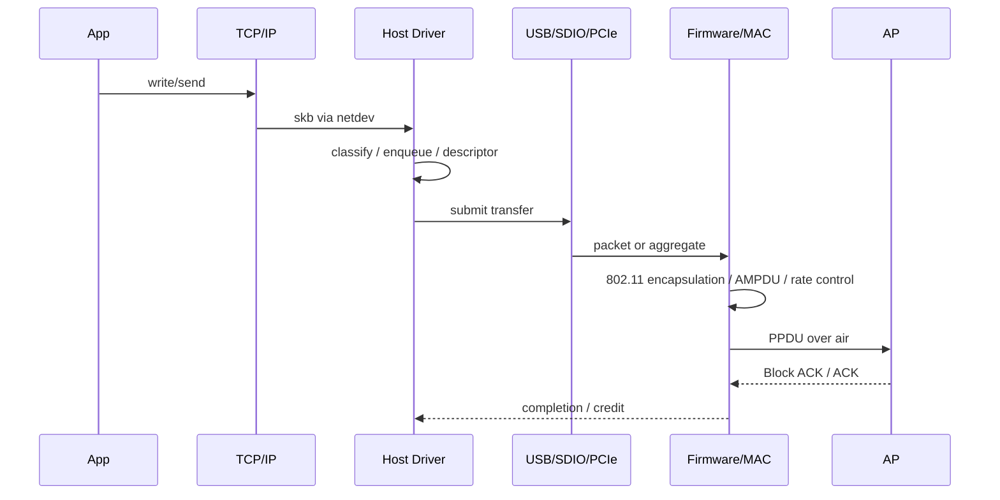

# 一次数据传输的端到端路径

## TX：应用数据怎样变成空口帧



沿途至少存在四种不同的“完成”：数据被内核接收、交给总线、被 Firmware 排入硬件队列、获得空口确认。驱动过早释放 buffer，或把“总线完成”误当成“发送成功”，都会制造难以复现的数据损坏或错误统计。

## RX：空口帧怎样到达应用

RX 从 PHY 解调开始，经过 MAC 校验与解密、重排序和去聚合，形成设备侧数据；再通过总线上送 Host，驱动构造或恢复 `skb`，交给 Linux 网络栈。SoftMAC 和 FullMAC 的 802.11→802.3 转换位置不同，但排查时都应记录：

- PHY/MAC 是否收到并通过 FCS，以及后续安全路径是否通过解密与重放检查；
- Firmware 是否因 reorder、flow control 或 buffer 不足丢弃；
- 总线传输是否完成，长度与 descriptor 是否匹配；
- Host 是否进入 RX handler/NAPI，最终是否到达协议栈和 Socket。

## 控制面与数据面的耦合

数据通路依赖控制状态。密钥尚未安装时，普通数据可能被 Port Control 拦截；ADDBA 建立前后，接收端的 reorder 行为不同；进入省电模式后，队列释放又受 TIM、U-APSD 或 TWT 调度约束。

因此最小系统快照应同时包含：连接状态、密钥状态、BA Session、功耗状态、每级队列深度、总线 credit 和关键丢包计数。

## 可观测点

| 位置 | 最小证据 |
|---|---|
| 应用/协议栈 | 流量方向、五元组、TCP 重传/窗口 |
| netdev/Driver | 包数、字节数、queue stop/wake、drop reason |
| Bus | 提交/完成数量、长度、延迟、错误码 |
| Firmware/MAC | 队列、重试、速率、聚合、ACK/BA |
| Air | Radiotap、Sequence、Retry、RSSI、MCS |

不要一开始就打开所有日志。先用同一时间基准建立各层计数差分，再在第一处不守恒的位置增加细粒度 Trace。

## 单包走读：长度和对象怎样变化

取 STA、FullMAC、USB、非 GSO 的 UDP 单播作为教学模型。应用 payload 为 1,400 byte，无 IP 选项时得到 `1400 + 8 UDP + 20 IPv4 = 1428 byte` IP 包；Ethernet 视图通常再有 14 byte header。1,442 byte 既不是空口长度，也不一定等于 USB transfer length。

假设普通三地址 QoS Data、无 HT Control、无 A-MSDU、采用 CCMP-128，可建立尺寸检查：

```text
MPDU = 26 MAC header + 8 CCMP header + 8 LLC/SNAP
     + 1428 IP packet + 8 MIC + 4 FCS
     = 1482 byte
```

该算例不适用于 GCMP、四地址或其他封装。A-MPDU 另有 delimiter/padding，PHY preamble 又在 MPDU 之外。描述符字段应明确包含哪一段；Host 填 Ethernet 长度而 FW 按 IP 长度解析，可能造成尾部越界。

| 阶段 | 对象 | 必须保留的关联 |
|---|---|---|
| qdisc | SKB、queue mapping | flow/priority |
| Host | SKB、私有 TX 元数据 | cookie、VIF/Peer/TID |
| USB | 一个 URB 包含多个子包 | transfer ID → 子包 cookie |
| Firmware | MSDU/MPDU queue | cookie → Peer/TID/Sequence |
| Hardware | aggregate、TXVECTOR | MPDU → PPDU/attempt |
| 完成 | bus result / TX status | 各资源的释放责任方 |

URB 完成之后，Device 中的副本还可能等待信道；聚合后一个 PPDU 对应多个 SKB；一个 MPDU 又可能重传多次。因此这些对象是多对多关系，不能依靠单个“packet count”直接对账。

## RX 检查的依赖关系

先识别帧边界才能检查 FCS；找到 Peer/Key 后才能使用相应 crypto context；replay 和 duplicate 判断还依赖 Key、TID、Sequence 与重排位置。硬件并行流水线不等于软件可以随意重排检查。

ACK/BA 不证明解密、replay、Host 交付或 Socket 接收成功。对端已确认但应用收不到时，继续检查安全、reorder、Firmware buffer、NAPI 和网络栈。A-MSDU 拆分后仍要保留共享外层 PN/Sequence 的语义。

Host 抓包通常看 Ethernet/IP，monitor 看 802.11，仪表看波形；GRO/GSO 又改变包数。对账必须先统一数据单位，并单独扣除重复、重传和丢弃。

## Reset 对这个包意味着什么

在 Host queue 可明确取消；在 USB inflight 要先等取消/完成，才能复用 buffer；数据复制到 Device 后，Host 回收与 Device flush 是两个动作。若已经发射但确认丢失，Reset 无法证明对端是否收到。

因此 Driver 能承诺资源最终回收和可解释的状态，不能承诺应用 exactly-once。需要可靠事务的业务仍须有上层确认和去重。

## 复习追问与答案

**为什么不能用 SKB 地址作为永久 ID？** 内存地址可复用，且 Device 不理解 Host 虚拟地址；需要 cookie、代际和显式映射。

**最早在哪里释放 TX buffer？** 在最后一个访问它的 DMA/总线实体交还所有权后；是否等待空口结果取决于 Device 是否保留独立副本及 ABI。

**怎样定位包被写坏？** 对已知测试 payload 在合法观察点记录长度、校验摘要和数据视图，找第一处变化；不要把 FCS 和仅覆盖 payload 的 checksum 混为一谈。

关联阅读：[所有权与生命周期](03-state-ownership-and-lifetime.md)、[DMA Ring](../06-Bus-Data-Path/02-ring-dma-memory-ordering.md)。
