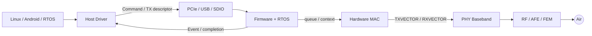

# Wi-Fi 芯片参考架构与责任边界

一张 `APP → Driver → Firmware → MAC → PHY → RF` 图只说明连接关系，不能指导实现。工程上还要给每条边界定义四件事：输入契约、输出契约、状态所有者和超时恢复者。

## 参考架构



| 边界 | 数据契约 | 状态所有者 | 典型超时 |
|---|---|---|---|
| OS↔Driver | `skb`、cfg80211 request/event | Linux 与 Driver 共同维护 | scan/connect/netdev watchdog |
| Host↔Device | descriptor、ring、command/event ABI | Driver/Firmware 各持一半 | command、credit、bus completion |
| Firmware↔MAC | STA/VIF/key/queue context | Firmware 配置，MAC 实时消费 | queue stuck、TX watchdog |
| MAC↔PHY | TXVECTOR/RXVECTOR、PSDU | MAC/PHY | SIFS、PPDU duration |
| PHY↔RF | sample、gain、calibration index | PHY/RF control | AGC/PLL/calibration timeout |

## 控制面和数据面不能只画一条线

TX 数据提交、TX 空口完成和控制命令完成是三种不同事件。以一个 SKB 为例：

```text
HOST_OWNED
  → DRIVER_QUEUED
  → BUS_INFLIGHT
  → DEVICE_QUEUED
  → MAC_SCHEDULED
  → AIR_ACKED / AIR_FAILED
  → COMPLETED_TO_HOST
  → FREED
```

不同芯片可能在 `DEVICE_QUEUED` 就归还 Host buffer，也可能一直等到空口结果。ABI 必须明确 completion 的含义；否则统计、速率控制和 buffer 生命周期都会混乱。

## 两条实时路径

普通数据路径容许排队和批处理；ACK、BA、CTS、Trigger Response 等 SIFS 级响应不能往返 Host，通常由 Hardware MAC、PHY 和确定性的 Firmware fast path 完成。“Firmware 负责”仍需要继续问：是 MCU task、硬件 sequencer，还是中断内的专用 fast path？

## 架构评审问题

1. VIF、STA、TID、Key、BA Session 分别以谁为权威源？
2. Host 与 Device ABI 如何版本协商，未知字段如何处理？
3. reset 发生在任意 ownership 状态时，谁回收 buffer？
4. Device 失联后，Host 如何区分 bus hang、Firmware deadlock 和 MAC 无完成？
5. 哪些状态必须跨 suspend 保存，哪些必须重建？

这套参考架构不是要求所有产品使用同一切分，而是要求每个产品把差异显式写出来。
