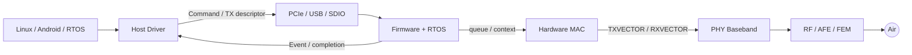

# Wi-Fi 芯片参考架构与责任边界

一张 `APP → Driver → Firmware → MAC → PHY → RF` 图只说明连接关系，不能指导实现。工程上还要给每条边界定义四件事：输入契约、输出契约、状态所有者和超时恢复者。

## 参考架构



| 边界 | 数据契约 | 状态所有者 | 典型超时 |
|---|---|---|---|
| OS↔Driver | `skb`、cfg80211 request/event | Linux 与 Driver 共同维护 | scan/connect/netdev watchdog |
| Host↔Device | descriptor、ring、command/event ABI | Driver/Firmware 各持一半 | command、credit、bus completion |
| Firmware↔MAC | STA/VIF/key/queue context | Firmware 配置，MAC 实时消费 | queue stuck、TX watchdog |
| MAC↔PHY | TXVECTOR/RXVECTOR、PSDU | MAC/PHY | SIFS、PPDU duration |
| PHY↔RF | sample、gain、calibration index | PHY/RF control | AGC/PLL/calibration timeout |

## 控制面和数据面不能只画一条线

TX 数据提交、TX 空口完成和控制命令完成是三种不同事件。以一个 SKB 为例：

```text
HOST_OWNED
  → DRIVER_QUEUED
  → BUS_INFLIGHT
  → DEVICE_QUEUED
  → MAC_SCHEDULED
  → AIR_ACKED / AIR_FAILED
  → COMPLETED_TO_HOST
  → FREED
```

不同芯片可能在 `DEVICE_QUEUED` 就归还 Host buffer，也可能一直等到空口结果。ABI 必须明确 completion 的含义；否则统计、速率控制和 buffer 生命周期都会混乱。

## 两条实时路径

普通数据路径容许排队和批处理；ACK、BA、CTS、Trigger Response 等 SIFS 级响应不能往返 Host，通常由 Hardware MAC、PHY 和确定性的 Firmware fast path 完成。“Firmware 负责”仍需要继续问：是 MCU task、硬件 sequencer，还是中断内的专用 fast path？

## 架构评审问题

1. VIF、STA、TID、Key、BA Session 分别以谁为权威源？
2. Host 与 Device ABI 如何版本协商，未知字段如何处理？
3. reset 发生在任意 ownership 状态时，谁回收 buffer？
4. Device 失联后，Host 如何区分 bus hang、Firmware deadlock 和 MAC 无完成？
5. 哪些状态必须跨 suspend 保存，哪些必须重建？

这套参考架构不是要求所有产品使用同一切分，而是要求每个产品把差异显式写出来。

## 从资源容量推导能力

芯片能力受多个容量的交集约束：VIF 数、Peer table、Key slot、每 TID BA context、SRAM、PHY stream、Radio、FEM、天线、总线和功耗预算。软件创建两个 netdev 并不增加两套 PHY。

教学算例：16 Peer，每 Peer 有 4 个 RX BA TID，window=64，每个缓存槽预留 2 KiB。仅 payload 最坏预留为：

```text
16 × 4 × 64 × 2048 = 8 MiB
```

尚未包含指针、bitmap、SKB 和 TX buffer。若片上 SRAM 不够，可以把 reorder 放在 Host，按需分配共享 pool，或降低协商能力。共享 pool 减少平均内存，却需要定义耗尽时的准入、公平与丢弃行为。

| 设计选择 | 收益 | 必须解决的问题 |
|---|---|---|
| Host reorder | 使用较大 DRAM | 总线开销、RX flags、Host 延迟 |
| HW reorder | 低延迟、CPU 少 | 窗口容量、teardown、可观察性 |
| FW 动态 pool | 复用 SRAM | 碎片、长尾延迟、资源隔离 |
| 深 TX queue | 吸收突发 | Bufferbloat、业务寿命、流控 |

## 每项卸载都需要一份契约

不要只标注 FullMAC/SoftMAC。逐项填写 scan、MLME、crypto、reorder、aggregation、rate 和 PS 的策略方、执行方、结果接收方。

例如 Host 下发 retry chain，Hardware 做实际 retry；Host 必须收到每个 rate stage 的实际尝试与成功。只有最终成功标志，算法就无法区分首发成功与多次低速回退。

对于 RX crypto，契约必须说明 IV 是否保留、谁验证 PN、MIC status 如何表达、错误帧是否上送。接口设计不完整会让两层重复检查，或两层都以为对方已经检查。

## 复位域与时钟域

列出 MCU、MAC、PHY、HIF、共享 BT 的 reset/clock/power domain 以及 SRAM retention。局部 MAC reset 不一定使 Host DMA 停止；MCU heartbeat 恢复也不证明 Key table、RF calibration 和 RX posting 恢复。

CDC/FIFO 的正确性由硬件跨时钟协议保证，Host memory barrier 无法修复 RTL CDC。软件需要 ready、quiesced、error、generation 等可观察状态，不应依赖一个未经测量的固定延时。

## 架构评审的答案应长什么样

**为什么连接数不能等于 Peer table 大小？** Key/BA/SRAM 和实时调度也可能先耗尽，最终限制由最小可用容量决定。

**怎样证明可以关闭一个时钟？** 列出该域的所有生产者和消费者，阻断新事务、完成 quiesce handshake，并证明 wake source 不在被关闭域内。

**一个功能迁到 FW 就更快吗？** 少了 Host round-trip，但也增加 MCU 调度与 SRAM 压力。应测对应路径的排队时间和最坏期限，而非按所在层推断。

关联阅读：[Context 与 Reset](../05-Driver-Firmware/04-context-generation-and-reset.md)、[多角色资源模型](../09-Scenarios-Integration/02-concurrency-coexistence.md)。
