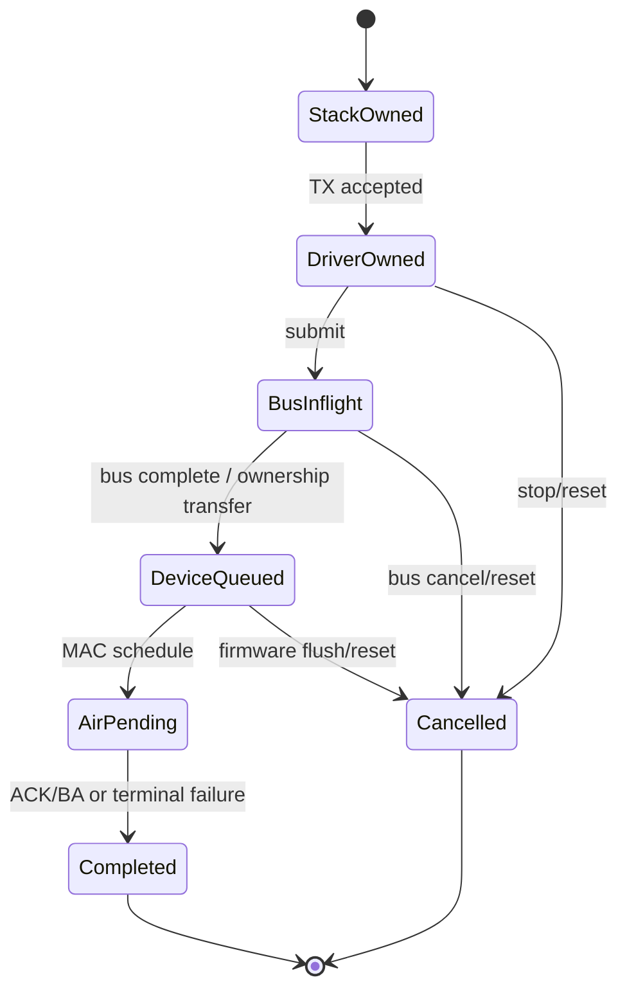

# 状态、所有权与生命周期设计

跨 Host/Firmware/Hardware 的 Wi-Fi 系统，最难的通常不是正常路径，而是对象在异步事件到达时是否仍然有效。VIF、Peer、Key、BA Session、Packet 和 Command 都应有显式生命周期。

## 先区分六类对象

| 对象 | 典型创建点 | 典型销毁点 | 主要引用者 |
|---|---|---|---|
| Device | probe/firmware boot | remove/fatal reset | bus、driver、FW |
| VIF | add interface/open | delete interface | cfg80211、FW、MAC |
| Peer | auth/assoc | disconnect/timeout | key、BA、scheduler |
| Key | handshake/rekey | disconnect/rekey | crypto、TX/RX replay |
| BA Session | ADDBA | DELBA/timeout | TX retry、RX reorder |
| Packet | stack enqueue/RX alloc | completion/delivery/drop | queue、bus、MAC |

这些对象不能只靠裸指针关联。跨异步边界至少携带稳定 ID 与 generation；收到事件时先验证 Device/VIF/Peer 代际，再解析后续状态。

## 权威状态与镜像状态

同一概念可以在多层出现，但只能有一个权威所有者。例如 FullMAC 架构中，Firmware 可能拥有关联状态，Host 保存 cfg80211 镜像，Hardware 保存 Peer table 快照。

```text
Authoritative state: Firmware CONNECTED
Host mirror:         cfg80211 connected + carrier on
Hardware projection: peer/key/BA entries valid
```

各层状态应分别定义提交点：关联成功可先通知 cfg80211/supplicant，再完成 Keying；受控端口授权与业务可用另需 Key、datapath 和网络配置。不要为了合并这些状态而延迟握手所需的关联通知。各事务按自己的提交边界回滚或恢复。

## Generation 为什么必要

考虑快速断开再重连：

```text
session 7: connect command ───── timeout ── disconnect
session 8: connect command ─────────────── connected
session 7: late connected event ──────────X reject
```

仅比较 VIF ID 无法识别旧事件，因为新连接复用了同一个 VIF。会话 `generation` 在新连接/对象代际开始时递增，每个命令另用 transaction ID 匹配，Event、Command completion、Packet completion、Timer 和 Work item 都携带或捕获该值。

Generation 不是替代引用计数：前者判断逻辑代际，后者保证对象内存仍存在。正确顺序通常是先取得安全引用，再验证 generation，然后访问状态。

## Packet 所有权状态机



实现中可以合并状态，但不能合并语义。USB URB completion 通常只表示 Host Controller 不再使用 transfer buffer；PCIe TX completion 可能表示 Device 已消费 descriptor；MAC TX status 才描述 retry/ACK。每种 completion 要归还对应资源，不能重复 free 或遗漏 credit。

## Control transaction 生命周期

一个可靠 Command 至少经历：

```text
ALLOCATED → QUEUED → SENT → ACKED/COMPLETED
                    ↘ TIMED_OUT → CANCELLED/RECOVERY
```

需要保存 transaction ID、deadline、request owner、completion reason、session generation。超时线程不能立即释放 Device 仍可能引用的 DMA buffer；应先标记终止、隔离迟到结果，再由总线取消或 Reset 协议完成资源回收。

## 销毁顺序

对象销毁遵循“关入口、停生产者、清消费者、等在途、再释放”：

1. 状态切到 `STOPPING`，拒绝新 Command/Packet；
2. 停止 Timer、Work、NAPI 和 Firmware scheduler 生产新引用；
3. 按总线协议取消在途请求或让 Hardware/Firmware 停止 DMA，确认 quiesce；
4. 同步/drain completion 与引用；不可仅用内存 barrier 代替 DMA 停止确认；
5. 清除 Key、BA、Peer、VIF 的反向引用；
6. 最后释放内存和 ID。

仅调用 `cancel_work_sync()` 不足以覆盖 Firmware Event 或 DMA；仅做 Firmware Reset 也不足以等待 Host callback。

## 必须维护的不变量

- 一个 Packet 在任意时刻只有一个释放责任方；
- completion 只归还它对应层的资源；
- `ACTIVE` Peer 必须属于一个 `ACTIVE` VIF；
- Key/BA generation 必须与 Peer session 一致；
- STOPPING 后不得创建新的长期异步引用；
- Reset 结束时旧 generation 的 pending 数必须归零或被永久隔离。

## 故障注入

在 Command 发送后、Event 到达前、DMA doorbell 后、completion 前、Key 写一半和 suspend 切换点注入延迟/丢失/重复。每个点验证：无 use-after-free、无 double completion、无旧状态复活、队列最终可恢复、统计能解释丢弃原因。

## 面试追问

- generation、reference count 和 transaction ID 分别解决什么问题？
- 为什么 bus completion 与 air completion 不能共用一个状态？
- Reset 时先 free buffer 再停 DMA 会发生什么？
- 如何证明迟到 Event 不会让已断开的 VIF 重新变成 connected？

## 答题要点与适用边界

Generation 区分逻辑代际，reference count 保证内存仍存活，transaction ID 匹配一次请求；三者不能互相替代。Bus completion 与 air status 归还不同资源，结果也不同。旧 DMA 尚运行就 free 会让 Device 写入复用内存；旧 Event 需先安全取得对象引用，再检查代际和允许状态。协议若没有显式 generation 字段，也需通过 drain、身份映射或禁止过早复用实现等价保证。
