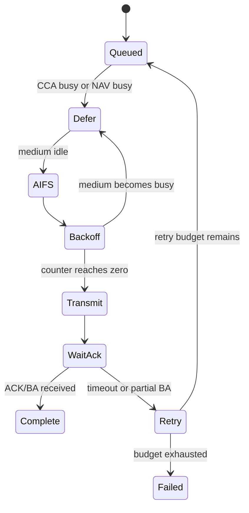

# Hardware MAC 实时路径

Hardware MAC 的价值不只是“收发 802.11 帧”，而是在严格时限内执行介质访问、响应、重试、加解密和统计。Host 可以决定策略，但无法参与每个 SIFS 级动作。

## 普通 EDCA TX



实现评审不应只看状态名，还要核对：AIFS 与 backoff 在 medium busy 时如何冻结；四个 AC 是否发生 internal collision；TXOP 剩余时间是否允许下一个 PPDU；retry chain 如何关联原 MPDU；Channel Switch/DFS/PS 是否能原子地阻止新 TX。

## SIFS 响应路径

RX PHY 在解出足够字段后，MAC 就要并行准备响应：地址匹配、FCS 状态、ACK policy、BA bitmap、NAV 和 TXVECTOR。数据上送 Firmware/Host、RX reorder 与协议栈处理不在这条关键时序上。

```text
RX PPDU end
  ├─ fast path: parse → response decision → TXVECTOR → ACK/BA/CTS
  └─ slow path: descriptor → Firmware/Driver → reorder → network stack
```

因此调试“收到了包但没有回 BA”时，要观察 fast-path reason：FCS、RA/BSSID、BA context、response enable、SIFS deadline、PHY ready，而不是只查 Host RX 包数。

## Context 查表

Hardware MAC 通常按 `VIF/Peer/TID/Key` 查表。表项更新必须具备生效点：

- 新 Key 写完后何时允许 Protected TX；
- DELBA 后旧 bitmap/reorder context 何时失效；
- roam/reset 后旧 Peer ID 是否可能命中新会话；
- PN/Sequence 由 Host、Firmware 或 MAC 哪一侧递增。

可靠实现会为上下文增加 generation，或在重建时先冻结队列、等待旧事务排空，再切换表项。

## 最小硬件 Trace

一次 TX 至少保留 packet/cookie、queue、peer/TID、CCA/NAV、backoff、TXVECTOR、retry、ACK/BA 与最终 reason；一次 RX 至少保留 RXVECTOR、FCS、filter、decrypt/replay、BA response 与上送 reason。只有计数而没有关联 ID，无法重建单包路径。

## 接收结束到 SIFS 响应：具体依赖

在一个普通 immediate ACK/BA 场景里，硬件流水线提前提取 RA/TA、类型、TID 和 ACK policy，查询 Peer/BA context，并随接收更新 FCS 与候选 bitmap。到接收尾部，结果决定是否提交响应；随后切换收发方向、准备 response TXVECTOR 并满足规定间隔。

Fast path 依赖有效 MAC 接收状态，但 ACK/BA 不是对解密、PN、应用交付的承诺。把 Host reorder 处理完成放入响应关键路径，会把总线和 OS 调度延迟引入微秒级时限。

以下是教学预算，非芯片实测、非标准参数：

| 接收尾部后的工作 | 假设耗时 |
|---|---:|
| 判定和响应选择 | 2 μs |
| Context/response 准备 | 2 μs |
| RF turnaround 与 PHY 启动 | 8 μs |
| 总消耗 | 12 μs |

若该场景 SIFS 为 16 μs，则只剩 4 μs 裕量。应验证 PVT、跨时钟 FIFO、SRAM 仲裁和最坏中断拥塞；不能拿平均值判断硬实时是否满足。

## Header 与 Context 的原子更新

Peer/Key/BA table 在发射期间仍可能被更新。硬件可以采用锁定快照、双 bank、版本化读等方式；要求一次 MPDU 使用自洽的 Context。

危险的交错是：先读旧 Key index，FW 删 Key 并复用 slot，再执行 crypto。防护需要停止新引用和等待 in-flight，而不是只给结构体加一个 valid bit。

硬件统计要保留 `context_lookup_fail`、`stale_generation`、`response_deadline_miss`、`phy_start_reject`，这些分别是不同机制。

## Beacon、TSF 与 TBTT

TSF 提供 BSS 时间基准，TBTT 是计划 Beacon 时间。实际 Beacon 仍可能因信道忙而延迟发射。Beacon template、TIM 和其他 IE 更新必须有提交边界，防止硬件读到半更新模板。

AP 侧测 planned TBTT→actual TX 的偏差；STA 侧测预唤醒→接收窗口→Beacon decode。把所有晚发都判成 Firmware 调度失败，会忽略正常介质竞争。

## 复习追问与答案

**Host 不在 SIFS 路径里，那它负责什么？** 预先配置响应规则、上下文与 Buffer，并消费结果、处理慢速策略和错误恢复。

**如何区分没响应和响应没被收到？** 对齐 hardware response-selected、PHY-start/end 与独立空口证据；只有最后一步失败不能归因于 parser。

**为什么关闭日志可能改变故障？** 日志写内存和抢占共享总线可能影响时限；应用有界 binary trace 测量最大延迟。

关联：[ABI](../05-Driver-Firmware/02-host-device-abi.md)、[PHY Vector](../11-PHY-RF-Calibration/01-phy-tx-rx-vector.md)。
